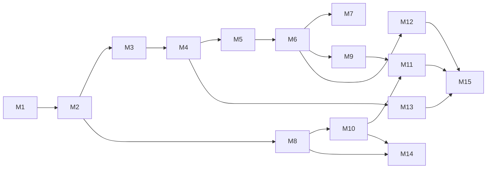

# Working with omp — Course Outline

> **Purpose of this document.** This is the build spec for a hands-on course on `omp` (Oh My Pi, https://omp.sh), the terminal coding agent. It is written for the agents who will produce the lesson content, exercises, fixtures, and reference sheets. It defines audience, structure, per-module scope, coursework, the shared practice repository, and a feature-coverage matrix. It does **not** contain the lesson prose itself.

---

## 0. Audience, outcomes, and ground rules

### Audience
- Software developers (any language) comfortable in a terminal and with git.
- Has used an AI assistant "a little": chat-style (ChatGPT/Claude web) or inline autocomplete (Copilot). Has **not** necessarily driven an autonomous terminal agent.
- Does not need to know omp internals (Rust crates, provider wire formats, TUI renderer). Those docs exist in `omp://` but are explicitly out of scope.

### What a graduate can do
1. Install, authenticate, and run omp against a real repo; read what it did from the TUI cards; stop, steer, and correct it.
2. Write prompts that produce verified, reviewable changes (acceptance criteria, verification, plan-then-implement).
3. Control blast radius: approval modes, plan mode, bash patterns, review/annotate, atomic commits.
4. Manage sessions and context over multi-day work: resume, fork, branch, tree, compaction, handoff, export/share.
5. Teach omp a project: `AGENTS.md`, `RULES.md`, rules, custom commands, skills, project/global settings, profiles.
6. Route work across models and providers (roles, fallbacks, local models) and track cost.
7. Use the full built-in toolbox: multi-format `read`, `web_search`, `eval` kernels, LSP, AST codemods, real debugger (DAP), semantic `find`, background services, GitHub-as-filesystem.
8. Use persistent memory and self-authored skills.
9. Run parallel subagents, supervise them in Agent Hub, define custom agents, and use advisors/TTSR/prewalk as guardrails.
10. Extend omp: extensions (tools, commands, events), hooks, MCP servers, marketplaces/plugins.
11. Run omp headless (`-p`, `--mode json`, RPC, SDK, ACP) in scripts, CI, and editors.
12. Automate browsers and the desktop; pair and share sessions live.

### Course-wide conventions (binding for content builders)
- **Ground truth is the bundled docs.** Every command, flag, key, setting key, file path, and default MUST be verified against `omp://<doc>` (index at `omp://`) and the live binary (`omp --help`, `omp <cmd> --help`, `/hotkeys`, `/settings`). Cite the doc file in a `Source:` footer of each lesson. Do not copy claims from third-party blog posts.
- **Pin the version.** Record `omp --version` used to build the module in the module header. Note any setting that is *off by default* and must be enabled (see matrix column "Default").
- **No marketing.** Benchmarks/claims ("6.7% → 68.3%") are omitted unless the lesson is *about* why hashline edits matter, and then attributed.
- **Third-party guides** (acchapm1 beginner guide, Better Stack, knightli, omp.sh/docs) may be linked as "further reading" but MUST NOT dictate structure. Their organization is feature-list/setup-first; this course is workflow-first.

---

## 1. Instructional design (how every lesson and exercise is built)

Principles, drawn from Merrill's First Principles, cognitive-load theory, and Diátaxis (tutorial vs how-to vs reference separation):

1. **One practice repo, cumulative exercises.** Everything runs in `omp-course-lab` (spec in Appendix A). Later exercises build on earlier state; each module starts from a tagged git checkpoint (`git checkout module-N-start`) so a learner can skip ahead or recover.
2. **Guided → supported → independent.** Each module's coursework has three tiers:
   - **Walkthrough** (exact prompts/keys to type, expected card output shown).
   - **Guided task** (goal + hints + checkpoints, no exact prompt).
   - **Stretch** (goal only; solution notes in instructor appendix).
3. **Every exercise has an observable pass condition** — a file diff, a command exit code, a card in the transcript, a `read` of an internal URI (`artifact://`, `agent://`, `memory://`), or a `omp config get` value. Never "you should now understand".
4. **Show before do.** Each concept opens with a ≤ 60 s demo transcript (asciinema/`.ompcast` via `/record` + `omp play`, or a fenced transcript) before the learner acts.
5. **One new concept per exercise step.** Don't introduce approval modes and plan mode in the same step.
6. **Troubleshooting sidebars are mandatory** for every step that touches the environment (terminal keyboard protocol, auth, LSP binaries, DAP adapters, permissions for `computer`).
7. **Explain *why*, briefly.** One paragraph per feature on what problem it solves. Internals only when they change user behavior (e.g. hashline anchors → why stale edits are rejected).
8. **Reference is separate from tutorial.** Each module ends with a one-page cheat sheet (commands/keys/settings). Appendix B aggregates them.
9. **Time-boxed.** Each module lists an estimated duration; each exercise 5–25 min. Whole course ≈ 20–24 h.

### Lesson template (use verbatim)
```
## Lesson N.M — <Title>              (~X min)
**You will be able to:** <1–3 observable outcomes>
**Why this exists:** <1 paragraph>
**Demo:** <transcript / recording>
**Concepts:** <bullets; exact commands, keys, settings, files>
**Try it (Walkthrough):** numbered steps → "Expected:" after each
**Guided task:** goal, hints, checkpoints, pass condition
**Stretch:** goal, pass condition
**Troubleshooting:** table (symptom → cause → fix)
**Cheat sheet:** table
**Source:** omp://<doc>, omp://<doc>
```

---

## 2. Course map

| Part | Module | Level | ~Time |
|---|---|---|---|
| **I. Foundations** | 1. Setup & First Contact | basic | 1.0 h |
| | 2. Anatomy of a Turn | basic | 1.5 h |
| | 3. Prompting & Steering an Agent | basic | 1.5 h |
| | 4. Staying in Control: Approvals, Plan Mode, Review, Commit | basic→int | 2.0 h |
| | 5. Sessions & Context Over Time | basic→int | 1.5 h |
| **II. Making omp Yours** | 6. Teaching omp Your Project | intermediate | 2.0 h |
| | 7. Models, Providers & Cost | intermediate | 1.5 h |
| | 8. The Full Toolbox | intermediate | 2.5 h |
| | 9. Memory & Self-Authored Skills | intermediate | 1.0 h |
| **III. Advanced** | 10. Subagents & Parallel Work | advanced | 2.0 h |
| | 11. Guardrails & Supervision | advanced | 1.5 h |
| | 12. Extending omp: Extensions, Hooks, MCP, Plugins | advanced | 2.5 h |
| | 13. Headless, Scripted & Editor-Embedded omp | advanced | 1.5 h |
| | 14. Browser, Desktop & Live Collaboration | advanced | 1.5 h |
| **IV. Capstone** | 15. Capstone Project | all | 3.0 h |

Prerequisite graph (content builders: do not forward-reference beyond this):



---

## Part I — Foundations

### Module 1 — Setup & First Contact (~1 h, basic)

**Goal:** From zero to a verified, model-backed `omp` answering one question in the practice repo.

Lessons:
- **1.1 What omp is (and isn't).** Terminal agent vs chat vs autocomplete. The loop: prompt → tools (read/search/edit/run) → cards → your review. Four entry points (TUI, `-p`, RPC, ACP) named, only TUI used now.
- **1.2 Install.** `curl -fsSL https://omp.sh/install | sh`, Homebrew, Bun, Nix, Windows PowerShell, mise. `omp --version`. Shell completions (`omp completions zsh|bash|fish`).
- **1.3 Terminal requirements.** Kitty keyboard protocol; per-terminal table (iTerm2/Kitty OK, Ghostty/WezTerm config snippet, Windows Terminal limits). How to detect a broken chord (Ctrl+O does nothing).
- **1.4 Authenticate.** `/login` picker (OAuth: Anthropic, OpenAI Codex, Gemini, Copilot, …), `/login <provider>`, `omp login`, `/logout`; env-var alternative (`ANTHROPIC_API_KEY`, `.env` lookup order). Where credentials live (`~/.omp/agent/agent.db`). Pick **one** provider now; routing is Module 7.
- **1.5 First prompt.** `omp` in `omp-course-lab`; the official quickstart prompt ("inspect for one small bug… make the smallest safe fix… run the relevant check"). Also `omp "text"`, `omp @file.md @image.png "question"`, `echo x | omp -p`.
- **1.6 The config root.** `~/.omp/agent/` tour: `config.yml`, `models.yml`, `sessions/`, `skills/`, `extensions/`, `agents/`. `omp config path`. `omp setup` wizard.
- **1.7 The CLI surface.** `omp --help`, `omp <cmd> --help`; the subcommands the course will use (`models`, `config`, `login`, `setup`, `commit`, `git`, `worktree`, `stats`, `usage`, `plugin`, `share`, `collab`, `stream`, `ttsr`, `tiny-models`, `q`/`search`, `find`) named once here, taught where relevant. Housekeeping: `omp update`, `omp gc --apply`.

Coursework:
- W: install → `omp --version` → `/login` → run quickstart prompt → confirm one file changed (`git diff --stat`).
- G: run `omp -p "List the top-level directories and what each is for"` and save output to `notes/m1.txt`. Pass: file exists, mentions `api/` and `cli/`.
- S: set up shell completions; verify `omp --res<Tab>` completes `--resume`.

Troubleshooting: keyboard protocol, OAuth callback blocked, model not found, Alpine musl libs.

Source: `cli-reference.md`, `providers.md`, `environment-variables.md`, `config-usage.md`.

---

### Module 2 — Anatomy of a Turn (~1.5 h, basic)

**Goal:** Read the TUI fluently; know what each built-in tool does and how to inspect it.

Lessons:
- **2.1 TUI layout.** Composer, transcript, tool cards, status line (model, context %, auto-compact icon), todo panel, pinned subagents block. `Esc` stops a turn. `Ctrl+O` expand card, `Ctrl+Shift+O` hide tool activity, `Ctrl+T` thinking blocks, `/hotkeys`.
- **2.2 The core tool set.** What the model reaches for: `read` (line selectors `:50-100`, directories), `grep`, `glob`, `edit`, `write`, `bash`, `todo`, `ask`, `web_search`. Card anatomy for each. Truncation → `artifact://N` spill and how to ask omp to read it.
- **2.3 Why edits are reliable: hashline.** Content-hash anchors; stale-file rejection; what "re-read before edit" looks like in the transcript. `edit.mode` exists (hashline default) — mention only.
- **2.4 `bash` behaviors you'll notice.** In-process coreutils, persistent shell session, `!cmd` from composer, background jobs, named services (`proc://<name>`), PTY for interactive commands. `bashInterceptor` (why `cat`/`grep` get redirected to tools).
- **2.5 `ask` and `todo`.** Structured questions (option picker), `ask.timeout`/`ask.notify`; the todo panel and `/todo`.
- **2.6 Composer skills.** `@path` attach, image paste (Ctrl+V), `Ctrl+R` history search, `Ctrl+G` external editor, `Ctrl+Q`/`Ctrl+Enter` queue follow-up, `Alt+Up` dequeue, `Ctrl+C` then `Up` recall draft, `Alt+R` retry, `Alt+L` reset display. Vim mode (`tui.vimMode`).

Coursework:
- W: ask omp to "explain how `api/` handles a request"; expand each card with Ctrl+O; identify one `read`, one `grep`, one `glob` card.
- G: ask for a change that touches two files (fixture bug #2); after completion, `read artifact://` for any truncated output; find the `todo` panel updates. Pass: both files in `git diff`; learner lists the tool sequence in `notes/m2.md`.
- G: start the lab dev server as a named service via prompt ("run the API as a service named `api`, ready on port 8080"); `read proc://api`; kill it. Pass: card shows readiness; `proc://` listing empty after kill.
- S: enable Vim mode; use `ciw` in the composer.

Source: `tools/read.md`, `tools/edit.md`, `tools/bash.md`, `bash-tool-runtime.md`, `tools/ask.md`, `tools/todo.md`, `keybindings.md`, `blob-artifact-architecture.md`.

---

### Module 3 — Prompting & Steering an Agent (~1.5 h, basic)

**Goal:** Turn vague requests into verified outcomes; steer mid-turn instead of restarting.

Lessons:
- **3.1 Outcome + acceptance + verification.** The three-part prompt. Why "run the tests" belongs in the prompt. Contrast: chat prompting vs agent prompting.
- **3.2 Scope control.** Non-goals, "don't touch X", "ask before Y". Using `ask`-friendly phrasing ("if ambiguous, ask").
- **3.3 Thinking effort.** `Shift+Tab` cycle thinking level, `--thinking`, `Ctrl+T` to see it. Magic keyword `ultrathink` (standalone lowercase prose only); mention `orchestrate`/`workflowz`/`jevify` exist (deferred to M10). `magicKeywords.*` toggles.
- **3.4 Steering.** `Esc` to interrupt, queued follow-ups, `/pause`, `/btw` side questions (own history, `f`/`c`/`b` keys), `/fresh` when the provider stream wedges.
- **3.5 Reading the result critically.** Ask for the diff summary; expand `bash` cards for test runs; never trust "done" without a verifying card.

Coursework:
- W: fixture bug #3 with a weak prompt, then a structured prompt; compare transcripts (tool count, whether tests ran). Record both in `notes/m3.md`.
- G: mid-turn, interrupt with Esc and redirect scope; queue a follow-up with Ctrl+Q while streaming. Pass: follow-up executes after the turn.
- G: use `/btw` to ask "what does this function do?" without polluting the main thread. Pass: main transcript unchanged.
- S: same task with and without `ultrathink`; note thinking-level differences.

Source: `magic-keywords.md`, `keybindings.md`, `slash-command-internals.md` (`/btw`, `/pause`), `session-operations-export-share-fork-resume.md` (`/fresh`).

---

### Module 4 — Staying in Control: Approvals, Plan Mode, Review, Commit (~2 h, basic→intermediate)

**Goal:** Choose how much autonomy omp gets, plan before implementing, review its work with your notes, and commit cleanly.

Lessons:
- **4.1 Approval modes.** `tools.approvalMode`: `always-ask` / `write` / `yolo` (**yolo is the default** — teach this explicitly). `--approval-mode`, `--auto-approve`/`--yolo`. Per-tool `tools.approval.<tool>: allow|deny|prompt`. What the prompt card looks like.
- **4.2 Bash patterns.** `bash.patterns: [{match, approval}]`, first-match-wins, `bash.allowCompoundCommands`. Approval ≠ sandbox (say so).
- **4.3 Plan mode.** `Alt+Shift+P` toggle; read-only exploration; the Plan Review overlay (`/plan-review`, `a`/`e`/`u` annotate sections); accept → implement. `--plan-yolo` / `--plan-yolo-into`. Plan model role preview (M7).
- **4.4 Reviewing changes.** `/review` (single-target LLM review; bundled `reviewer`/`security-reviewer` agents); `/annotate code-review [focus]`, `/annotate last`, `/annotate path`, overlay keys, "Continue with LLM review". `read pr://owner/repo/N` as a preview of GitHub-as-filesystem.
- **4.5 Committing.** `omp commit` (model-generated commit per `omp commit --help`; commit→smol role), `omp git`. Conflicts: `conflict://N` with `@ours`/`@theirs`/`@base`, `read file:conflicts`.
- **4.6 Undo strategies.** git as the safety net; `/fork` before risky work (full treatment in M5).

Coursework:
- W: set `always-ask`, run fixture task #4, approve/deny individual tool calls; then add a `bash.patterns` allow rule for `npm test` and confirm it stops prompting. Pass: `omp config get bash.patterns` shows the rule; transcript shows no prompt for `npm test`.
- G: plan mode on fixture feature #5: get a plan, annotate one section as "out of scope", accept, implement. Pass: implementation omits the annotated item.
- G: `/annotate code-review` on the working diff, add two line notes, continue with LLM review; then `omp commit`. Pass: ≥ 2 commits with distinct scopes.
- S: check out `conflict-lab` branch, merge `main`, resolve via `conflict://*`. Pass: no conflict markers, tests pass.

Source: `approval-mode.md`, `cli-reference.md` (plan flags), `slash-command-internals.md` (`/annotate`, `/plan-review`), README `/review`, `omp commit`, `conflict://`.

---

### Module 5 — Sessions & Context Over Time (~1.5 h, basic→intermediate)

**Goal:** Work across days without losing state or blowing the context window.

Lessons:
- **5.1 Sessions on disk.** `~/.omp/agent/sessions/<encoded-cwd>/*.jsonl`, tree-of-entries model, `--no-session`, `--session-dir`, `/rename`. `/move` and `/wt` (worktree sessions, `omp worktree`).
- **5.2 Resume & switch.** `/resume` picker (Tab toggles folder/all), `/resume <id>`, `omp --resume`, `omp -c/--continue` (terminal breadcrumb), `/resume @claude|@codex` import.
- **5.3 Reset semantics.** `/new` vs `/clear` (reset boundary, keeps file) vs `/fresh` (provider stream only) vs `/delete` vs `/restart`.
- **5.4 Branching history.** `/tree` (in-file leaf move; Shift+L label, Alt+L jump, Ctrl+O filters, Shift+Enter summarize) vs `/branch` (new file from a user message) vs `/fork` (whole copy; `--fork`). `branchSummary.enabled`.
- **5.5 Compaction.** Status-line context %; auto-compaction triggers; `/compact [instructions]`; `compaction.methodOrder` (`remote`, `snapcompact`, `handoff`, `shake`, `soft`), `thresholdPercent`; `/handoff [focus]` and `handoffSaveToDisk`; `/shake`. Async/speculative compaction as background behavior (observe icon). Context promotion (`contextPromotionTarget`) mention.
- **5.6 Getting a session out.** `/export [--themes] [path]` (HTML incl. subagents), `omp --export`, `/dump` (clipboard + JSON sidecar), `/share` (E2E-encrypted link, `share.redactSecrets`), `/record` → `.ompcast`, `omp play`, `omp clip`.

Coursework:
- W: run three turns; `/tree`, label turn 2, jump back, continue a different way with summarization; then `/branch` and `/fork` from the same point; open `/resume` and identify all three. Pass: three session files; learner explains scope of each in `notes/m5.md`.
- G: drive context > threshold with a large `read`, watch auto-compaction, then `/handoff "focus on the API refactor"`; `/tree` to find the compaction entry. Pass: entry visible; context % dropped.
- G: `/export` to `notes/m5-session.html`; `/share`; compare. Pass: HTML opens; share link resolves.
- S: `/record` a short session, `omp play -s 2`.

Source: `session.md`, `session-switching-and-recent-listing.md`, `session-operations-export-share-fork-resume.md`, `tree.md`, `session-tree-plan.md`, `compaction.md`, `handoff-generation-pipeline.md`, `stream.md` (record/play/clip).

---

## Part II — Making omp Yours

### Module 6 — Teaching omp Your Project (~2 h, intermediate)

**Goal:** Encode repo conventions so every session starts informed; layer settings correctly.

Lessons:
- **6.1 Context files.** `.omp/AGENTS.md` (project), `~/.omp/agent/AGENTS.md` (user); auto-discovery of `AGENTS.md`, `CLAUDE.md`, `.claude/CLAUDE.md`, `GEMINI.md`, `.github/copilot-instructions.md`, Cursor `.mdc`, Cline, Windsurf. `@path` imports (5 hops). Nearest non-empty `.omp/` rule. What to put in it (build/test commands, conventions, review expectations) and what not to.
- **6.2 `RULES.md`.** Sticky, every-request rules vs one-time context. Keep it short. Re-discovered on `/clear`/`/new`.
- **6.3 Rules directory.** `.omp/rules/*.md` with frontmatter: `alwaysApply: true`, `description:` (rulebook, readable via `rule://<name>`), `agents: [...]` scoping. (`condition:` TTSR deferred to M11.)
- **6.4 Precedence & shadowing.** Provider priority (native > omp-plugins > claude > codex > gemini > …), same-depth shadowing, `/extensions` listing, `disabledProviders`, `disabledExtensions: [context-file:<level>:<basename>]`, `enabledProviders` for foreign user-level sources.
- **6.5 Custom slash commands.** `.omp/commands/<name>.md` / `~/.omp/agent/commands/`, frontmatter description, `$ARGUMENTS`/`$1`.
- **6.6 Skills.** `<root>/skills/<name>/SKILL.md` with `name`/`description` frontmatter; `skill://<name>[/asset]`; `/skill:<name>` (needs `skills.enableSkillCommands`); `hide`, `disableModelInvocation`; `skills.customDirectories`, `ignoredSkills`/`includeSkills`. Skill vs command vs rule decision table.
- **6.7 Settings layering.** defaults < `~/.omp/agent/config.yml` < `<cwd>/.omp/config.yml` < `--config overlay.yml` (repeatable, `PI_CONFIG_FILES`) < runtime < env. Deep-merge objects, arrays replace. `omp config list|get|set|reset|path`, `/settings` panel. Profiles: `--profile`, `OMP_PROFILE`, `omp --alias`.
- **6.8 System prompt customization (overview).** `APPEND_SYSTEM.md` / `--append-system-prompt`, `SYSTEM.md`, `PERSONALITY.md`, `TITLE_SYSTEM.md`; `SYSTEM_TEMPLATE.md` (Handlebars) named only.
- **6.9 Secrets.** `secrets.enabled`, `secrets.yml` (plain/regex; obfuscate/replace), what the model sees vs what tools receive.

Coursework:
- W: write `.omp/AGENTS.md` (test command, lint command, "never edit `generated/`"), `.omp/RULES.md` ("never commit unless asked"); `/new`; ask for a change that would touch `generated/`. Pass: omp refuses/asks; `/extensions` lists both files.
- G: create `.omp/commands/changelog.md` using `$ARGUMENTS`; create `.omp/skills/release-checklist/SKILL.md`; invoke `/changelog 1.2.0` and `/skill:release-checklist`. Pass: both produce expected output; `read skill://release-checklist` works.
- G: project `.omp/config.yml` overriding `tools.approvalMode: write` and `theme.dark`; `omp config get tools.approvalMode` inside vs outside the repo. Pass: values differ.
- G: enable `secrets.enabled`, add a regex for the lab's fake token format; ask omp to print `.env`. Pass: transcript shows placeholder; `bash echo $TOKEN` card shows real value restored for execution.
- S: `omp --profile course` with its own login; confirm `~/.omp/profiles/course/agent/` exists.

Source: `context-files.md`, `rulebook-matching-pipeline.md`, `skills.md`, `slash-command-internals.md`, `settings.md`, `config-usage.md`, `system-prompt-customization.md`, `secrets.md`.

---

### Module 7 — Models, Providers & Cost (~1.5 h, intermediate)

**Goal:** Route the right model to the right job; add local/custom providers; watch spend.

Lessons:
- **7.1 Roles.** `modelRoles`: `default`, `smol`, `slow`, `plan`, `commit`, `vision`, `task`, `advisor`, `tiny`, plus `memory`, `judge`, `web`, `image`, `speech`, `dictation`. `/model` → Roles view; `--model/--smol/--slow/--plan`; `PI_*_MODEL` env.
- **7.2 Switching in-session.** `Ctrl+P` / `Shift+Ctrl+P` cycle (`cycleOrder`, `--models a,b,c`), `Alt+P` temporary, `Alt+M` selector, `^` composer chip (session pseudonyms `m1`, `m2` — used again in M10), `/models`, `omp models [--kind] | find | refresh`.
- **7.3 Providers.** OAuth vs API key vs coding-plan; `disabledProviders`/`enabledProviders`; credential resolution order (`--api-key` > `models.yml` > stored OAuth > login key > env/.env > …); `.env` file locations.
- **7.4 Custom & local providers.** `~/.omp/agent/models.yml` (`baseUrl`, `api`, `apiKey` env/literal/`!command`, `models[]` with `contextWindow`, `maxTokens`, cost, `reasoning`); `omp models <provider>` to verify. Auto-discovered Ollama / llama.cpp / LM Studio (`*_BASE_URL`). Tiny on-device models: `omp tiny-models list|download`, `omp setup speech`.
- **7.5 Resilience.** `retry.*` and `retry.fallbackChains` per role/model; round-robin credentials; path-scoped `enabledModels`/`disabledProviders`; `contextPromotionTarget`.
- **7.6 Cost visibility.** `omp stats` dashboard (localhost:3847), `omp usage`; per-turn cost in status line; subagent cost in Agent Hub (M10).

Coursework:
- W: assign `smol` → a cheap model, `slow` → a reasoning model; `Ctrl+P` through them; `/model` Roles view persisted to `config.yml`. Pass: `omp config get modelRoles`.
- G: run Ollama (or any local server) and confirm auto-discovery in `/model`; assign it to `commit`; `omp commit`. Pass: commit card shows the local model.
- G: add a custom provider in `models.yml` (lab provides a mock OpenAI-compatible endpoint script in `tools/mock-provider.py`); `omp models mock`. Pass: model listed.
- G: add `retry.fallbackChains.default` with two entries; simulate failure with the mock provider's `--fail` flag. Pass: transcript shows fallback.
- S: path-scope a model set to `omp-course-lab` only; verify from a sibling directory.

Source: `models.md`, `providers.md`, `local-models.md`, `settings.md`, `environment-variables.md`, `non-compaction-retry-policy.md`, `user-facing-packages.md` (stats).

---

### Module 8 — The Full Toolbox (~2.5 h, intermediate)

**Goal:** Know the capabilities worth asking for by name. Split into four lessons; each is self-contained.

- **8.1 `read` beyond text.** PDFs/docs, SQLite (`db.sqlite:table`, `:table:key`, `?where=`, `?q=`), archives (`archive.zip:member`), notebooks, images (`:img`), video frames, URLs (site-aware markdown: GitHub, arXiv, npm, SO, MDN…), `ssh://host/path`, `pr://`, `issue://`, `:raw`, `:conflicts`. `write` to archives/SQLite rows. `web_search` (provider chain, `omp q --model web/<provider>`, security DBs NVD/OSV/KEV).
- **8.2 `eval` kernels.** Persistent Python & JS cells, `display()`, `%pip`/`%bun add`, `%load`, `reset`; the tool bridge (`tool.read(...)` from inside a cell); `completion()` one-shot model calls with schema; charts. When eval beats bash. (`agent()`/`workpool()`/`@tool` deferred to M10; `browser`/`computer` to M14.)
- **8.3 Code intelligence.** `lsp` (diagnostics, definition, references, hover, symbols, rename via `willRenameFiles`, code actions); auto-detection and `.omp/lsp.json` / `~/.omp/agent/lsp.json` (`disabled`, custom `command`/`fileTypes`/`rootMarkers`, `idleTimeoutMs`); `--no-lsp`. `ast_grep` (`astGrep.enabled`, `$X`/`$$$ARGS` metavariables) and `ast_edit` (preview card → accept via `xd://resolve` / reject). `find` semantic search (`omp find "<query>"`, judge-model prerequisite). `xd://` discoverable devices (`read xd://`, `tools.xdev`), `--tools` pinning.
- **8.4 Real debugging (DAP).** `debug` tool: launch/attach, breakpoints (source/function/data), step, stack/scopes/variables, evaluate, memory; built-in adapters (debugpy, dlv, lldb-dap, gdb, js-debug); `.omp/dap.json` custom adapters. Workflow: reproduce → breakpoint → inspect → fix → re-run. Contrast with print-debugging.
- **8.5 Optional tools (setting-gated).** `github` (`github.enabled`, `gh` required: PR create/checkout, Actions run-watch, code search), `security_scan` (`security.enabled`, `security://scans/<id>`), `generate_image`, `tts` (`speechgen.enabled`), `ida` (if IDA Pro present). Each: one-paragraph + enable key + one prompt.

Coursework:
- W (8.1): `read docs/spec.pdf:1-40`, `read data/lab.sqlite:orders?limit=5`, `read fixtures/bundle.zip:README.md`, `read https://github.com/can1357/oh-my-pi`. Pass: four cards with structured output.
- G (8.2): "In eval, load `data/lab.sqlite` via `tool.read`, compute orders per month, plot to `notes/orders.png`." Pass: PNG exists; second cell reuses the DataFrame without reloading.
- G (8.3): LSP rename `get_user` → `fetch_user` across the `api/` package (re-exported from `api/__init__.py`); then `ast_edit` to replace `print($$$A)` with `logger.debug($$$A)` in `cli/`, accept the proposal. Pass: `grep` shows zero `print(` in `cli/`; tests pass; `api/__init__.py` re-export updated.
- G (8.4): `bin/crash.py` (seeded `None` deref) and `bin/crash.c` (seeded bad pointer): ask omp to attach a debugger, break at the failing line, report the offending variable, fix. Pass: transcript shows `debug` cards with scopes/variables; program exits 0.
- G (8.5): enable `github.enabled`; `read issue://<lab-repo>/1`, then create a PR from the current branch. Pass: PR URL in transcript.
- S: `security_scan` preflight+start on the lab; read findings via `security://`.

Source: `tools/read.md`, `tools/write.md`, `tools/web_search.md`, `tools/eval.md`, `python-repl.md`, `tools/lsp.md`, `lsp-config.md`, `tools/ast-grep.md`, `tools/ast-edit.md`, `resolve-tool-runtime.md`, `tools/find.md`, `tools/debug.md`, `tools/github.md`, `tools/security_scan.md`, `tools/generate_image.md`, `tools/tts.md`, `tools/ida.md`.

---

### Module 9 — Memory & Self-Authored Skills (~1 h, intermediate)

**Goal:** Make omp remember across sessions and turn lessons into reusable skills.

Lessons:
- **9.1 Backends.** `memory.backend`: `off` (default) / `local` (background consolidation → `MEMORY.md`, `memory_summary.md`, `learned.md`) / `mnemopi` (local SQLite; `recall`/`retain`/`reflect`/`memory_edit`; scoping `global|per-project|per-project-tagged`) / `hindsight` (remote) / `sharpshooter`. `/memory view|stats|sync|clear|enqueue`; `read memory://root`, `memory://<id>`.
- **9.2 Explicit memory tools.** `retain` (facts), `recall` (search), `reflect` (synthesize), `memory_edit` (update/forget). Prompt phrasing that triggers each.
- **9.3 Learn & managed skills.** `autolearn.enabled` → `learn` tool (2000-char lessons, dedup, secret-redacted); `manage_skill` creates `omp-managed` skills; how they surface next session as "Memory Guidance".
- **9.4 Scoped exploration pruning.** `checkpoint.enabled` → `checkpoint({goal})` / `rewind({report})`: keeps a long investigation from polluting context. (Cross-ref M5 compaction.)

Coursework:
- W: set `memory.backend: mnemopi`; "remember that this repo's integration tests need `DATABASE_URL` set"; `/new`; "how do I run integration tests here?" Pass: `recall`/`reflect` card cites the fact; `read memory://root` shows it.
- G: enable `autolearn`; solve fixture gotcha #6 (a misleading error); ask omp to `learn` the lesson and promote it to a skill; restart; verify the skill is listed. Pass: `~/.omp/agent/skills/<managed>/SKILL.md` exists.
- G: enable `checkpoint`; ask for a deep investigation of a red-herring bug (fixture #7) with a checkpoint; observe the `rewind` report. Pass: context % drops after rewind; report retained.
- S: `memory_edit` to correct a retained fact; `/memory stats`.

Source: `memory.md`, `mnemosyne-memory-backend.md`, `tools/retain.md`, `tools/recall.md`, `tools/reflect.md`, `tools/memory_edit.md`, `tools/learn.md`, `tools/manage_skill.md`, `tools/checkpoint.md`, `tools/rewind.md`.

---

## Part III — Advanced

### Module 10 — Subagents & Parallel Work (~2 h, advanced)

**Goal:** Fan work out, watch it, steer it, and get typed results back.

Lessons:
- **10.1 The `task` tool.** Single vs batch (`context` + `tasks[]`), bundled agents (`scout` read-only, `reviewer`, `security-reviewer`, `task`, `sonic`), `effort`, `outputSchema` (schema-validated JSON results), background jobs (`async.enabled`), `task.maxConcurrency`, `task.maxRecursionDepth`.
- **10.2 Watching and steering.** Agent Hub `Alt+A` (`j/k`, Enter to steer, `r` revive, `x` kill, `t` tree), pinned-agents block (`display.pinnedAgents`, `tui.mouse`), `/agents`. URIs: `agent://<id>[/field/path]`, `history://<id>`, `proc://<id>` + `/kill`, `write agent://<id>` (steer), `agent://all` broadcast, IRC-style peer messaging between siblings, `wait`.
- **10.3 Custom agents.** `.omp/agents/<name>.md` / `~/.omp/agent/agents/` with frontmatter (`name`, `description`, `tools`, `model` incl. `@role`, `spawns`, `output`, `prewalk`, `advisor`); precedence project > user > bundled; `task.disabledAgents`, `task.agentModelOverrides`. `^` model chips as ad-hoc agents.
- **10.4 Isolation.** `task.isolation.enabled`, `isolated: true`, backends (APFS/btrfs/ZFS/overlayfs/reflink), merge as patch vs `omp/task/<id>` branch, `omp worktree`.
- **10.5 Orchestration from code.** `eval` `agent()` handles (`wait/send/cancel/output`), `workpool()` keep-alive pools (`push`, `status`, `yield`), `completion()`, kernel-defined `@tool` exposed to children. Magic keywords `orchestrate`, `workflowz`.
- **10.6 Vibe mode.** `/vibe`: director with read-only toolset driving persistent `fast`/`good` workers (`vibe_spawn/send/wait/kill/list`); when to use vs `task`; exit kills workers.
- **10.7 `/review` revisited.** Reviewer subagents sweeping branches/commits/uncommitted work in parallel; reading their `agent://` outputs.

Coursework:
- W: single batch `task` with three `scout`s mapping `api/`, `cli/`, `web/` with an `outputSchema`; open Alt+A while they run; `read agent://<name>/modules/0`. Pass: three structured results; Hub shows cost per agent.
- G: define `.omp/agents/test-writer.md` (tools: read/grep/edit/bash, model `@smol`); dispatch it on two packages in parallel with `isolated: true`; merge results. Pass: two branches/patches; tests pass on merge.
- G: steer a running agent via `write agent://<id>` to change scope; kill another from Hub. Pass: transcript reflects steer; killed agent status.
- G: `workpool()` in eval over 10 files for a lint-fix pass; compare wall time/cost vs 10 separate `task` calls (from `omp stats`). Pass: table in `notes/m10.md`.
- S: `/vibe`, spawn a fast and a good worker, `vibe_wait`, exit.

Source: `tools/task.md`, `task-agent-discovery.md`, `agent-hub.md`, `tools/eval.md`, `tools/wait.md`, `vibe-mode.md`, `magic-keywords.md`.

---

### Module 11 — Guardrails & Supervision (~1.5 h, advanced)

**Goal:** Put a second model, live rules, and cost hand-offs around the agent.

Lessons:
- **11.1 Time-Traveling Stream Rules (TTSR).** Rule frontmatter `condition:` (regex), `astCondition:` (ast-grep), `question:` (judged); `interruptMode`; how a match aborts mid-stream, injects `<system-interrupt>`, retries; survives compaction. `/omfg` to generate rules from recent history; `omp ttsr list|test|scan`.
- **11.2 Advisor / watchdog.** `advisor.enabled`, `modelRoles.advisor`, `WATCHDOG.md` priorities, `WATCHDOG.yml` roster (multiple advisors, per-advisor tools/instructions), note levels nit/concern/blocker, `/advisor on|off|status|dump`; per-subagent `advisor:` in frontmatter.
- **11.3 Prewalk.** Plan on the expensive model, hand off to `@smol` at first edit: `prewalk.enabled`, `--prewalk`, `--prewalk-into`, `/prewalk [restart]`, `task.prewalk` / agent `prewalk:`.
- **11.4 Extension-level guardrails (preview).** `tool_call` block contract (`{block:true, reason}`) — built in M12.
- **11.5 Long-running context strategies.** Notes-backed context windows (`compaction.experimentalContextManagement`, `context_notes`, `new_context`, `history://current/full`); `/extended-context`; choosing between compaction, handoff, checkpoint/rewind, notes.

Coursework:
- W: `.omp/rules/no-console-log.md` with `condition: "console\\.log"`, `interruptMode: always`; ask for a change that would add one. Pass: amber "Injecting rule" card, retried output uses the logger.
- G: enable advisor with `WATCHDOG.md` ("watch for silent error swallowing"); implement fixture task #8 (tempting to swallow errors). Pass: `<advisory>` note appears; `/advisor status` shows model.
- G: enable prewalk; run a feature; identify the hand-off point in the transcript and the model chip change. Pass: `/prewalk` status shows fired.
- S: enable notes-backed context; long task; observe `new_context` rollover and `context_notes` content.

Source: `rulebook-matching-pipeline.md`, `ttsr-injection-lifecycle.md`, `advisor-watchdog.md`, `prewalk.md`, `compaction.md`, `tools/context-notes.md`, `tools/new-context.md`.

---

### Module 12 — Extending omp: Extensions, Hooks, MCP, Plugins (~2.5 h, advanced)

**Goal:** Add tools, commands, event handlers, and external servers; package and share them.

Lessons:
- **12.1 Extension anatomy.** `~/.omp/agent/extensions/*.ts` or `.omp/extensions/`, default export `(pi: ExtensionAPI) => void`; `pi.registerCommand`, `pi.registerTool` (`pi.zod`/`arktype`/`typebox`, `approval`, `loadMode`), `pi.on(...)` events (`session_start`, `turn_end`, `context`, `tool_call`, `tool_result`, `before_subagent_spawn`, `session_before_compact`, `mcp_notification`), `ctx.ui.setStatus`. Loading: `--extension/-e`, `extensions:` setting, `/reload-plugins`, `disabledExtensions`. Bundled examples: `hello-extension`, `safety-hook`.
- **12.2 Hooks (legacy) and standalone custom tools.** `.omp/hooks/pre|post/*.ts` `HookAPI`; `CustomToolFactory` in `~/.omp/agent/tools` / `.omp/tools`. When to prefer each over a full extension.
- **12.3 MCP servers.** `.omp/mcp.json` / `~/.omp/agent/mcp.json` (`stdio`, `http`, `sse`), `${VAR}` / `!command` secrets, imports from Claude/Cursor/VS Code configs; `/mcp add|list|test|reload|reconnect|reauth`; tools appear as `mcp__<server>_<tool>`; resources via `mcp://`; background registration & `OMP_MCP_TIMEOUT_MS`; per-profile OAuth. Authoring an MCP server that plays well with omp (declare `i`, unique names).
- **12.4 Marketplaces & plugins.** `.omp-plugin/marketplace.json`, `/marketplace add|install|uninstall|update|upgrade`, `/plugins list|enable|disable`, `omp plugin install|link|doctor|list`, `package.json#omp.extensions`; example `mini-marketplace`. Gemini manifest interop.
- **12.5 Inheriting other tools' config.** What omp reads from `.claude`, `.cursor`, `.windsurf`, `.gemini`, `.codex`, `.cline`, `.github/copilot`, `.vscode`; `/extensions` audit; disabling providers.

Coursework:
- W: copy `hello-extension`; `/hello Ada`. Then add `pi.registerTool` `word_count`; ask omp to count words in `README.md`. Pass: custom tool card.
- G: write a `tool_call` guard blocking `git push --force`; verify the model sees your reason. Pass: blocked card with reason text.
- G: `.omp/mcp.json` with the filesystem MCP server on `data/`; `/mcp test`; ask omp to list files via `mcp__filesystem_*`. Pass: MCP tool card; `/mcp list` shows source file.
- G: build a two-file local marketplace containing a plugin with one skill + one command; `/marketplace add ./my-marketplace`, install, `/reload-plugins`, `read skill://…`. Pass: skill reachable.
- S: `pi.on('before_subagent_spawn')` rerouting `scout` to a cheap model; verify in Agent Hub.

Source: `extensions.md`, `extension-loading.md`, `skills/authoring-extensions.md`, `skills/authoring-hooks.md`, `hooks.md`, `custom-tools.md`, `mcp-config.md`, `mcp-protocol-transports.md`, `mcp-runtime-lifecycle.md`, `mcp-server-tool-authoring.md`, `marketplace.md`, `skills/authoring-marketplaces.md`, `plugin-manager-installer-plumbing.md`, `gemini-manifest-extensions.md`, `skills/examples/*`.

---

### Module 13 — Headless, Scripted & Editor-Embedded omp (~1.5 h, advanced)

**Goal:** Run omp without the TUI — in scripts, CI, other programs, and editors.

Lessons:
- **13.1 Print mode.** `omp -p`, stdin piping, `--print-thoughts`, `--mode json` (event stream), `--max-time`, `--no-session`, `--config overlay.yml`, `--tools`/`--no-tools`, `--approval-mode` for unattended runs, `--profile`. Exit codes.
- **13.2 RPC.** `omp --mode rpc [--no-ui|rpc-ui]`: NDJSON `prompt`/`abort`/`set_model`…, `prompt_result`/`session_settled`; TS `RpcClient` and Python `omp-rpc`; host tools (`set_host_tools` → `host_tool_call`), host URI schemes, subagent subscriptions.
- **13.3 SDK.** `@oh-my-pi/pi-coding-agent`: `createAgentSession`, `SessionManager.inMemory()`, `discoverAuthStorage`, `ModelRegistry`, `session.subscribe`, `toolNames`+`restrictToolNames`, `settings` overrides.
- **13.4 ACP / editors.** `omp acp` with Zed (and any ACP client); permission routing (`session/request_permission`), `omp acp --yolo`/`--config` for unattended.
- **13.5 CI patterns.** Read-only review bot on PRs (`read pr://…`, `--tools read,grep,glob`), fail on a prompt-defined JSON verdict parsed from `--mode json` output, `robomp` mention; secrets via env; cost caps with `--max-time`.

Coursework:
- W: `omp -p --mode json "list failing tests" | jq` to extract the final text. Pass: script prints only the answer.
- G: `ci/review.sh` that runs a read-only review of the working diff with `--config ci.yml` (`approvalMode`, tool pinning) and exits non-zero on a P0. Pass: exit code observed both ways.
- G: Python `omp-rpc` client: send prompt, stream events, abort after N seconds. Pass: `abort` acknowledged.
- G: SDK script: restricted read-only session printing `text_delta` events. Pass: output; write attempt rejected.
- S: `omp acp` inside Zed; approve one write.

Source: `cli-reference.md`, `rpc.md`, `sdk.md`, `approval-mode.md` (ACP), README (ACP table), `user-facing-packages.md`.

---

### Module 14 — Browser, Desktop & Live Collaboration (~1.5 h, advanced)

**Goal:** Let omp operate a browser and the desktop; share a live session with a teammate.

Lessons:
- **14.1 Browser automation.** `browser.enabled`; eval prelude `browser.open({name,url})`, `tab.observe()`, `tab.id(...).click()/type()`, `tab.run(fn,{args})`, screenshots; headless Chromium vs CDP vs relay (`omp browser-relay install`, adopt logged-in Chrome tabs). Use cases: UI smoke verification, form flows, scraping JS-rendered pages.
- **14.2 Computer use.** `computer.enabled` / `/computer`; `computer.window({app})`, `win.screenshot()`, `win.ax()`, `win.find({role})`, `el.press()`, `computer.run(...)`; OS permissions (macOS Screen Recording/Accessibility; Linux XTEST/portal); prefer AX over pixel clicks; approval gating for mutating calls.
- **14.3 Collab.** `/collab` (control link + QR), `/collab view` (read-only), `/join <link>` / `omp join`, browser guest, `/collab status|stop`, `/leave`, `collab.autoStart`, `omp collab list|link`. E2E sealing.
- **14.4 Streaming & voice.** `omp stream --title` (live.omp.sh, needs Stencil login, `stream.redactPatterns`), `/live` voice mode (`Ctrl+L`), push-to-talk STT, `omp setup speech`.

Coursework:
- W: start the lab web app as a service; eval `browser.open` it, fill the signup form, assert the success banner text. Pass: assertion passes; screenshot saved.
- G: wrap the browser check in `agent()` so it runs as a background job while you continue. Pass: job result delivered.
- G (VM/sandbox recommended): `computer` — screenshot the terminal window, walk its AX tree, find a button in a simple GUI app (`bin/gui-demo.py` Tk fixture), click it via AX. Pass: app state changes.
- G: `/collab`, partner `/join`s, partner steers a subagent from their Hub; `omp collab list --json`. Pass: JSON shows two participants.
- S: `omp stream`; `/record` + `omp clip`.

Source: `tools/browser.md`, `tools/computer.md`, `computer-use.md`, `collab.md`, `stream.md`, `keybindings.md` (`Ctrl+L`), `user-facing-packages.md` (browser-relay).

---

## Part IV — Capstone

### Module 15 — Capstone Project (~3 h)

**Brief:** Ship the `omp-course-lab` "v2" feature set (fixture spec in Appendix A: new endpoint + CLI flag + web form + migration) as a reviewed, committed, documented change — driving omp the way a senior engineer would.

Required evidence (checklist the learner submits; instructor rubric in appendix):
1. `.omp/AGENTS.md`, `.omp/RULES.md`, at least one rule with `condition:` (M6, M11).
2. Plan mode plan with ≥ 1 annotation before implementation (M4).
3. Batch `task` fan-out with `outputSchema`; ≥ 1 custom agent definition; Agent Hub screenshot (M10).
4. LSP rename or `ast_edit` codemod used and accepted (M8).
5. DAP session used on the seeded regression (M8).
6. `/review` verdict; `/annotate` notes; `omp commit` producing ≥ 3 focused commits (M4).
7. Browser-verified web form (M14).
8. One extension or MCP server used in the flow (M12).
9. `ci/review.sh` headless review passing (M13).
10. `/export` HTML and `/share` link; `omp stats` cost summary (M5, M7).
11. A retained memory or learned skill from a gotcha hit during the work (M9).

Stretch: pair on it via `/collab`; add an advisor with `WATCHDOG.md`; use prewalk and report the cost delta.

---

## Appendix A — Practice repository spec (`omp-course-lab`)

Content builders create this repo; every exercise references it. Keep it small (< 3k LOC), fast to test (< 10 s), and dependency-light.

Layout:
```
omp-course-lab/
  .omp/                      # empty at module-1-start; learner populates
  api/        (Python, stdlib http.server)  # HTTP service, SQLite-backed; api/__init__.py re-exports
  cli/        (Python, argparse)            # CLI client; uses print() (ast_edit fixture)
  web/        (static HTML + small JS)      # signup form for browser exercises
  generated/                                # "never edit" directory for RULES tests
  data/lab.sqlite                           # orders/users tables (seeded)
  docs/spec.pdf, docs/spec.md               # PDF read exercise
  fixtures/bundle.zip                       # archive read exercise
  bin/crash.py, bin/crash.c, bin/gui-demo.py # DAP + computer-use fixtures
  tools/mock-provider.py                    # OpenAI-compatible mock (+ --fail)
  ci/                                       # learner writes review.sh here
  notes/                                    # learner outputs; gitignored
  tests/                                    # py + ts suites
```

Seeded fixtures (tagged issues in `docs/ISSUES.md`):
- #1 obvious one-line bug (M1 quickstart).
- #2 bug spanning two files (M2).
- #3 vague-vs-structured prompt task (M3).
- #4 task that triggers several tool approvals (M4).
- #5 feature for plan mode with one deliberately out-of-scope sub-item (M4).
- #6 misleading error message gotcha (M9 learn).
- #7 red-herring investigation (M9 checkpoint/rewind).
- #8 error-swallowing temptation (M11 advisor).
- `conflict-lab` branch that conflicts with `main` in two files (M4).
- Fake token format in `.env.example` for secrets exercise (M6).
- v2 feature spec for capstone (M15).

Git tags: `module-1-start` … `module-15-start`; branches `conflict-lab` (M4) and `capstone-solution` (instructor reference, M15). The lab is its own repository, included in the course repo as a git submodule.

## Appendix B — Reference sheets to produce
1. Keybindings (default chords + action IDs for `keybindings.yml`).
2. Slash commands, grouped (session / context / model / agents / review / config / collab / plugins).
3. Settings keys used in the course, with defaults and file locations.
4. Internal URI schemes (`agent://`, `artifact://`, `history://`, `proc://`, `skill://`, `rule://`, `memory://`, `mcp://`, `pr://`, `issue://`, `conflict://`, `local://`, `ssh://`, `xd://`, `cfg://`, `security://`, `vault://`, `attachment://`, `omp://`).
5. Tool inventory: default-on vs setting-gated, enable key.
6. Config file map (`~/.omp/agent/*`, `<repo>/.omp/*`, foreign formats discovered).
7. Troubleshooting index (aggregated sidebars).

## Appendix C — Feature coverage matrix

Use this to verify "majority of features" before sign-off. Every row MUST appear in the named module. "Default" notes opt-in settings the lesson must call out.

| Feature | Module | Default |
|---|---|---|
| Install paths, completions, terminal kbd protocol | 1 | — |
| `/login`, `/logout`, env keys, `.env` order, `agent.db` | 1, 7 | — |
| `omp`, `omp "prompt"`, `@file`, stdin, `-p` | 1, 13 | — |
| `omp setup`, config root tour | 1 | — |
| TUI cards, `Ctrl+O`, `Ctrl+Shift+O`, `Ctrl+T`, `Esc`, `/hotkeys` | 2 | — |
| `read`/`grep`/`glob`/`edit`/`write`/`bash`/`todo`/`ask`/`web_search` | 2, 8 | on |
| Hashline edits, stale-anchor rejection | 2 | on |
| `bash` services, `proc://`, PTY, `!cmd`, interceptor, patterns | 2, 4 | on (bashInterceptor off) |
| `artifact://` spill | 2 | on |
| Composer: `Ctrl+R/G/Q`, queue/dequeue, draft recall, paste image, Vim mode | 2 | vimMode off |
| Thinking level, `ultrathink`, magic-keyword toggles | 3 | on |
| `/pause`, `/btw`, `/fresh` | 3 | — |
| Approval modes, per-tool approval, `--yolo` | 4 | **yolo default** |
| Plan mode, `/plan-review`, `--plan-yolo` | 4 | — |
| `/review`, `/annotate` | 4, 10 | — |
| `omp commit`, `omp git`, `conflict://` | 4 | — |
| Sessions on disk, `/rename`, `/move`, `/wt`, `omp worktree` | 5 | — |
| `/resume`, `--continue`, foreign import | 5 | — |
| `/new` `/clear` `/fresh` `/delete` `/restart` | 5 | — |
| `/tree`, `/branch`, `/fork`, branch summaries | 5 | branchSummary opt-in |
| Compaction, `/compact`, methodOrder, snapcompact, async | 5 | on |
| `/handoff`, `/shake`, context promotion | 5 | — |
| `/export`, `/dump`, `/share`, `/record`, `omp play|clip` | 5, 14 | — |
| `AGENTS.md` family, `@imports`, `RULES.md` | 6 | — |
| `.omp/rules` (alwaysApply / rulebook / `rule://`) | 6 | — |
| Discovery precedence, `/extensions`, `disabledProviders/Extensions` | 6, 12 | — |
| Custom slash commands (`$ARGUMENTS`) | 6 | — |
| Skills, `skill://`, `/skill:` | 6, 9 | on (enableSkillCommands true in 18.3.1) |
| Settings layering, `omp config`, `/settings`, `--config`, profiles | 6 | — |
| `SYSTEM.md` / `APPEND_SYSTEM.md` / `PERSONALITY.md` / template | 6 | — |
| Secrets obfuscation | 6 | off |
| Model roles, `/model`, `Ctrl+P`, `Alt+P/M`, `^` chip, `omp models` | 7 | — |
| `models.yml` custom providers, local engines, tiny models | 7 | — |
| Fallback chains, retry, round-robin, path-scoped models | 7 | on |
| `omp stats`, `omp usage` | 7 | — |
| `read` multi-format, `ssh://`, `pr://`, `issue://`, URLs | 8 | on |
| `web_search` providers, `omp q` | 8 | on |
| `eval` kernels, `%pip`, tool bridge, `completion()` | 8 | on |
| LSP tool + `lsp.json` | 8 | on |
| `ast_grep`, `ast_edit` + `xd://resolve` | 8 | astGrep off / astEdit on |
| `find` semantic search | 8 | needs judge model |
| `xd://` devices, `--tools` | 8 | tools.xdev |
| `debug` (DAP), `.omp/dap.json` | 8 | on |
| `github`, `security_scan`, `generate_image`, `tts`, `ida` | 8 | off (ida auto) |
| Memory backends, `/memory`, `memory://` | 9 | off |
| `retain`/`recall`/`reflect`/`memory_edit` | 9 | off |
| `learn`, `manage_skill`, autolearn | 9 | off |
| `checkpoint`/`rewind` | 9, 11 | off |
| `task` single/batch/schema/async/effort | 10 | on |
| Bundled agents, custom agents, model overrides | 10 | — |
| Agent Hub, pinned agents, `agent://`, `history://`, steering, IRC | 10 | — |
| Isolation/worktrees | 10 | off (`task.isolation.enabled`) |
| eval `agent()`, `workpool()`, `@tool` | 10 | on |
| `orchestrate`, `workflowz`, `jevify` | 10 | on |
| Vibe mode | 10 | — |
| TTSR rules, `/omfg`, `omp ttsr` | 11 | — |
| Advisor/watchdog | 11 | off |
| Prewalk | 11 | off |
| Notes-backed context, `/extended-context` | 11 | off (experimental) |
| Extensions API, events, loading, `/reload-plugins` | 12 | — |
| Hooks, custom tools | 12 | — |
| MCP config, `/mcp`, `mcp__` tools, `mcp://`, OAuth | 12 | — |
| Marketplaces, `omp plugin`, foreign-config inheritance | 12 | — |
| `-p`, `--mode json`, RPC, host tools, SDK, ACP | 13 | — |
| Browser prelude, browser-relay | 14 | browser on; relay off |
| Computer use | 14 | off |
| `/collab`, `/join`, `omp collab`, `omp stream`, `/live` voice | 14 | off |

**Explicitly out of scope** (internal/architecture docs in `omp://`): `natives-*`, `provider-*`, `toolconv/*`, `tui-core-renderer`, `tui-runtime-internals`, `omptype-guide`, `ERRATA-GPT5-HARMONY`, `ai-schema-normalize`, `fs-scan-cache-architecture`, `adding-a-provider`, `porting-*`, `macos-signing-notarization`, `auth-broker-gateway`, `install-id`. Content builders MUST NOT pull these into learner-facing material.

## Appendix D — Build workflow for content agents
1. Build `omp-course-lab` first (Appendix A); tag `module-N-start` states.
2. Build modules in prerequisite order (Section 2 graph). Each module = one directory: `MN-<slug>/README.md` (lessons), `exercises.md`, `cheatsheet.md`, `demos/` (`.ompcast` or transcripts), `solutions/` (instructor-only).
3. For every command/key/setting: verify against `omp://` docs and the live binary; record `omp --version`; note default-off features.
4. Run every Walkthrough end-to-end in a clean profile (`omp --profile course-build`) before marking a module done; capture the pass-condition evidence.
5. Cross-check Appendix C: every row's module must contain the feature; flag gaps in `COVERAGE-REPORT.md`.
