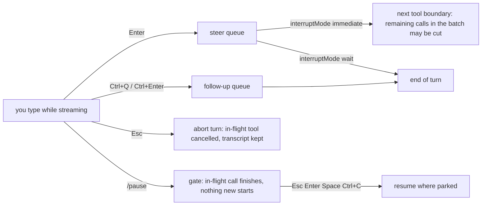

# Module 3 — Prompting & Steering an Agent

| | |
|---|---|
| **Built against** | `omp --version` → `omp/18.3.1` (2026-09-25); audited 2026-09-27 against `omp/18.3.5` (all facts re-verified, no behavior differences found for this module) |
| **Level / time** | basic · ~1.5 h (5 lessons + coursework in `exercises.md`) |
| **Prerequisites** | Module 1 (install, auth) and Module 2 (reading cards, `Ctrl+O`, `@path`, `!cmd`, `Ctrl+Q`) |
| **Start state** | `cd omp-course-lab && git checkout module-3-start` |
| **Fixture** | issue #3 in `docs/ISSUES.md` — *CLI: `orders` has no `--format csv` (export for spreadsheets)* (files: `cli/__main__.py`, `cli/commands.py`; gated test `LAB_ISSUE=3 python3 -m unittest tests.test_issues`, which fails on `main` with `FAILED (failures=1, skipped=18)` and passes with `OK (skipped=18)`) |
| **Goal** | Turn vague requests into verified outcomes; steer mid-turn instead of restarting. |

Everything in this module is either a prompt-writing habit (no omp feature involved) or one of these omp surfaces: thinking level (`Shift+Tab`, `Ctrl+T`, `--thinking`, `ultrathink`), mid-turn control (`Esc`, steer, `Ctrl+Q` follow-ups, `/pause`), side questions (`/btw`), and stream recovery (`/fresh`). Every default in this module is **on** unless a lesson says otherwise.

Card drawings in this module and in `demos/` are schematic (`›` = your message, `●` = a tool card, `⋯` = elided). Glyphs and colors depend on your theme; the *sequence* of cards is what you are learning to read.

---

## Lesson 3.1 — Outcome + acceptance + verification              (~20 min)
**You will be able to:** Write a three-part prompt (outcome, acceptance, verification) for a repo task; predict which cards a good run must contain; explain why "run the tests" belongs in the prompt rather than in your head.
**Why this exists:** A chat assistant answers a question; an agent changes the state of a repository through a loop of tool calls and stops when *it* decides the request is satisfied. If the request does not say what "satisfied" means in checkable terms, the model picks its own definition — usually "the code I wrote looks right" — and reports done. The `bash` card that runs your acceptance command is the only thing in the transcript that is not the model's opinion: a non-zero exit is rendered as an error card whose text ends in `Command exited with code <n>`. Ask for that card explicitly and you turn "done" into evidence.
**Demo:** `demos/3.1-weak-vs-structured-issue3.md` — the same issue #3 driven by `add csv output to the orders command` and by the structured prompt below, side by side.
**Concepts:**
- **Chat prompt vs agent prompt.**

  | | Chat prompt | Agent prompt |
  |---|---|---|
  | Describes | what you want to read | the repo state you want to exist |
  | Success | you like the answer | a command exits 0 and its output is in a card |
  | Ambiguity | model guesses, you re-ask | model guesses, *edits files*, you clean up |
  | Verification | you do it later | part of the request; shown in a `bash` card |

- **The three parts.** Write them as labelled sections; the labels are for you, the model reads prose fine.
  1. **Outcome** — the end state in repo terms: command, flag, file, behavior. Not "make it work".
  2. **Acceptance** — observable checks: exact command + expected exit code/output; what must be unchanged.
  3. **Verification** — the commands omp must *run itself and show*, in order; what to do on failure ("fix and re-run; never report done with a failing run").
- **Attach, don't paraphrase.** `@docs/ISSUES.md` in the composer inlines the file into your message (a `fileMention` entry in the session). From the shell: `omp @docs/ISSUES.md "…"`. Pointing at the issue beats retyping it.
- **The verifying card.** A `bash` card running your acceptance command. Expand it with `Ctrl+O`. Merged stdout+stderr; non-zero exit → error-marked card ending `Command exited with code <n>`; long output is truncated in the card and the full text is available at `artifact://<id>` (shown in the card footer).
- **Ask for the receipt.** End every task prompt with: *"Finish with: files changed (one line each) and the exact commands you ran."* You will compare that list to `!git diff --stat` in Lesson 3.5.
- **The prompt used throughout this module** (copy into `notes/prompt-issue3.md` so you can `@` it later):

  ```text
  Implement issue #3 from @docs/ISSUES.md: add `--format {table,csv}` (default `table`) to the `orders` CLI command.

  Outcome:
  - `python3 -m cli orders --month 2026-03 --format csv` prints CSV to stdout, written with the `csv` module:
    header `id,user_id,created_at,status,total_cents`, then one row per order, `total_cents` as an integer,
    no summary line.
  - The existing default (table) output of `orders` is unchanged.

  Acceptance:
  - `LAB_ISSUE=3 python3 -m unittest tests.test_issues` passes.
  - `python3 -m unittest discover -s tests` still passes.
  - Only files under `cli/` and `tests/` change.

  Verification (run these yourself and show the output):
  1. Run the gated test before changing anything and confirm it fails.
  2. Implement.
  3. Run both test commands and the repro command. If anything fails, fix and re-run.
     Do not report done with a failing run.

  Finish with: files changed (one line each) and the exact commands you ran.
  ```

**Try it (Walkthrough):**
1. `cd omp-course-lab && git checkout module-3-start && omp`
   **Expected:** the TUI opens in the lab; status line shows the model and a context percentage (Module 2).
2. Type the weak prompt exactly: `add csv output to the orders command` → `Enter`. Let the turn finish. Do not answer any question it asks with more than one word.
   **Expected:** some `read`/`grep` cards, one or more `edit` cards, a final message. Note (a) how many tool cards, (b) whether any `bash` card ran a test command, (c) whether the final message names the files it changed.
3. `!git diff --stat` then `!LAB_ISSUE=3 python3 -m unittest tests.test_issues`
   **Expected:** a diff in `cli/`; the gated test may pass or fail — write the result in `notes/m3.md` under **Weak**.
4. Reset: `!git stash push -u -m m3-weak` (ignored `notes/` is not stashed). Quit with `Ctrl+C` twice, then `omp` again so the second run starts from an empty context.
   **Expected:** `git status` clean; new empty session.
5. Paste the structured prompt from **Concepts** (multi-line paste is fine; `Ctrl+G` opens `$EDITOR` if you prefer) → `Enter`.
   **Expected, in order:** the issue text inlined into your message by the `@` mention (no `read` card needed for it) → reads of `cli/__main__.py`, `cli/commands.py`, `tests/test_issues.py` → a `bash` card running the gated test that is **error-marked** (`Command exited with code 1`) → `edit` cards in `cli/` → a `bash` card with the gated test passing → a `bash` card with the full suite passing → a `bash` card with the repro command whose first output line is `id,user_id,created_at,status,total_cents` → a final message listing files and commands.
6. `Ctrl+O` on the last test card; then `!git diff --stat`.
   **Expected:** the card shows `OK` from `unittest`; the diff touches only `cli/` (and possibly `tests/`). Record tool count, "tests ran: yes", and the file list in `notes/m3.md` under **Structured**.
7. Keep this state — Lessons 3.2–3.5 build on it. (`!git stash list` still holds the weak run if you want to diff the two approaches.)

**Guided task:** Tighten acceptance until it is machine-checkable. Goal: rewrite the **Acceptance** section so the CSV *header line* is checked by a command, not by reading. Hints: `python3 -m cli orders --month 2026-03 --format csv | head -1` is a command whose output you can state exactly; put the expected string in the prompt. Checkpoints: (1) your prompt contains a command and its exact expected first line; (2) the run contains a `bash` card for that command. Pass: `Ctrl+O` on that card shows `id,user_id,created_at,status,total_cents` as the first line.

**Stretch:** Ask for test-first. Goal: a prompt for issue #3 that makes omp run the gated test *before* editing and again *after*. Pass: the transcript contains two `bash` cards for `LAB_ISSUE=3 python3 -m unittest tests.test_issues` — the first error-marked (`Command exited with code 1`), the second not — with all `edit` cards between them.

**Troubleshooting:**

| Symptom | Cause | Fix |
|---|---|---|
| Structured run has no `bash` card for the tests | Verification section missing or phrased as a suggestion ("you may want to test") | Use imperative, numbered steps: "Run … and show the output." |
| `@docs/ISSUES.md` stays literal in the sent message | The path did not resolve to a file from omp's cwd | Check `!ls docs`; start omp from the lab root |
| Test card shows `ModuleNotFoundError` | omp ran the command from a different cwd | Add "run from the repo root" to Verification |
| Gated test passes in step 3 for the weak run | The weak prompt happened to do it right | Fine — record it. Compare the *transcripts*, not just the diff: did a verifying card exist? |
| Final message says "tests pass" but no card | The model reported from memory | Lesson 3.5; for now: "Run `<cmd>` now and show the output." |

**Cheat sheet:**

| Item | Value |
|---|---|
| Three parts | Outcome → Acceptance (command + expected) → Verification (run + show; fix on failure) |
| Inline a file | `@path/to/file` in the composer; `omp @file "prompt"` from the shell |
| Verifying card | `bash` card; error-marked + `Command exited with code <n>` on failure; `Ctrl+O` expands |
| Receipt | "Finish with: files changed (one line each) and the exact commands you ran." |
| Diff check | `!git diff --stat` |

**Source:** omp://tools/bash.md, omp://session.md (`fileMention`), omp://keybindings.md (`app.tools.expand`, double-`Ctrl+C` exit, `app.editor.external`), `omp --help` (`@file` messages)

---

## Lesson 3.2 — Scope control              (~15 min)
**You will be able to:** State non-goals and hard boundaries in a prompt; make omp ask instead of guess when a request is ambiguous; confirm the boundary held with one command.
**Why this exists:** An agent optimizes toward your acceptance criteria along the shortest path it can see. If a neighboring function is "wrong", if a test elsewhere is flaky, if the formatter disagrees with the file — nothing in the acceptance section stops it from fixing those too, and now your diff is three problems instead of one. Scope is stated as *what not to do* ("do not touch `api/`"), *what must survive unchanged*, and *when to stop and ask*. omp has a dedicated `ask` tool for the last case: it renders an option picker in the TUI and blocks the turn until you answer, so "if ambiguous, ask" is a real instruction, not a hope.
**Demo:** `demos/3.2-scope-and-ask.md` — an ambiguous CSV-escaping question turned into an `ask` card, and a scope violation caught by `!git diff --stat`.
**Concepts:**
- **Non-goals.** A bulleted "Not in scope" list: other issues, refactors, formatting, dependency changes. Non-goals are cheaper than approvals: they stop the work before it starts.
- **Do-not-touch.** Name paths: "Do not modify anything under `api/` or `generated/`." Name behaviors: "Existing `orders` default output must be byte-for-byte unchanged."
- **Ask-before.** Name the decision, not the file: "Before changing the CLI's exit codes, ask." The model calls `ask`, which is only available in interactive mode (headless `-p` runs have no `ask` tool). The card shows an option picker (the tool guidance says 2–5 options) plus `Other (type your own)`. `ask.timeout` (default `0` = wait forever) and `ask.notify` (default `on` — terminal notification "Waiting for input") are the two settings.
- **"If ambiguous, ask; otherwise state your assumption and proceed."** Both halves matter: without the second, a cautious model asks about everything; without the first, it guesses silently. Decide per task which failure you prefer.
- **Budgets.** "At most 2 files", "no new dependencies", "no new files outside `tests/`". Budgets are easy to verify with `!git diff --stat`.
- **Where a constraint should live.** In the prompt if it is task-specific (this module). Approval prompts and plan mode (Module 4) enforce limits the model cannot talk its way past. Repo-wide rules that apply to every session belong in project files (Module 6).
- **Verify the boundary, always:** `!git diff --stat` — if a path you excluded is listed, the run failed regardless of tests.

**Try it (Walkthrough):**
1. Still in the lab, still in the session from 3.1 (or `omp` fresh — either works). Send:
   ```text
   Follow-up to issue #3. Quote CSV fields correctly: a field containing a comma, quote, or newline
   must be double-quoted per RFC 4180.

   Not in scope: any other command, any change under api/ or generated/, reformatting, new dependencies.
   Do not change the default (non-csv) output.
   If it is unclear whether `status` values can contain commas, ask me before choosing an approach.

   Verify: LAB_ISSUE=3 python3 -m unittest tests.test_issues and python3 -m unittest discover -s tests.
   Finish with files changed and commands run.
   ```
   **Expected:** either an `ask` card (option picker: e.g. "quote every field" / "quote only when needed" / `Other`) — answer it — or a one-line stated assumption followed by edits. No `edit` card outside `cli/` and `tests/`.
2. `!git diff --stat`
   **Expected:** only `cli/…` and `tests/…` paths. If `api/` appears: the boundary failed; say so in the next prompt ("You changed `api/…`, which was out of scope. Revert that file only.") and re-check.
3. `!python3 -m unittest discover -s tests`
   **Expected:** `OK`.

**Guided task:** Force the question. Goal: send a deliberately under-specified request for the lab (e.g. "export orders somewhere spreadsheet-friendly") with a scope section that requires omp to ask about *format* and *destination* before editing. Hints: "Do not edit any file until you have asked …"; list the two decisions explicitly. Checkpoints: (1) an `ask` card appears; (2) it appears *before* the first `edit` card. Pass: the transcript order is `read…` → `ask` → `edit…`, and `!git diff --stat` lists only `cli/`.

**Stretch:** Budget enforcement. Goal: a prompt for the same follow-up with "at most 2 files changed, no new files" and a verification step that *omp itself* runs `git diff --stat` and counts. Pass: a `bash` card with `git diff --stat` whose summary line reports `2 files changed` (or fewer), and the final message repeats that number.

**Troubleshooting:**

| Symptom | Cause | Fix |
|---|---|---|
| No `ask` card even though the prompt says "ask" | Instruction was conditional and the model judged it unambiguous | Make it unconditional for this run: "Before any edit, ask me which quoting strategy to use." |
| `ask` never appears in `omp -p` runs | `ask` requires interactive mode; it is not registered headless | Use the TUI for tasks that need questions |
| Option picker has no option you want | Normal | Pick `Other (type your own)` and type it |
| Terminal bell/notification when it asks | `ask.notify` is `on` by default | `omp config set ask.notify off` |
| Diff includes `api/` despite "do not touch" | Model decided the fix required it | Revert that path, re-state the boundary, and add "if the change seems to require touching `api/`, stop and ask" |

**Cheat sheet:**

| Item | Value |
|---|---|
| Non-goals | "Not in scope: …" bulleted list |
| Hard boundary | "Do not modify anything under `<path>`" |
| Ask gate | "If ambiguous, ask; otherwise state your assumption and proceed." |
| `ask` tool | interactive only; option picker + `Other (type your own)` |
| `ask.timeout` / `ask.notify` | `0` (no timeout) / `on` — both defaults |
| Boundary check | `!git diff --stat` |

**Source:** omp://tools/ask.md, omp://settings.md (`ask.timeout`, `ask.notify`), omp://bash-tool-runtime.md (`!cmd` surface)

---

## Lesson 3.3 — Thinking effort              (~15 min)
**You will be able to:** Change the thinking level for a session (`Shift+Tab`, `--thinking`) and see its effect (`Ctrl+T`, status line); use `ultrathink` for one hard turn and explain exactly what it does; find and flip the magic-keyword toggles.
**Why this exists:** Reasoning models can spend a variable budget of hidden tokens "thinking" before they act. More thinking is slower and costs more but catches multi-step mistakes; less is faster for mechanical work. omp exposes this as a per-session *thinking level* with a default of `high`, a key to cycle it, a key to show or hide the thinking text, and one magic word — `ultrathink` — that escalates a single turn. You choose the level per task the same way you choose how carefully to read a diff.
**Demo:** `demos/3.3-thinking-cycle.md` — cycling with `Shift+Tab`, toggling blocks with `Ctrl+T`, and an `ultrathink` turn.
**Concepts:**
- **Levels:** `off`, `minimal`, `low`, `medium`, `high`, `xhigh`, `max`, `auto` (CLI `--thinking=<level>`). Not every model exposes every level; a level the model cannot honor is clamped by the transport (a model that requires an effort turns `off` into its lowest effort).
- **Default:** `defaultThinkingLevel: high` (`omp config get defaultThinkingLevel`). Enum in settings: `minimal|low|medium|high|xhigh|max|auto`.
- **Cycle for this session:** `Shift+Tab` (`app.thinking.cycle`). The prompt border color changes per level (theme tokens `thinkingOff` … `thinkingMax`) and the status line shows the level as an icon on the model name; set `statusLine.compactThinkingLevel: false` to get a ` · <level>` text suffix instead. The level is part of session state: `/dump` output lists "Active model/thinking level", and a resumed session restores it.
- **Set for one run:** `omp --thinking low`. Per-model suffix: `omp --model <selector>:low` (suffix `off|minimal|low|medium|high|xhigh|max`).
- **See it:** `Ctrl+T` (`app.thinking.toggle`) shows/hides thinking blocks in the transcript. Display only: `--hide-thinking` / `hideThinkingBlock: true` hide the text; they do **not** turn thinking off — `--thinking off` does.
- **Budgets:** `thinkingBudgets.<level>` token budgets (`minimal 1024`, `low 2048`, `medium 8192`, `high 16384`, `xhigh 32768`, `max 32768`). Leave them alone unless a provider bill tells you otherwise.
- **`auto`:** a classifier picks a level per turn, capped by `providers.autoThinkingMaxEffort` (default `xhigh`, so only `ultrathink` reaches `max`).
- **`ultrathink`** (magic keyword, on by default): a standalone lowercase prose word anywhere in your prompt. It adds a hidden, user-attributed "reason carefully, multi-step" notice for **that turn only**. If the session is on `auto`, it also selects the highest effort the model supports for that turn. On a fixed level it does *not* change the level — only the notice is added. Matching rules: exact lowercase (`Ultrathink` does not trigger); standalone (`ultrathink,` yes; `ultrathink.ts`, `ultrathink()` no); ignored inside code fences, inline code, and HTML comments. The composer highlights a recognized keyword with an animated gradient — no gradient, no trigger.
- **The other keywords** — `orchestrate`, `workflowz`, `jevify` — exist and are on by default; they drive multi-agent and bulk-judgment workflows and are covered in Module 10. Until then, avoid typing them as bare words.
- **Toggles:** `magicKeywords.enabled` (global) and per-keyword `magicKeywords.ultrathink`, `.orchestrate`, `.workflow` (note: not `workflowz`), `.jevify` — all default `true`. `/settings` → Interaction → Magic Keywords, or `omp config set magicKeywords.ultrathink false`. Disabling does not remove the gradient.

**Try it (Walkthrough):**
1. In the lab: `omp`. Look at the status line's model segment and the prompt border.
   **Expected:** a thinking icon next to the model name; border color for `high`.
2. Press `Shift+Tab` repeatedly.
   **Expected:** the icon and border change each press. Stop on `low`.
3. Send: `Explain in five lines how cli/__main__.py parses --month.` Then press `Ctrl+T`.
   **Expected:** a short (or no) thinking block appears above the answer when blocks are shown; `Ctrl+T` hides it again.
4. `Shift+Tab` to `high` (or `xhigh` if offered). Send the same question.
   **Expected:** a longer thinking block. Same answer quality for a question this small — that is the point: level is a cost dial, not a quality switch.
5. Type (do not send yet): `ultrathink about whether the csv writer in cli/commands.py handles a status value containing a comma; list every branch you checked`
   **Expected:** the word `ultrathink` renders with a gradient in the composer. Send it.
6. `Ctrl+T` to view thinking.
   **Expected:** a visibly more deliberate block than step 4 (the notice, not the level, is doing this on a fixed level). Add "ultrathink: notice only on fixed level; also max effort on `auto`" to `notes/m3.md`.
7. In another shell: `omp config get magicKeywords.ultrathink` and `omp config get defaultThinkingLevel`.
   **Expected:** `true` and `high`.

**Guided task:** Launch-time and session-time levels. Goal: start a session at `low`, prove it, raise it to `high` without restarting, prove that too. Hints: `omp --thinking low`; `statusLine.compactThinkingLevel: false` makes the level readable as text; `Shift+Tab`. Checkpoints: (1) status line reads `… · low` after launch; (2) reads `… · high` after cycling. Pass: both readings written in `notes/m3.md`, then `omp config reset statusLine.compactThinkingLevel`.

**Stretch:** Make `ultrathink` change the *level*, not just the notice. Goal: run the same hard question once on a fixed level and once on `auto` with `ultrathink`. Hint: `omp --thinking auto`. Pass: on `auto`, the status line/border shows a higher level during the `ultrathink` turn than during the plain turn; on the fixed level it does not change. (Coursework S in `exercises.md` extends this.)

**Troubleshooting:**

| Symptom | Cause | Fix |
|---|---|---|
| `Shift+Tab` does nothing | Terminal does not send Shift+Tab (kbd protocol, Module 1) or the key is remapped | `/hotkeys` to see the live chord; remap `app.thinking.cycle` in `~/.omp/agent/keybindings.yml` |
| No thinking block ever appears | Level `off`, blocks hidden, or model has no visible reasoning | `Ctrl+T`; check `omp config get hideThinkingBlock`; raise the level |
| `ultrathink` has no gradient | Capitalized, glued to letters/digits/`_`/`-`/`/`/a file extension/call syntax (`ultrathink()`), or inside backticks | Lowercase, standalone word in prose (sentence punctuation and quotes may touch it) |
| Gradient shows but no effect | `magicKeywords.enabled` or `.ultrathink` is `false` (gradient stays even when disabled) | `omp config get magicKeywords.enabled` |
| Turn is slow/expensive after `ultrathink` on `auto` | It selected the model's top effort | Expected; use it for hard turns only |

**Cheat sheet:**

| Item | Value |
|---|---|
| Cycle level | `Shift+Tab` (`app.thinking.cycle`) |
| Show/hide blocks | `Ctrl+T` (`app.thinking.toggle`); `--hide-thinking`; `hideThinkingBlock` (display only) |
| Set for run | `--thinking off\|minimal\|low\|medium\|high\|xhigh\|max\|auto`; `--model <sel>:<level>` |
| Default | `defaultThinkingLevel: high` |
| Status line text level | `statusLine.compactThinkingLevel: false` |
| `ultrathink` | lowercase standalone prose; this turn only; notice + (on `auto`) top effort |
| Toggles | `magicKeywords.enabled`, `.ultrathink`, `.orchestrate`, `.workflow`, `.jevify` — all `true` |
| Auto cap | `providers.autoThinkingMaxEffort: xhigh` |

**Source:** omp://magic-keywords.md, omp://keybindings.md, omp://settings.md (Thinking; `providers.autoThinkingMaxEffort`), omp://cli-reference.md (`--thinking`, `--hide-thinking`), omp://models.md (`:thinkingLevel` suffix), omp://theme.md (thinking borders), omp://session-operations-export-share-fork-resume.md (`/dump` contents), `omp config get statusLine.compactThinkingLevel --json`

---

## Lesson 3.4 — Steering              (~25 min)
**You will be able to:** Stop a turn with `Esc`; redirect a running turn by typing (steer) versus queuing work for after it (`Ctrl+Q`); freeze everything with `/pause`; ask a side question with `/btw` without touching the main transcript; recover a wedged provider stream with `/fresh` without losing the conversation.
**Why this exists:** Restarting is the expensive way to correct an agent: you lose the context it built and pay to rebuild it. omp gives you four cheaper moves, ordered by how much they disturb the run. *Steer* (type + `Enter` while it works) injects your message at the next tool boundary and can cancel the remaining tool calls in that batch. *Follow-up* (`Ctrl+Q`) waits until the turn is over. `Esc` aborts the turn but keeps everything already in the transcript. `/pause` parks the agent — and its subagents — at a safe boundary without aborting anything. Two more commands keep you from polluting or abandoning a session: `/btw` runs a side question with the current context but stores it outside the transcript, and `/fresh` discards only the provider-side stream state (cache/conversation handles) when a stream is wedged, keeping the local transcript intact.
**Demo:** `demos/3.4-steer-and-queue.md`, `demos/3.4-btw-side-question.md`, `demos/3.4-pause-and-fresh.md`.
**Concepts:**
- **`Esc` — abort the running turn.** In-flight tool calls are cancelled (a running `bash` call ends as a user abort). What was already streamed stays in the transcript. The advisor (Module 11) treats this as a deliberate stop. **Gotcha:** `Esc` twice on an *empty* composer opens the transcript rewind selector (`doubleEscapeAction: rewind`, the default); press `Esc` once, or set `doubleEscapeAction: none` if you keep tripping it.
- **Steer — type and `Enter` while streaming.** Free-text `Enter` during a turn queues a *steering* message. With `interruptMode: immediate` (default) the runtime checks the steering queue between tool calls; a pending steer can abort the remaining tool calls of the current batch and the model reads your message next. `interruptMode: wait` defers delivery to the end of the turn. `steeringMode: one-at-a-time` (default) delivers one queued steer per turn; `all` drains the queue at once.
- **Follow-up — `Ctrl+Q` or `Ctrl+Enter`** (`app.message.followUp`). Queued to run *after* the current turn ends; the current turn is untouched. `followUpMode` mirrors `steeringMode`. `Alt+Up` / `Shift+Up` (`app.message.dequeue`) pulls a queued message back into the editor. Windows Terminal swallows `Ctrl+Enter`; use `Ctrl+Q`.
- **Draft safety.** `Ctrl+C` clears the draft; `Up` recalls it (`composer.recallClearedDrafts: true`). `Ctrl+C` twice exits omp.
- **`/pause`** — TUI only. A process-global gate for the main agent, in-process subagents, and the advisor. Each parks at its next safe boundary: in-flight calls finish, nothing is aborted, no new work starts. Resume from the pause screen with `Esc`, `Enter`, `Space`, or `Ctrl+C` — `Ctrl+C` here resumes, it does not abort.
- **`/btw <question>`** — an independent side question that sees the *current* main-session context but is not appended to the main transcript and is not sent as history to later main turns. The answer opens in an inline panel. Keys while a panel is showing: `Esc` cancels a running answer (partial text kept as `Cancelled`) / closes a finished panel; `c` copies the answer; `f` opens a follow-up on that topic (main editor must be empty and focused); `b` promotes a completed *single-turn* answer to a chat branch (only if the main session is idle and unchanged since the question). Bare `/btw` opens the side-question history: `Up`/`Down` select, `Tab` switches history⇄details, `Enter`/`f` follow-up. One BTW request at a time; a new one is refused while another runs. History is saved under the session's artifact directory in `btw-history/` (in memory only with `--no-session`) and is **excluded** from `/export` and `/share`. `/move`, `/wt`, and a persistent `!cd` refuse to relocate while a BTW request is running.
- **`/fresh`** — resets provider-facing stream state only: closes cached provider-session/prompt-cache handles, mints a new provider session id, and makes the next turn re-send the full local transcript. Transcript, session file, and session identity are untouched. Rejected while streaming — `Esc` first. Use it when a stream wedges (stale prompt cache, mid-turn glitch, drifted server-side conversation id). For a turn that simply *failed*, try `Alt+R` (`app.retry`, retry the last failed assistant turn) first. `/fresh` is not `/clear`, `/new`, or `/delete` (Module 5): those drop or replace the conversation; `/fresh` keeps it.

**Try it (Walkthrough):**
1. In the lab, send a task with several tool calls: `For every function in cli/ and api/, read the file and write a one-line description into notes/functions.md, one section per file.`
   **Expected:** a stream of `read` cards begins.
2. While cards are still appearing, type `Only cli/. Skip api/ entirely.` → `Enter`.
   **Expected:** your message appears as a queued/steering message; at the next tool boundary the model acknowledges it and stops reading `api/`. (With a very fast model the turn may finish first — then it lands as a normal prompt; retry with the follow-up in step 3 to see the difference.)
3. Send `Now do the same for api/ into notes/functions-api.md.` and, while it runs, type `When finished, run git status --short and show it.` → `Ctrl+Q`.
   **Expected:** a queued-follow-up indicator; the running turn is not interrupted; after it ends, the follow-up runs and a `bash` card with `git status --short` appears.
4. Send another long task, then press `Alt+Up` after queuing a follow-up with `Ctrl+Q`.
   **Expected:** the queued text returns to the editor unsent. `Ctrl+C` to clear it; `Up` recalls it.
5. Send a long task; press `Esc` once while a tool card is in progress.
   **Expected:** the turn stops; the partial transcript remains; the composer is ready. Press `Esc` once more with an empty editor.
   **Expected:** the rewind selector opens (default `doubleEscapeAction: rewind`) — close it with `Esc`. You have now seen the gotcha.
6. Send a long task, then `/pause`.
   **Expected:** the pause screen; the in-flight tool call completes, then nothing new starts. Press `Space`.
   **Expected:** the turn continues where it parked.
7. When idle: `/btw What does the function that renders the orders table in cli/commands.py return, and who calls it?`
   **Expected:** an inline panel with the answer; the main transcript has **no** new user message. Press `c` to copy, then `Esc` to close. Type `/btw` → `Enter`.
   **Expected:** the history view with your question selected; `Esc` closes it.
8. When idle: `/fresh`.
   **Expected:** a notice that provider session state was pruned (a count); the transcript is unchanged. Send `What was my very first message in this session?`
   **Expected:** it answers correctly — the local transcript was re-sent.

**Guided task:** Redirect scope mid-turn, then queue. Goal: start a broad task for issue #3's follow-up (quoting rules), steer it to a narrower scope while it runs, and queue a verification follow-up. Hints: steer text: `Stop — only change the csv branch, leave table rendering alone.`; follow-up text: `Run LAB_ISSUE=3 python3 -m unittest tests.test_issues and show the output.` via `Ctrl+Q`. Checkpoints: (1) the steer is acknowledged before the turn ends; (2) the follow-up runs after. Pass: transcript order is `edit…` → your steer → `edit…` (cli only) → turn end → follow-up `bash` card with `OK`.

**Stretch:** Delivery modes. Goal: observe `interruptMode: wait`. Steps: `omp config set interruptMode wait`, repeat walkthrough step 2. Pass: the steer is delivered only after the turn completes (no mid-batch acknowledgement), then `omp config reset interruptMode` and `omp config get interruptMode` prints `immediate`.

**Troubleshooting:**

| Symptom | Cause | Fix |
|---|---|---|
| Typed steer is only picked up at the end | Turn had no further tool calls, or `interruptMode: wait` | Normal; check `omp config get interruptMode` |
| `Ctrl+Enter` does nothing | Terminal (Windows Terminal, some multiplexers) swallows it | Use `Ctrl+Q` |
| `Ctrl+Q` opens something else | Your `keybindings.yml` maps `Ctrl+Q` to another action | Bind `app.message.followUp` explicitly or use `Ctrl+Enter` |
| Esc opened a full-screen transcript picker | Double-`Esc` on empty editor = rewind selector | `Esc` to close; `omp config set doubleEscapeAction none` if unwanted |
| `/btw` refused: another request running | One BTW at a time | `Esc` the running one, or wait |
| `/btw` history empty after restart | Session was `--no-session` | History is memory-only without a session file |
| `/fresh` refused | Agent is streaming | `Esc`, then `/fresh` |
| `/move` refuses while a BTW is running | By design | Finish or cancel the BTW first |

**Cheat sheet:**

| Item | Value |
|---|---|
| Abort turn | `Esc` (once; twice on empty editor = rewind selector) |
| Steer | type + `Enter` while streaming; `interruptMode: immediate` (default) / `wait`; `steeringMode: one-at-a-time` / `all` |
| Follow-up | `Ctrl+Q` / `Ctrl+Enter`; dequeue `Alt+Up` / `Shift+Up`; `followUpMode` |
| Draft | `Ctrl+C` clear, `Up` recall; `Ctrl+C` ×2 exits |
| `/pause` | park everything; resume `Esc`/`Enter`/`Space`/`Ctrl+C` |
| `/btw <q>` | side question; panel keys `Esc` `c` `f` `b`; bare `/btw` = history |
| `/fresh` | reset provider stream state only; needs idle; keeps transcript |
| Retry failed turn | `Alt+R` |

**Source:** omp://keybindings.md, omp://slash-command-internals.md (§10 `/pause`, §11 `/btw`, §8 streaming), omp://session-operations-export-share-fork-resume.md (Fresh), omp://settings.md (Interaction), omp://rpc.md (mode semantics), omp://tree.md (double-escape), omp://skills.md (`Enter` steers while streaming)

---

## Lesson 3.5 — Reading the result critically              (~15 min)
**You will be able to:** Decide in under a minute whether a "done" message is backed by evidence; get a per-file diff summary from omp and cross-check it; recover full output from a truncated card.
**Why this exists:** The final assistant message is a claim. Everything that makes it true is in the cards above it: `edit` cards show what changed, `bash` cards show what was run and how it exited. A message that says "all tests pass" with no `bash` card behind it is a guess dressed as a report — and models do produce those, especially after long turns. Reading critically means: find the card, expand it, compare it to the claim, and if there is no card, ask for one.
**Demo:** `demos/3.5-verifying-card.md` — a claim without a card, the prompt that forces one, and the truncation footer.
**Concepts:**
- **Three questions per result.** (1) *Which command proves it?* Find the `bash` card; `Ctrl+O` expands it. Error-marked + `Command exited with code <n>` = it failed, whatever the prose says. (2) *Does the diff match the claim?* Ask: `Summarize the diff per file: path — what changed — why. Then paste git diff --stat.` Compare with your own `!git diff --stat`. (3) *Was anything cut?* A card with a truncation footer (`[raw output: artifact://<id>]` or a truncation note with an artifact id) holds more than you see — ask omp to `read artifact://<id>` and report the tail, or the specific error.
- **No card → no credit.** Reply: `You said the tests pass but I see no test run. Run <cmd> now and show the output.` Then check the exit.
- **Keep tool activity visible while reviewing.** `Ctrl+Shift+O` (`app.tools.toggleVisibility`) hides all tool cards — great for reading prose, terrible for auditing. Toggle it back before judging.
- **Cheap cross-checks from the composer:** `!git diff --stat`, `!git status --short`, `!python3 -m unittest discover -s tests`. They run in your shell without a model turn and appear as your own execution blocks. They are recorded in the transcript (a `bashExecution` message) and go to the model with your next prompt, so keep their output short.
- **Watch for the word "should".** "This should work", "tests should pass" — unverified. Ask for the run.
- Module 4 adds `/review` and `/annotate` for structured review; this lesson is the manual habit they build on.

**Try it (Walkthrough):**
1. With the issue #3 change in the working tree (Lesson 3.1/3.2), send: `Summarize the diff per file: path — what changed — why. Then run git diff --stat and paste it.`
   **Expected:** a prose list plus a `bash` card with `git diff --stat`.
2. `!git diff --stat`
   **Expected:** identical file list. If omp's list mentions a file `git` does not, or vice versa, note it in `notes/m3.md` — that is exactly the kind of drift you are learning to spot.
3. Find the last test card; press `Ctrl+O` on it.
   **Expected:** `unittest` output ending in `OK`; no error mark on the card.
4. Send: `Run python3 -m unittest discover -s tests -v and show all output.` Expand the card.
   **Expected:** verbose per-test lines. If the card is truncated, the footer names an `artifact://<id>`; send `Read artifact://<id> and list any test that did not print ok.`
   **Expected:** a `read` card on the artifact and a short answer.
5. `Ctrl+Shift+O` twice.
   **Expected:** cards disappear, then reappear. Leave them visible.

**Guided task:** Catch an unbacked claim. Goal: find one sentence in this session's transcript that asserts something no card proves (a test result, a behavior, a file state) and get a card for it. Hints: scroll up; search for "should", "passes", "works". Checkpoints: (1) you can name the claim; (2) you can name the command that would prove it. Pass: a new `bash` or `read` card exists whose output confirms or refutes the claim, and `notes/m3.md` records which it was.

**Stretch:** Produce a false "done" on purpose, then catch it. Goal: `Implement issue #3's quoting follow-up but do not run any tests; just report when done.` then ask `Did the tests pass?` Pass: `notes/m3.md` records the first answer (a guess — no card) and the exit code of the test card you then forced with `Run … and show the output.`

**Troubleshooting:**

| Symptom | Cause | Fix |
|---|---|---|
| Can't find the test card | Tool activity hidden | `Ctrl+Shift+O` |
| Card shows `OK` but `!python3 -m unittest …` fails for you | Different cwd or env (`LAB_ISSUE`) | Compare the card's command line with yours exactly |
| `artifact://<id>` read fails | Artifact belongs to another session | Re-run the command in this session |
| omp's per-file summary lists a file with no diff | Model summarized from memory of edits, one of which was reverted | Trust `git diff --stat`; ask omp to re-read the diff |
| Prose says "should pass" | Unverified | "Run it now and show the output." |

**Cheat sheet:**

| Item | Value |
|---|---|
| Expand card | `Ctrl+O` |
| Hide/show all cards | `Ctrl+Shift+O` |
| Failure signature | error-marked card + `Command exited with code <n>` |
| Truncated output | footer with `artifact://<id>` → "Read artifact://<id> …" |
| Diff summary prompt | "Summarize the diff per file: path — what changed — why. Then run `git diff --stat`." |
| Own cross-check | `!git diff --stat`, `!git status --short` |
| No card | "Run `<cmd>` now and show the output." |

**Source:** omp://tools/bash.md (exit codes, truncation, `artifact://` footer), omp://keybindings.md (`app.tools.expand`, `app.tools.toggleVisibility`), omp://bash-tool-runtime.md (`!cmd` execution component), omp://session.md and omp://compaction.md (`bashExecution` message role is conversation input)

---

## Reference — where a message lands while a turn is running

All five mid-turn moves from Lesson 3.4 are the same question asked of the runtime: *at which boundary does my text reach the model?*



| Queue | Delivered | Setting (default) | Dequeue |
|---|---|---|---|
| steer | between tool calls (`immediate`) or after the turn (`wait`) | `interruptMode: immediate`; `steeringMode: one-at-a-time` | `Alt+Up` / `Shift+Up` |
| follow-up | after the turn ends | `followUpMode: one-at-a-time` | `Alt+Up` / `Shift+Up` |

`one-at-a-time` delivers one queued message per turn; `all` drains the whole queue at once. Slash commands typed while streaming go through the same queues after expansion — except extension-registered commands, which execute immediately (Module 12). Compaction (Module 5) preserves queued steer/follow-up messages and replays them afterwards.

Things that are **not** queues: `/btw` runs beside the main session and never enters its transcript; `/fresh` is refused while streaming and touches only provider-side state.

**Source:** omp://rpc.md (mode semantics), omp://settings.md (Interaction), omp://slash-command-internals.md (§8 streaming path), omp://compaction.md (queued steer/follow-up on resume)

---

## Coursework

See `exercises.md` (W / G / G / S with pass conditions) and `cheatsheet.md`. Instructor notes are in `solutions/`.

## Prompt skeleton (copy)

```text
<Task in one sentence, pointing at @docs/ISSUES.md or the file.>

Outcome:
- <end state, as commands/flags/files/behavior>

Acceptance:
- <command> → <expected exit/output>
- <what must stay unchanged>

Not in scope: <list>. Do not modify <paths>.
If <specific ambiguity>, ask before editing; otherwise state your assumption and proceed.

Verification (run these yourself and show the output):
1. <check before>
2. Implement.
3. <checks after>; on failure fix and re-run. Do not report done with a failing run.

Finish with: files changed (one line each) and the exact commands you ran.
```
