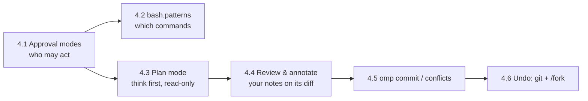

# Module 4 — Staying in Control: Approvals, Plan Mode, Review, Commit

| | |
|---|---|
| **Level** | basic → intermediate |
| **Estimated time** | ~2 h |
| **Built against** | `omp --version` → `omp/18.3.1` |
| **Prerequisites** | Modules 1–3 (a working login, the TUI card vocabulary from M2, three-part prompts from M3) |
| **Practice repo** | `omp-course-lab`, start from `git checkout module-4-start` |
| **Fixtures used** | issue #4 (`stats` CLI subcommand — triggers several `edit` + `bash` approvals), issue #5 (order cancellation; sub-item (c) "email the customer" is out of scope), branch `conflict-lab` (merged into a scratch branch off `main`, it conflicts in `api/server.py` and `cli/__main__.py`) |
| **Lab test command** | `python3 -m unittest discover -s tests` (gated issue tests: `LAB_ISSUE=N python3 -m unittest tests.test_issues`) |

**Goal:** Choose how much autonomy omp gets, plan before implementing, review its work with your own notes, and commit cleanly.

The single most important fact in this module: **omp ships with `tools.approvalMode: yolo`** — every tool call, including shell commands and file writes, is auto-approved unless you change something. Every lesson below is a dial you can turn down (or, after you trust a workflow, back up).

How the module fits together:



---

## Lesson 4.1 — Approval modes              (~25 min)
**You will be able to:** name the three approval tiers and three modes; switch mode for one session or permanently; add a per-tool `allow|deny|prompt` override; read an approval prompt card.
**Why this exists:** An autonomous agent that runs `bash` and rewrites files is only useful if you decide *in advance* how much it may do without you. omp resolves every tool call against a small, deterministic policy — the tool's declared tier, the tool's own safety policy, your per-tool override, and the active mode — so that "will this prompt me?" has one answer you can predict. The default answer is **no, it will not prompt** (`yolo`), which is right for a scratch repo and wrong for production checkouts; this lesson makes that choice deliberate.
**Demo:** `demos/4.1-approval-prompt.md`
**Concepts:**
- Every tool declares an **approval tier**: `read` (reads data / UI-only session metadata), `write` (mutates workspace or session state, no arbitrary code), `exec` (runs code, shells out, drives a browser, spawns agents). Tools without a declaration are treated as `exec`. MCP server tools declare `write`.
- **Modes** (`tools.approvalMode`):

  | Mode | Auto-approves | Prompts for |
  |---|---|---|
  | `always-ask` | `read` | `write`, `exec` |
  | `write` | `read`, `write` | `exec` |
  | `yolo` **(default)** | `read`, `write`, `exec` | none |

  Confirm on your machine: `omp config get tools.approvalMode` → `yolo` on a fresh install.
- **Per session:** `omp --approval-mode always-ask|write|yolo`. `--auto-approve` and `--yolo` force `yolo` for the session. These are runtime overrides: they win over every config file and are never persisted.
- **Persistent:** `omp config set tools.approvalMode write` writes `~/.omp/agent/config.yml`. A project can pin its own value in `<repo>/.omp/config.yml` (layering is Module 6; precedence is runtime flag > `--config` overlay > project > global).
- **Per-tool override** `tools.approval.<toolName>: allow | deny | prompt`, honored in every mode:
  ```yaml
  tools:
    approvalMode: write
    approval:
      bash: prompt
      read: allow
      mcp__filesystem_delete: deny
  ```
  From the shell: `omp config set tools.approval '{"bash":"prompt"}'`. A user override cannot bypass a tool's own `deny`/`prompt` policy, and in non-yolo modes it cannot bypass a tool's safety override either.
- **Resolution order per call** (why a given call prompts or not):
  1. The tool's own `approval(args)` decision is evaluated; missing/malformed → tier `exec`.
  2. Tool `policy: deny` always denies; then a user `deny` always denies.
  3. In `yolo`: an explicit tool `allow`/`prompt` wins; otherwise your user policy wins; otherwise allowed. A bare safety `override` alone does **not** force a prompt in `yolo`.
  4. In `always-ask`/`write`: a safety `override: true` allows only with an accompanying tool `policy: allow`; every other non-denied case prompts.
  5. Otherwise explicit tool `allow`/`prompt` wins, then your user policy.
  6. With no explicit policy, the mode auto-approves or prompts by tier.
- **The prompt card** shows `Allow tool: <name>`, `Origin: MCP server tool` for unannotated `mcp__…` tools, `Reason: <reason>` when the tool supplies one (e.g. `bash`'s "Critical pattern detected"), and tool-specific detail lines (command, path, code, browser action, subagent assignment). Choose the allow or deny option to continue; a denied call returns an error to the model, which then decides what to do next.
- **Subagents** (Module 10) run headless in `yolo`; the parent `task` approval is the boundary. Your `tools.approval.<tool>` still applies: `deny` blocks, `allow` permits, `prompt` cannot be satisfied headless and rejects the call.
- Approval is **not a sandbox**: an approved command keeps the shell's full filesystem, network and subprocess access (details in 4.2).

**Try it (Walkthrough):**
1. In `omp-course-lab`, run `omp config get tools.approvalMode`.
   **Expected:** `yolo` (unless you changed it in Module 1).
2. Start a session with the strictest mode for this run only: `omp --approval-mode always-ask`.
   **Expected:** the TUI opens; nothing else changes yet.
3. Prompt: `Read docs/ISSUES.md and summarize issue #4 in two sentences. Do not change anything.`
   **Expected:** `read` cards run without prompting (tier `read`).
4. Prompt: `Fix issue #4 (add the stats subcommand) as described. Run python3 -m cli stats and python3 -m unittest discover -s tests before and after.`
   **Expected:** the first `bash` or `edit` call stops on an approval card (`Allow tool: bash` with the command shown). Approve the test run; when the first `edit` card appears, **deny** it once and read what the model says next; then let it retry and approve.
5. Quit (`/quit`) and run `omp config get tools.approvalMode`.
   **Expected:** still `yolo` — `--approval-mode` was session-only.
6. Make a persistent per-tool rule: `omp config set tools.approval '{"bash":"prompt"}'`, then `omp config get tools.approval`.
   **Expected:** `{"bash":"prompt"}`. Now even in `yolo`, `bash` prompts; `edit`/`write` do not.

**Guided task:** Set mode `write` globally and decide which single tool you want prompted on top of it.
- Hints: `omp config set tools.approvalMode write`; `tools.approval` takes a JSON object from the shell; `omp config reset tools.approval` clears it.
- Checkpoints: `omp config get tools.approvalMode` → `write`; a session run of issue #4 prompts only for `exec`-tier calls (`bash`), never for `edit`.
- Pass condition: `omp config list --json` shows both keys with your values, and one transcript in `notes/m4-approvals.md` lists which cards prompted.

**Stretch:** Run `omp --yolo` while `tools.approval.bash: prompt` is set. Pass condition: `bash` still prompts (user `prompt` policy is enforced in `yolo`); record the resolution step (from the list above) that explains it.

**Troubleshooting:**

| Symptom | Cause | Fix |
|---|---|---|
| Nothing ever prompts | Default mode is `yolo` | `omp --approval-mode write` for a session, or `omp config set tools.approvalMode write` |
| `edit` prompts even in `write` mode | A `tools.approval.edit: prompt` override, or the tool declared `exec` | `omp config get tools.approval`; reset with `omp config reset tools.approval` |
| Subagent errors with a rejected tool call | `tools.approval.<tool>: prompt` cannot be answered headless | Use `allow`/`deny` for tools subagents need, or run the work in the main session |
| `rm -rf /`-style command prompted under `write` mode but not under `yolo` | Critical-pattern safety override is ignored in `yolo` unless a `prompt`/`deny` policy exists | Add `bash.patterns` `deny` (4.2) or `tools.approval.bash: prompt` |
| `--approval-mode` seems ignored | Typo in mode name (`always-ask`, `write`, `yolo` only) | Re-check `omp --help` |

**Cheat sheet:**

| Item | Value |
|---|---|
| Setting | `tools.approvalMode` = `always-ask` \| `write` \| `yolo` (default `yolo`) |
| Session flag | `--approval-mode <mode>`, `--auto-approve`, `--yolo` |
| Per-tool | `tools.approval.<tool>: allow\|deny\|prompt` (`omp config set tools.approval '{"bash":"prompt"}'`) |
| Tiers | `read` < `write` < `exec` (unknown tools = `exec`) |
| Inspect | `omp config get tools.approvalMode`, `/settings` |

**Source:** omp://approval-mode.md, omp://settings.md, omp://cli-reference.md

---

## Lesson 4.2 — Bash patterns              (~20 min)
**You will be able to:** write ordered `bash.patterns` rules that allow, prompt or deny shell commands; predict what happens with compound commands; explain why a pattern is not a sandbox.
**Why this exists:** Mode-level approval is coarse: `write` mode prompts for *every* `bash` call, including the test run you want to see fifty times a day. `bash.patterns` lets you say "the test command is always fine, `curl` always asks, `rm -rf` is never allowed" — as a first-match-wins list that is honored even in `yolo` for `deny`. It governs *whether a command may execute*; it does not change what an approved command can touch, and it does not cover other tools (`eval`) that can also spawn a shell.
**Demo:** `demos/4.2-bash-patterns.md`
**Concepts:**
- Rule shape: ordered list of `{match, approval}`; `match` is literal text plus `*` wildcards (no regex); `approval` is `allow` | `prompt` | `deny`. **First matching rule wins.**
  ```yaml
  bash:
    patterns:
      - match: "git *"
        approval: allow
      - match: "curl *"
        approval: prompt
      - match: "rm -rf *"
        approval: deny
  ```
- `deny` stops the call before it runs — **including in `yolo`**. `prompt` displays an approval request (only an accepted one runs). `allow` lowers a matching *simple* command to the `write` tier, so it is auto-approved in `write` mode; by default an `allow` must match the entire command and **cannot approve a compound line** (`git *` does not approve `git status && rm -rf build`).
- `deny` and `prompt` are checked against the complete command *and* each shell command segment, so `match: "rm -rf *"` catches `cd /tmp && rm -rf build`.
- **`bash.allowCompoundCommands`** (default `false`): when `true`, flat chains of literal commands joined only by `&&` are evaluated per segment; the chain is auto-allowed only if *every* segment resolves to `allow`; any `deny` wins, otherwise any `prompt` wins; an unmatched segment falls back to `tools.approval.bash` and the active mode. Expansions, assignments, redirections, globs, `cd`/`source`/`eval` and non-POSIX shells (cmd, PowerShell, fish) keep the default behavior. Put narrow `deny` rules *before* overlapping `allow` rules.
- Built-in critical patterns (`rm -rf /`, fork bombs, remote-fetch-then-execute, writes to `/etc/passwd`, host shutdown) force a prompt in non-yolo modes; their reason text appears on the card.
- **Approval ≠ sandbox.** An allowed program keeps ambient filesystem, network and subprocess access. The rules govern the `bash` tool only. `eval` (Module 8) can run `subprocess.run(["bash","-c",...])` and a `bash.patterns` `deny` does nothing there; pair patterns with `tools.approval.eval: prompt` (or `deny`) if you need that gate.
- Do not confuse with `bashInterceptor.patterns` (Module 2): that redirects `cat`/`grep`-style commands to dedicated tools; it never decides whether execution is permitted. A matching `deny` never reaches the interceptor; a `prompt` reaches it only after you accept.
- Shell: `omp config set bash.patterns '[{"match":"python3 -m unittest*","approval":"allow"}]'`; inspect with `omp config get bash.patterns --json` (the description field confirms "only `*` wildcards are supported"); clear with `omp config reset bash.patterns` (→ `[]`).

**Try it (Walkthrough):**
1. Ensure `tools.approvalMode` is `write` (from 4.1), and clear any per-tool override: `omp config reset tools.approval`.
2. Add rules (the lab's test command is `python3 -m unittest discover -s tests`):
   ```bash
   omp config set bash.patterns '[{"match":"python3 -m unittest*","approval":"allow"},{"match":"rm -rf *","approval":"deny"},{"match":"curl *","approval":"prompt"}]'
   omp config get bash.patterns
   ```
   **Expected:** the JSON array echoed back with three rules, in order.
3. `omp` → prompt: `Run the test suite and report pass/fail counts.`
   **Expected:** the `bash` card runs **without** an approval prompt (rule 1 lowered it to `write` tier; `write` mode auto-approves).
4. Prompt: `Delete the build directory with rm -rf build`.
   **Expected:** the call is denied before it runs; the model reports the denial. (Try again with `omp --yolo` in a second terminal: still denied — `deny` is absolute.)
5. Prompt: `Run the tests and then remove the .pytest_cache directory in one command.`
   **Expected:** a compound command such as `python3 -m unittest discover -s tests && rm -rf .pytest_cache` — the `rm -rf *` segment match denies the whole line even though the first segment is allowed.
6. Enable compound evaluation: `omp config set bash.allowCompoundCommands true`, then ask: `Run git status and then the test suite, chained with &&.`
   **Expected:** with an added `{"match":"git status","approval":"allow"}` rule *before* any broader rule, the chain runs without a prompt; without it, the unmatched `git status` segment falls back to `write` mode → prompts for `exec`.

**Guided task:** Build the rule set you would actually use in this repo: allow the test runner and `git status|diff|log`, prompt on network tools, deny recursive deletes.
- Hints: order matters; test each rule with a one-line prompt; `omp config get bash.patterns --json` shows the effective list.
- Checkpoints: three prompts (test, `git log`, `curl https://example.com`) produce: no prompt, no prompt, prompt.
- Pass condition: `omp config get bash.patterns` shows ≥ 4 rules; a transcript with a `python3 -m unittest…` `bash` card and **no** approval card precedes it.

**Stretch:** Demonstrate the `eval` bypass: with `rm -rf *` denied, ask omp to remove a scratch directory "using Python's subprocess in eval". Pass condition: it runs (or prompts, if you also set `tools.approval.eval: prompt`); write one sentence in `notes/m4-approvals.md` on which setting closed the hole.

**Troubleshooting:**

| Symptom | Cause | Fix |
|---|---|---|
| Allow rule matches but still prompts | Command is compound, or contains redirection/glob/`cd` | Keep test commands simple; or enable `bash.allowCompoundCommands` and add per-segment allows |
| Rule never matches | Pattern is treated literally except `*`; regex syntax is not supported | Use `python3 -m unittest*`, not `python.*unittest` |
| Command denied that you expected to prompt | An earlier `deny` rule matched a segment | Reorder: first match wins; segment `deny` beats later rules |
| `omp config set bash.patterns` rejects the value | Not valid JSON, or missing `match`/`approval` | Quote the whole array in single quotes; keys are exactly `match`, `approval` |
| `deny` rule "ignored" | Command was issued through `eval`, not `bash` | Add `tools.approval.eval: prompt` |

**Cheat sheet:**

| Item | Value |
|---|---|
| Setting | `bash.patterns: [{match: "<literal with *>", approval: allow\|prompt\|deny}]` — first match wins |
| Compound | `bash.allowCompoundCommands: true` (default `false`); flat `&&` chains only |
| Shell | `omp config set bash.patterns '[…]'`, `omp config get bash.patterns --json`, `omp config reset bash.patterns` |
| Escape hatch to close | `tools.approval.eval: prompt` |
| Not this | `bashInterceptor.patterns` (routing, not permission) |

**Source:** omp://approval-mode.md, omp://settings.md, omp://tools/bash.md, omp://bash-tool-runtime.md

---

## Lesson 4.3 — Plan mode              (~25 min)
**You will be able to:** toggle plan mode, get a read-only plan, annotate and trim it in the Plan Review overlay, approve it, and know when `--plan-yolo` is the right shortcut.
**Why this exists:** For anything bigger than a one-file fix, the cheapest correction is to the plan, not the code. Plan mode makes omp explore *read-only* — writes, edits and mutating subagents are refused — until it proposes a plan you can read, annotate section by section, and approve. Only then does it implement. This replaces "watch it go and hit Esc" with "read three paragraphs and say no to one of them".
**Demo:** `demos/4.3-plan-mode.md`
**Concepts:**
- Toggle: **`Alt+Shift+P`** (action `app.plan.toggle`; remap in `~/.omp/agent/keybindings.yml`). `plan.enabled` is `true` by default; `plan.defaultOnStartup: false` (set `true` to start every interactive session in plan mode).
- While active: `write`/`edit` enforce a plan-mode write policy before mutating anything; subagents spawned by `task` are restricted to `read`, `grep`, `glob`, `web_search` (plus `ast_grep` if declared) with no child spawns; `ask` timeouts are disabled so a question can wait for you.
- **Proposal:** the model writes its plan to `local://<slug>-plan.md` and submits it with a plain-text `write` to `xd://propose` (body = the slug). That write is valid only while plan mode is active. Interactive mode hands the proposal to the **Plan Review** overlay.
- **Plan Review overlay / `/plan-review`** (reopens the overlay for the latest plan; plan mode only):
  - Contents sidebar: `a` annotates the selected **section**; in the plan body `a` annotates the top visible line.
  - `e` edits the annotation(s) at that section/line (chooser when several apply); `u` undoes the latest section deletion or annotation change.
  - Note editor: `Enter` saves, `Shift+Enter` newline, `Escape` discards, the external-editor key (`Ctrl+G` by default, Module 2) replaces the draft; saving an empty edit deletes the annotation.
  - Approval choices dispatch execution into a fresh, preserved, or compacted session ("Approve and compact context" distills the exploration); cancelling the approval-time compaction keeps you in plan mode with the plan preserved. An unnamed session is auto-named from the plan title (e.g. `fix_session_naming` → `Fix session naming`).
- **Headless / unattended:** `--plan-yolo` forces read-only plan mode at start, auto-approves the plan on the model's first resolve call, then switches to `--plan-yolo-into <model>` (default: the `smol` role) to implement. `plan.defaultOnStartup` is ignored under `--print`; use `--plan-yolo` for a headless plan flow.
- **Plan model role:** `--plan <id>` / `PI_PLAN_MODEL` / `modelRoles.plan` picks the model used while plan mode is active; assigning the role does not itself enter plan mode. Full role treatment is Module 7.

**Try it (Walkthrough):**
1. `git checkout module-4-start` (or keep your 4.2 state), open `omp`, press `Alt+Shift+P`.
   **Expected:** plan mode is on — the proof is the next step, where only read-only cards appear. If step 2 produces `edit`/`write` cards, your terminal ate the chord — see Troubleshooting.
2. Prompt: `Implement issue #5 (order cancellation) from docs/ISSUES.md. Propose a plan first with one section per sub-item; state which tests you will add.`
   **Expected:** only `read`/`grep`/`glob` cards; then the Plan Review overlay opens with a Contents sidebar listing sections (expect one for `DELETE /orders/<id>`, one for `python3 -m cli cancel <id>`, one for sub-item (c) "email the customer").
3. In the sidebar, move to the section for sub-item (c) "email the customer" (issue #5 marks it out of scope); press `a`, type `Out of scope for this issue — do not implement`, `Enter`.
   **Expected:** the annotation appears attached to that section.
4. Press `Escape` to leave the overlay without deciding, then type `/plan-review`.
   **Expected:** the overlay reopens with your annotation intact.
5. Press `e` on the annotated section, append `; add a TODO comment instead`, `Enter`. Then `u`.
   **Expected:** the edit is undone; the original note remains.
6. Approve the plan.
   **Expected:** plan mode exits, implementation cards (`edit`, `bash`) run under your 4.1/4.2 approval settings; the session gains a name derived from the plan title (terminal title and editor border colour refresh).
7. `git diff --stat`.
   **Expected:** files for the in-scope sub-items only.

**Guided task:** Use plan mode to *decline* work. Ask for a "quick cleanup of `cli/`", get a plan, delete every section except one, approve.
- Hints: `/plan-review` to reopen; section deletion is undoable with `u`; be explicit in the prompt that sections should be small.
- Checkpoints: the overlay shows ≥ 3 sections; after approval `git diff --stat` touches one area.
- Pass condition: the implemented diff corresponds to exactly the kept section; `notes/m4-plan.md` records the section titles you removed.

**Stretch:** `omp --plan-yolo -p "Implement issue #5; skip sub-item (c) — it is out of scope"`. Pass condition: print-mode output shows the plan then implementation; `git diff --stat` shows no email-related change.

**Troubleshooting:**

| Symptom | Cause | Fix |
|---|---|---|
| `Alt+Shift+P` does nothing | Terminal does not forward the chord | Remap `app.plan.toggle` in `~/.omp/agent/keybindings.yml`, or set `plan.defaultOnStartup: true` |
| `/plan-review` says nothing to review | Not in plan mode, or no plan proposed yet | Toggle plan mode; ask for a plan explicitly |
| Model tries to edit during planning and gets an error | Plan-mode write policy refused the mutation — working as designed | Let it finish the plan; approve; edits run after |
| Plan approved but nothing implemented | Approval-time compaction was cancelled | Re-run `/plan-review` and approve again |
| `--plan-yolo` implemented with a weak model | Execution switches to the `smol` role by default | `--plan-yolo-into <model>` |

**Cheat sheet:**

| Item | Value |
|---|---|
| Toggle | `Alt+Shift+P` (`app.plan.toggle`) |
| Settings | `plan.enabled` (true), `plan.defaultOnStartup` (false) |
| Reopen | `/plan-review` |
| Overlay keys | `a` annotate section/line · `e` edit · `u` undo · `Enter` save · `Shift+Enter` newline · `Escape` discard |
| Headless | `--plan-yolo`, `--plan-yolo-into <model>` (default `smol` role) |
| Plan model | `--plan <id>`, `PI_PLAN_MODEL`, `modelRoles.plan` |

**Source:** omp://keybindings.md, omp://settings.md, omp://cli-reference.md, omp://slash-command-internals.md, omp://resolve-tool-runtime.md, omp://session-tree-plan.md, omp://task-agent-discovery.md, omp://tools/write.md, omp://tools/ask.md

---

## Lesson 4.4 — Reviewing changes              (~25 min)
**You will be able to:** annotate a diff line-by-line before omp acts on it; run the LLM review with your notes as focus; annotate omp's last reply or any file; preview a GitHub PR with `read pr://`.
**Why this exists:** A chat model's "done" is a claim. `/annotate` lets you put *your* observations on the exact lines of the working diff — "this branch is unreachable", "wrong table" — and hand them to the reviewer or back to the agent as structured, line-anchored feedback instead of a paragraph of prose. `/review` runs the bundled review prompt over the same frozen diff snapshot, so what you annotated is what gets reviewed.
**Demo:** `demos/4.4-annotate-review.md`
**Concepts:**
- `/annotate` sources (with no argument, a source menu opens):

  | Command | Source |
  |---|---|
  | `/annotate code-review [focus]` | Local base-branch, working-copy, or commit diff, or a GitHub PR |
  | `/annotate last` | Latest non-empty assistant reply on the active branch |
  | `/annotate session` | A message or block picked in the `/copy` selector |
  | `/annotate path/to/file` | Text read from a file |
  | `/annotate "text"` | Literal text |

  The remainder after `/annotate` is one source spec: quoted → literal; unquoted `last`/`session`/`code-review …` → modes; anything else → one file path (spaces allowed). To annotate a file literally named `code-review`, prefix `./`.
- **Code review flow:** the menu lists up to three GitHub PRs referenced in the conversation, then local diff kinds. `/annotate code-review pr://owner/repo/N [focus]` skips the menu. The diff is resolved once in the session cwd and **frozen**; overlay and reviewer read the same snapshot, filtered by the same exclusion rules as `/review`. The overlay offers **Continue with LLM review** (submits the `/review` prompt with your notes as operator focus) and **Paste annotations into prompt**. Nothing is posted to GitHub.
- **Text sources** (`last`, `session`, file, literal): feedback is pasted into the composer, never auto-submitted. The latest reply is referenced as "your last reply" and only annotated lines are quoted.
- **Overlay keys:** `a` line note · `A` whole-file/whole-text note · `e` edit note(s) at cursor · `u` undo last add/edit/delete. Editor: `Enter` save, `Shift+Enter` newline, `Escape` discard, external-editor key replaces the draft. Empty new notes are ignored; saving an empty edit deletes.
- **`/review`** is the bundled review command the overlay submits to; it reviews the same frozen diff (same exclusion rules) with your notes as operator focus. Treat its output as a reviewer's report you still verify: expand its `read`/`grep` cards, then ask for fixes in a fresh prompt. (Bundled `reviewer` and `security-reviewer` task agents exist separately — Module 10.)
- **GitHub as filesystem preview:** `read pr://N` (repo inferred) or `read pr://owner/repo/N`; `pr://N/diff`, `/diff/<i>`, `/diff/all`; `?comments=0` for the no-comments rendering; bare `pr://` lists with `?state=`, `?limit=`, `?author=`, `?label=`. Same shapes for `issue://`. Full treatment in Module 8.

**Try it (Walkthrough):**
1. With the uncommitted 4.3 implementation in the working copy, type `/annotate code-review`.
   **Expected:** a menu of diff kinds (working copy, base branch, commit…); pick the working-copy diff. The overlay opens on the frozen diff.
2. Navigate to a changed line; press `a`; type `Why is this not covered by a test?`; `Enter`.
   **Expected:** the note is shown anchored to that line.
3. On a second file press `A`; type `File-level: naming does not follow cli/ conventions`; `Enter`. Then `e` on the first note, add ` (see tests/)`, `Enter`; then `u`.
   **Expected:** the edit is reverted; two notes remain.
4. Choose **Continue with LLM review**.
   **Expected:** a `/review` turn starts; the transcript shows `read`/`grep` cards and a findings report that references your two notes.
5. `/annotate last`, add one note on a finding you disagree with, `Enter`, close.
   **Expected:** the composer now contains a pasted message quoting "your last reply" with only the annotated lines. Edit it, then send.
6. `read pr://owner/repo/N?comments=0` for any public PR you know (needs `gh` installed and authenticated).
   **Expected:** a rendered PR summary card.

**Guided task:** Review before merge, twice. Run `/annotate code-review` on the working diff, add ≥ 2 line notes, continue with LLM review, apply the fixes it proposes, then run `/annotate code-review` again on the new diff with focus text `"regressions only"`.
- Hints: focus text goes after the source: `/annotate code-review regressions only`; the second overlay is a fresh snapshot.
- Checkpoints: the first review references both notes; the second review has fewer findings.
- Pass condition: `notes/m4-review.md` contains both review reports and the two notes verbatim.

**Stretch:** `/annotate docs/spec.md`, annotate two paragraphs, send the pasted message asking omp to reconcile the spec with the implementation. Pass condition: omp's reply quotes both annotated passages.

**Troubleshooting:**

| Symptom | Cause | Fix |
|---|---|---|
| `/annotate path` says missing/not a regular file | Path resolved against the live session cwd (follows `/move`, `/wt`) | Use a path relative to the current session cwd, or `./` prefix |
| `/annotate code-review` shows an empty diff | No uncommitted changes and no base-branch delta | Pick a different diff kind, or make a change |
| Notes vanished after review | Snapshot is frozen per invocation; a new `/annotate` starts empty | Paste annotations into prompt if you need them in text |
| `/annotate session` pasted a warning about condensing | Older session message > 1,000 chars is condensed by the session model; that call failed | The full source is embedded anyway; proceed |
| `read pr://…` fails | `gh` not installed/authenticated, or not in a GitHub repo | Install `gh`, check `gh auth status`; use the long form `pr://owner/repo/N` |

**Cheat sheet:**

| Item | Value |
|---|---|
| Diff notes | `/annotate code-review [focus]`, `/annotate code-review pr://owner/repo/N [focus]` |
| Other sources | `/annotate last`, `/annotate session`, `/annotate path`, `/annotate "text"` |
| Keys | `a` line · `A` whole · `e` edit · `u` undo · `Enter`/`Shift+Enter`/`Escape` |
| Exits | **Continue with LLM review** (runs `/review`) · **Paste annotations into prompt** |
| PR preview | `read pr://N`, `pr://owner/repo/N`, `/diff`, `?comments=0` |

**Source:** omp://slash-command-internals.md, omp://tools/read.md, omp://tools/task.md

---

## Lesson 4.5 — Committing              (~20 min)
**You will be able to:** generate commits with `omp commit`, inspect and stage with `omp git`, and resolve merge conflicts through `conflict://` instead of hand-editing markers.
**Why this exists:** The model's diff is only useful once it is a reviewable commit. `omp commit` uses a model to write the message (and changelog entries) from the staged changes; `omp git` is a fullscreen diff/staging UI for when you want to look before you commit. When a merge produces conflict markers, `read <file>:conflicts` turns each marker block into a numbered, session-stable id that you (or omp) resolve with `@ours`/`@theirs`/`@base` tokens — no risk of leaving a stray `>>>>>>>` behind.
**Demo:** `demos/4.5-commit-and-conflicts.md`
**Concepts:**
- **`omp commit [FLAGS]`** — "Generate a commit message and update changelogs".

  | Flag | Effect |
  |---|---|
  | `--dry-run` | Preview without committing |
  | `--push` | Push after committing |
  | `--no-changelog` | Skip changelog updates |
  | `--legacy` | Use the legacy deterministic pipeline (observed: "Staging all changes… Reading staged changes…") |
  | `-c, --context <text>` | Additional context for the model |
  | `-m, --model <id>` | Override model selection |

  It needs a model: without credentials it fails with `No model available for commit generation`. Model resolution tries the `commit` role first, then `smol` (observed in the failure trace); assign `modelRoles.commit` in `/model` → Roles (Module 7) to pin a cheap model.
  Staging (observed on this build): with files already staged, `omp commit` commits **only** the staged changes and leaves the rest unstaged; with nothing staged it stages and commits the working-tree changes. `--legacy` prints `Staging all changes…` first. So `git add <files>` before `omp commit` is the way to scope a commit.
- **`omp git [REVISION] [-C dir]`** — interactive fullscreen git UI: split diff viewer, staging sidebar, commit composer. `omp git HEAD~2` pins the view to one commit.
- Generated and lockfile-like files: `edit.blockAutoGenerated` (default `true`) makes `edit`/`write` refuse to modify them, so they rarely show up in a model-authored diff.
- **Conflicts:**
  1. `read <file>:conflicts` — scans for unresolved markers, registers each block in session conflict history, prints `#N Lx-Ly` plus `ours = <ref>` / `theirs = <ref>`. Stale or unknown ids require re-reading.
  2. `read conflict://N` shows one block; `conflict://N/ours`, `/theirs`, `/base`, `/both` show one side (read-only scopes).
  3. `write conflict://N` with content replaces **only** that marker block. A line exactly `@ours`, `@theirs`, `@base`, or `@both` expands to the recorded side (`@both` = ours then theirs, for additive conflicts only; `@base` needs a diff3 base). Other content is literal.
  4. `write conflict://*` applies the same content to every registered conflict, or per-id directives `1: @ours\n2: @theirs` (each line one side token, no repeats). Bulk is all-or-nothing per file, applied bottom-up; partial cross-file success returns an error you must read. Resolved ids are invalidated.
  5. Verify: `read <file>:conflicts` again → no conflicts; run tests; `git add` the files and conclude the merge with `git commit` (see the guided task for why not `omp commit`).
  From the shell you can preview step 1 with `omp read api/server.py:conflicts` (ids are session-scoped, so `conflict://N` works only inside the session that read the file; a second file read in the same session continues the numbering — `#2`).

**Try it (Walkthrough):**
1. With 4.4's reviewed diff in the working copy: `omp commit --dry-run`.
   **Expected:** a proposed commit message (and any changelog edit) printed, nothing committed (`git log -1` unchanged).
2. `omp commit -c "Implements issue #5 (cancellation); sub-item (c) email deliberately omitted"`.
   **Expected:** a commit lands; `git log --oneline -3` shows it; if the lab has a changelog, it was updated (use `--no-changelog` to skip).
3. `omp git` → browse the commit in the split viewer, then exit the UI. Then `omp git HEAD~1`.
   **Expected:** the fullscreen UI pinned to the previous commit.
4. Conflict drill (the lab's documented flow): `git switch -c scratch main && git merge conflict-lab`.
   **Expected:** `CONFLICT (content)` in `api/server.py` and `cli/__main__.py` — one block each (`SERVICE_NAME` and `DESCRIPTION` strings changed on both sides).
5. In `omp`, prompt: `Read api/server.py:conflicts and cli/__main__.py:conflicts, show me conflict://1/ours and conflict://1/theirs, and stop.`
   **Expected:** cards: `⚠ 1 unresolved conflict in api/server.py` with `ours = HEAD` / `theirs = conflict-lab` and `#1 L…`, then `#2 L…` for `cli/__main__.py`, then the two sides.
6. Prompt: `Resolve every conflict keeping theirs, except conflict #1 which should keep ours. Use per-id conflict://* directives. Then re-read both files with :conflicts and run the tests.`
   **Expected:** one `write conflict://*` card with `1: @ours` + `2: @theirs` lines, a re-read showing no conflicts, a passing test card, and `git grep -c '<<<<<<<' -- api cli` returns nothing.

**Guided task:** Conclude the merge with a message that explains each resolution.
- Hints: draft the message with `omp commit --dry-run -c "merge conflict-lab into scratch; #1 kept ours because …"`, then conclude with `git commit -m "<that message>"`. Observed on this build: `omp commit` does **not** conclude an in-progress merge — it creates a single-parent commit and leaves `MERGE_HEAD` in place, so `git status` still says "you are still merging". Use `omp commit` for ordinary commits, `git commit` for merges.
- Checkpoints: `git status` clean; `git log -1 --format=%P` shows two parents.
- Pass condition: `git log -1 --format=%B` mentions both files and the reason for each side choice.

**Stretch:** Redo the merge (`git merge --abort`, then merge again) and resolve one block with literal content that combines both sides — e.g. a `SERVICE_NAME` that keeps `orders api` from `conflict-lab` and `v1` from `main` — and the other with a single `@theirs` line. Pass condition: `read <file>:conflicts` reports none and the resulting string contains text from both branches.

**Troubleshooting:**

| Symptom | Cause | Fix |
|---|---|---|
| `No model available for commit generation` | No authenticated provider, or `commit`/`smol` roles unresolved | `/login` (Module 1) or `omp commit -m <model>` |
| `Conflict #1 not found` | Ids are session-scoped and invalidated after resolution | `read <file>:conflicts` again in the same session |
| `@base` fails | No diff3 base recorded | Use `@ours`/`@theirs`/literal content, or set `git config merge.conflictStyle diff3` before merging |
| Bulk write returned `isError` | One file failed, others succeeded; failed-file ids stay registered | Read the error, re-run for the failed ids only |
| Write to `conflict://1/ours` rejected | Side scopes are read-only | Write to `conflict://1` (no scope) |
| `git status` says "still merging" after `omp commit` | `omp commit` made a single-parent commit and did not consume `MERGE_HEAD` | Conclude merges with `git commit`; keep `omp commit` for ordinary commits |

**Cheat sheet:**

| Item | Value |
|---|---|
| Commit | `omp commit [--dry-run] [--push] [--no-changelog] [--legacy] [-c ctx] [-m model]` |
| Git UI | `omp git [REVISION] [-C dir]` |
| Find conflicts | `read <file>:conflicts` → `#N Lx-Ly` |
| Inspect | `read conflict://N`, `/ours`, `/theirs`, `/base`, `/both` |
| Resolve one | `write conflict://N` with `@ours` \| `@theirs` \| `@base` \| `@both` \| literal |
| Resolve all | `write conflict://*` (same content, or `N: @side` lines) |

**Source:** `omp commit --help`, `omp git --help`, omp://tools/read.md, omp://tools/write.md, omp://settings.md, omp://models.md

---

## Lesson 4.6 — Undo strategies              (~10 min)
**You will be able to:** pick the right undo for a bad turn — git for files, `/fork` for the conversation — and set one up *before* risky work.
**Why this exists:** omp does not have a magic "undo last turn" for the working tree; git already is that, and it is the one tool every reviewer trusts. What git cannot undo is the *conversation*: once the model has argued itself into a wrong design, continuing in that session keeps the bad context. `/fork` copies the session so you can try again from the same point while keeping the original.
**Demo:** `demos/4.6-fork-and-undo.md`
**Concepts:**
- **Files:** commit or stash before a risky prompt. Ask omp to work on a branch (`git switch -c try/x`) so `git diff main` is the review surface; after a bad turn `git checkout -- <file>` or `git restore .` and tell omp what you reverted (it cannot see your revert until it re-reads; its old hashline tags are stale and an edit fails unless snapshot recovery can prove a safe result — Module 2).
- **Conversation:** `/fork` creates a new session file from the current one and switches to it; the artifact directory is copied; persistent sessions only (`--no-session` cannot fork); rejected while the agent is streaming — press `Esc` first. From the shell: `omp --fork <id|path>` forks into the current cwd/session dir. `/tree`, `/branch`, and the full session model are Module 5.
- **Pattern:** *before* "refactor `api/` to use X": `git stash` or commit → `/fork` → try it. If it goes wrong: `git restore .` in the fork, `/resume` the original (Module 5), and rewrite the prompt with the constraint you learned.
- Turn-level checkpoints (`checkpoint`/`rewind` tools) exist but are **off by default**; they are taught in Modules 9 and 11.

**Try it (Walkthrough):**
1. `git status` clean (commit your 4.5 work). In `omp`, `/fork`.
   **Expected:** the active session switches to a new session file (a second `.jsonl` appears under the session directory; `/resume` lists two sessions for this folder).
2. Prompt: `Rename the cancel subcommand to void across cli/ and tests without keeping a compatibility alias.`
   **Expected:** several `edit` cards; tests may fail.
3. Undo files: `git restore .` in another terminal. Back in omp: `I reverted your changes with git. Re-read before editing. Do the rename but keep a deprecated alias.`
   **Expected:** omp re-reads (fresh hashline tags) and edits again; no stale-anchor rejections after the re-read.
4. `/resume` and pick the pre-fork session.
   **Expected:** the original transcript ends before the rename prompt.

**Guided task:** Set up the "fork before risk" habit: fork, run a deliberately over-broad refactor prompt, revert with git, resume the original.
- Hints: `Esc` before `/fork` if streaming; `git stash list` to prove nothing was lost.
- Checkpoints: two session files exist; `git status` clean afterwards.
- Pass condition: `notes/m4-undo.md` names the fork's session id and the git command used to revert.

**Stretch:** Do the same with `omp --fork <id>` from the shell on a closed session. Pass condition: the forked session opens with the original transcript.

**Troubleshooting:**

| Symptom | Cause | Fix |
|---|---|---|
| `/fork` warns and does nothing | Agent is streaming | `Esc`, then `/fork` |
| `/fork` fails "requires persistence" | Session started with `--no-session` | Restart without the flag |
| omp keeps failing edits after your git revert | Stale hashline tags | Tell it to re-read; it will get fresh tags |
| `--fork` rejected | Combined with `--no-session` | Drop `--no-session` |

**Cheat sheet:**

| Item | Value |
|---|---|
| File undo | `git restore .`, `git stash`, work on a branch |
| Conversation undo | `/fork` (persistent sessions, not while streaming), `omp --fork <id\|path>` |
| Later | `/tree`, `/branch`, `/resume` (M5); `checkpoint`/`rewind` (M9/M11, off by default) |

**Source:** omp://session-operations-export-share-fork-resume.md, omp://tools/edit.md, omp://cli-reference.md

---

## Module wrap-up

You now own the four dials: **mode** (4.1), **command rules** (4.2), **plan-before-write** (4.3), **review-before-commit** (4.4/4.5), and the two undos (4.6). Coursework is in `exercises.md`; the one-page reference in `cheatsheet.md`. Module 5 picks up `/fork`'s siblings — `/tree`, `/branch`, `/resume` — and context management over days.
