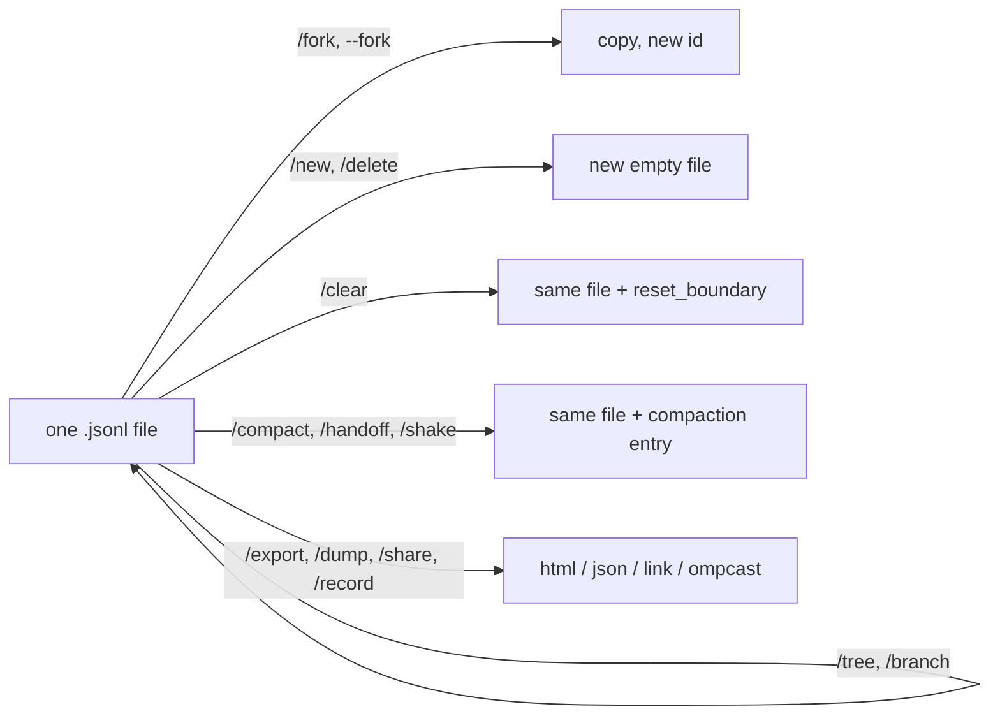

# Module 5 — Sessions & Context Over Time

| | |
|---|---|
| **Level** | basic → intermediate |
| **Time** | ~1.5 h (lessons ≈ 50 min, coursework ≈ 40 min) |
| **Prerequisites** | Modules 1–4 (you can run omp in `omp-course-lab`, read cards, use `Ctrl+O`, and know what `/fork` does in outline) |
| **Built against** | `omp --version` → `omp/18.3.1` (Linux x64); facts re-audited against the `omp/18.3.5` binary and its bundled `omp://` docs |
| **Lab checkpoint** | `cd omp-course-lab && git checkout module-5-start` |

**Goal:** work across days without losing state or blowing the context window. By the end you can find any past session, rewind or branch inside one, keep a long session under the context limit, and get a session out as HTML, a share link, or a screen recording.

Every command, key, setting and default below was checked against the bundled docs (`read omp://…`), `omp --help` / `omp <cmd> --help`, `omp config get <key>`, and a live TUI run on 18.3.1. Lines marked **[observed]** are things we saw on screen during that run; lines marked **[doc]** are documented behaviour we could not exercise on the build machine (see `BUILD-NOTES.md`).

---

## Lesson 5.1 — Sessions on disk              (~8 min)
**You will be able to:** locate the JSONL file for the session you are in; explain what an "entry" is and why history is never rewritten; move a session to another directory or a git worktree; rename it.

**Why this exists:** A chat tab disappears when you close it. An omp session is a file: every prompt, model answer, tool call, tool result, model switch, label, compaction and reset is appended as one JSON line.
Because the file is append-only and every entry points at its parent, omp can rewind, branch, and summarize without ever destroying what happened.
Knowing where that file lives and what is in it is the foundation for everything else in this module.

**Demo:** `demos/5.1-session-on-disk.md`

**Concepts:**
- Default location: `~/.omp/agent/sessions/<encoded-cwd>/<timestamp>_<sessionId>.jsonl`. **[observed]** `~/.omp/agent/sessions/-Downloads-omp-course`.
- `<encoded-cwd>` is the canonical working directory with `/` replaced by `-`: `-<relative>` under your home (e.g. `-Downloads-omp-course-lab`), `-tmp-<relative>` under the temp root, `--<encoded-absolute>--` elsewhere. Symlinked paths share one bucket.
- `omp config path` prints the agent directory (`~/.omp/agent` unless `PI_CODING_AGENT_DIR` or `--profile` relocates it).
- File shape **[observed]**: a fixed 256-byte `{"type":"title",…}` slot, then the header `{"type":"session","version":3,"id":…,"cwd":…}`, then entries. Each entry has `type`, `id` (8 chars), `parentId`, `timestamp`.
- Entry types you will meet: `message` (roles `user`, `assistant`, `toolResult`, `bashExecution`, …), `model_change`, `thinking_level_change`, `credential_pin`, `custom` (e.g. `tool_execution_start`, `session_exit`), `title_change`, `label`, `branch_summary`, `compaction`, `reset_boundary`.
- **Tree of entries.** Appending always creates a child of the current *leaf*. Navigating (`/tree`, 5.4) only moves the leaf pointer; nothing is deleted. That is why abandoned branches stay visible and recoverable.
- A brand-new session stays in memory until the first assistant message arrives; only then is the file written. **[observed]** the file appeared after turn 1 completed, not at launch.
- Side files next to the session: a directory `<timestamp>_<sessionId>/` holds artifacts (subagent transcripts — a subagent is a child agent omp spawns for delegated work, Module 10 — plus `/btw` history and auto-handoff documents). `~/.omp/agent/blobs/<sha256>` stores large images referenced from entries.
- Flags: `--session-dir <dir>` (store and look up sessions there instead of the cwd bucket), `--no-session` (ephemeral; nothing written; `/export` and `/fork` then fail, `/share` and `/dump` still work). `--cwd <dir>` starts in another directory.
- `/rename <title>` sets a user title (auto-titling never overwrites it). `/rename` with no argument generates one from recent conversation with the tiny title model; failure prints `Could not generate a session title. Use /rename <title> to set one.`
- **[observed]** `Session renamed to "M5 smoke session".` The title appears in the status line's right segment (`statusLine.rightSegments` default `[session_name, token_total, cost, context_pct]`) and in the `/resume` picker.
- `/move <path>` relocates the *session* to another working directory (strings **[observed in binary]** `Usage: /move <path>`, `Directory does not exist: …`, `Moved to …`): the file moves to that cwd's bucket, the header records `previousSessionFiles`, and the running session's cwd changes. Refused while streaming (`Cannot move while streaming.`) and while a `/btw` request is running.
- `/wt [<branch>]` (alias `/worktree`; description **[observed in binary]** "Move this session into a new worktree, changes included") creates a linked git worktree carrying your uncommitted changes and moves the current session into it, leaving the original checkout untouched. Success prints `Moved to worktree <path> on branch <branch> (…)`.
- The branch name is optional — omitted, omp uses `wt/<YYYYMMDD-HHMMSS>`; an existing branch name is refused. Also refused while streaming and while a `/btw` request is running (exact strings in Troubleshooting).
- Worktree settings:

  | Setting | Default | Effect |
  |---|---|---|
  | `worktree.base` | unset → `~/.omp/wt` | Where worktrees land; `OMP_WORKTREE_DIR` overrides |
  | `worktree.clone` | `true` | `/wt`, `github pr_checkout` and `git worktree add` via the `bash` tool start the worktree as a copy-on-write clone so ignored build artifacts carry over, falling back to a plain checkout when the filesystem cannot clone |
  | `worktree.cleanSource` | `false` | When true, resets tracked changes and removes untracked files from the original checkout after carrying them over |

- CLI counterpart: `omp worktree [list|clear|add] …` — `omp worktree add -b feature ../feature origin/main`, `omp worktree clear --dry-run`, `--json`.
- Housekeeping: `omp gc` previews; `omp gc --apply` sweeps unreferenced blobs, archives cold sessions (`--cold-archive-after-days`, `--retain-newest-per-cwd`), checkpoints DB WALs. Storage GC is unrelated to context compaction.

**Try it (Walkthrough):**
1. `cd omp-course-lab && git checkout module-5-start && omp`. Prompt: `Read api/__init__.py and tell me in one sentence what it re-exports. Do not edit anything.`
   Expected: one `read` card, one sentence, and the status line's right end shows an auto-generated title after a moment.
2. `!ls -t ~/.omp/agent/sessions/*/ | head -3`
   Expected: the newest `.jsonl` is yours; its name starts with today's timestamp.
3. `/rename m5 sessions lesson`
   Expected: `Session renamed to "m5 sessions lesson".`; the right segment of the status line now reads `◀ m5 sessions lesson`.
4. Ask omp: `Read the newest .jsonl under ~/.omp/agent/sessions for this directory and list the distinct "type" values it contains.`
   Expected: the answer lists at least `session`, `message`, `model_change`, `title_change`. (Tip: `read` handles the file; the first 256 bytes are the title slot.)
5. `/resume` → Esc. Expected: your session is listed with the new title and a `current` marker.

**Guided task:** Move this session into a fresh git worktree.
- Hints: `/wt m5-worktree` names the branch (plain `/wt` generates a name); `omp worktree list` shows what was created; `!pwd` shows the session's new cwd.
- Checkpoints: `omp worktree list` lists a path under `~/.omp/wt` (or `worktree.base`); `!git branch --show-current` inside omp shows the new branch.
- Pass: `/resume` (Tab → all projects) shows the session under the worktree path; `omp worktree clear --dry-run` lists it.

**Stretch:** Prove which "get it out" commands still work for an ephemeral (`--no-session`) session. Pass: `/export` errors (`Cannot export in-memory session to HTML`), `/share` still prints a link.

**Troubleshooting:**

| Symptom | Cause | Fix |
|---|---|---|
| No `.jsonl` file after starting omp | File is created lazily on the first assistant message | Finish one turn, then look again |
| Session listed under a strange `--…--` bucket | cwd is outside home and temp, so the absolute path is encoded | Normal; `/resume` Tab (all projects) finds it |
| `/move` or `/wt` refuses: `Cannot move while streaming.` / `Cannot create a worktree while streaming.` or a BTW message | A `/btw` side question or a response is still running | Finish/cancel the `/btw` request or wait for the response, retry |
| `/wt` refuses: `Branch '<name>' already exists; pick another name.` | The branch name is taken | Pick another name, or omit it for a generated `wt/<timestamp>` branch |
| `/rename` alone prints "Could not generate a session title" | Tiny title model missing or empty conversation | `omp tiny-models download`, or `/rename <title>` |
| Sessions from another profile are missing | `--profile` uses its own agent dir | Run with the same `--profile` / `OMP_PROFILE` |

**Cheat sheet:**

| Item | Value |
|---|---|
| Session file | `~/.omp/agent/sessions/<encoded-cwd>/<ts>_<id>.jsonl` |
| Agent dir | `omp config path` |
| Ephemeral | `omp --no-session` |
| Custom store | `omp --session-dir <dir>` |
| Rename | `/rename [title]` |
| Relocate | `/move <path>`, `/wt` (`/worktree`) |
| Worktrees | `omp worktree [list\|add\|clear]`; `worktree.base`, `worktree.clone=true`, `worktree.cleanSource=false` |
| Storage GC | `omp gc` (dry-run) / `omp gc --apply` |

**Source:** omp://session.md, omp://session-switching-and-recent-listing.md, omp://cli-reference.md, omp://slash-command-internals.md, omp://settings.md, `omp worktree --help`, `omp gc --help`, `omp config get worktree.*`

---

## Lesson 5.2 — Resume & switch              (~8 min)
**You will be able to:** reopen yesterday's session from the shell or from inside a running session; understand what `-c` picks when several sessions exist; import a Claude Code or Codex transcript.

**Why this exists:** Multi-day work means you will close the terminal. omp gives three ways back: a picker, an id, and "whatever this terminal was doing last". Picking the wrong one wastes a context window re-explaining the task; picking the right one costs nothing.

**Demo:** `demos/5.2-resume.md`

**Concepts:**
- **In-session:** `/resume` opens the fullscreen picker in *current-folder* scope. **[observed]** title `Resume Session (current folder)`, a `>` search box, one card per session showing title, first user message, `just now · 39.9KB · current · ✔ done · ⑂ fork`, and the footer `[Del/⌫ delete · Enter select · Tab all projects · Esc cancel]`.
  - `Tab` toggles all-projects scope (never automatic — an empty folder shows `No sessions in current folder. Press Tab to view all.`).
  - Typing filters across id/title/cwd/first message, and matches from prompt history (`~/.omp/agent/history.db`) are merged in after a pause. `Delete`, or `Backspace` on an empty search, deletes after confirmation.
  - Enter → `Resumed session` (or `Resumed session in <dir>` for another project, which also switches the process cwd). **[observed]** `Resumed session`.
- `/resume <id-prefix>`: local match first, then all projects; unknown → `Session "<value>" not found`. Matching is case-insensitive on the session id prefix, the full filename prefix, or the id after the timestamp. First match by newest wins — there is no ambiguity prompt, so type enough characters.
- `/resume @claude` / `/resume @codex`: read-only import pickers for Claude Code / Codex transcripts; the selection is converted into a **new** omp session and switched to. CLI: `--from-claude`, `--from-codex`.
- **From the shell:** `omp --resume` (`-r`, `--session`) opens the same picker (prints `No sessions found` only if every project is empty; `No session selected` on Esc). `omp --resume <id|path>` opens directly; a path (contains `/` or ends in `.jsonl`) is opened as-is.
  **[observed]** `omp --session-dir /tmp/s --resume 01a0d994 -p "…"` continued the earlier conversation (the model counted three user messages).
- If a matched session's recorded directory no longer exists you are asked `Move (re-root) it into the current directory? [Y/n]`; non-TTY runs fail instead. If the directory exists, omp switches *into* that project (settings, plugins, models reload) — it does not fork.
- `omp -c` / `--continue`: **terminal breadcrumb first.** Each turn writes `~/.omp/agent/terminal-sessions/<terminal-id>` containing the cwd and the session path (**[observed]** third line `cwdstat …`; a `fresh` third line marks a `/new` whose file does not exist yet).
  - Resolution: breadcrumb whose cwd matches → that session; cwd mismatch → newest session in this cwd's bucket; nothing → new session.
  - Terminal id comes from the TTY path, falling back to `ZELLIJ_PANE_ID`, `TMUX_PANE`, `CMUX_SURFACE_ID`, `KITTY_WINDOW_ID`, `WEZTERM_PANE`, `TERM_SESSION_ID`, `WT_SESSION`.
  - So `-c` in the *same* pane reopens *that pane's* session; in a new pane it reopens the newest one for the directory. `-c <full-uuid>` is normalized to `--resume <uuid>`.
- `autoResume: false` (default) — set `true` to make plain `omp` behave like `-c` when no session flag is given. **[observed]** `omp config get autoResume` → `false`.
- Welcome screen "Recent sessions" **[observed]** `• Read calc.py and identify bug (just now)` — a 4 KiB-prefix scan sorted by mtime.
- On resume, an interrupted tool loop gets a synthetic aborted assistant message so the transcript does not look "live"; the persisted model, thinking level and service tier are restored.

**Try it (Walkthrough):**
1. Still in the 5.1 session: `/exit`. Then `omp -c`.
   Expected: the transcript from 5.1 re-renders; status line shows the same title.
2. `!cat ~/.omp/agent/terminal-sessions/$(ls -t ~/.omp/agent/terminal-sessions | head -1)`
   Expected: the first two lines are `…/omp-course-lab` and your `.jsonl` path (a third bookkeeping line may follow).
3. `/resume`, type `lesson`, Esc.
   Expected: the list narrows to sessions whose title/first message contains "lesson".
4. `/exit`; `omp --resume <first 8 chars of the id from step 2's filename>` then `What did I rename this session to?`
   Expected: omp answers with the title from 5.1 step 3.
5. In a *second* terminal tab, `cd omp-course-lab && omp -c`. Expected: the same session (newest for this cwd), because the new pane has no breadcrumb.

**Guided task:** Prove that `-c` is per-terminal.
- Hints: open two panes in tmux; in pane A run one turn in session A; in pane B `omp` → one turn → `/exit`; back in pane A `/exit` then `omp -c`.
- Checkpoints: `ls ~/.omp/agent/terminal-sessions` shows two files; their second lines differ.
- Pass: pane A's `omp -c` resumes session A even though session B is newer. Record the two breadcrumb contents in `notes/m5.md`.

**Stretch:** Bring a Claude Code or Codex transcript into omp as a session of its own. Pass: a new `.jsonl` appears in the bucket and `/resume` lists it (needs an existing Claude/Codex session on the machine).

**Troubleshooting:**

| Symptom | Cause | Fix |
|---|---|---|
| `omp -c` opens the wrong session | Breadcrumb belongs to a different pane / cwd | `omp --resume` and pick, or `omp --resume <id>` |
| `--resume abc` picks an unexpected session | Prefix matched several; newest wins silently | Use more characters or the full filename |
| Picker is empty | Current-folder scope only | Press `Tab` for all projects |
| `Session's directory no longer exists … [Y/n]` | Session recorded a deleted cwd | `Y` re-roots it into the current directory |
| Resumed transcript ends with an aborted turn | Previous process died mid-tool-call | Normal; just prompt again |

**Cheat sheet:**

| Action | Command |
|---|---|
| Picker (in session / shell) | `/resume` · `omp --resume` |
| By id / path | `/resume <prefix>` · `omp --resume <prefix\|path>` |
| Last session of this terminal | `omp -c` / `--continue` |
| Import foreign | `/resume @claude` · `/resume @codex` · `--from-claude` · `--from-codex` |
| Picker keys | `Tab` scope · type to search · `Del` delete · `Esc` |
| Auto-continue | `autoResume: true` (default `false`) |

**Source:** omp://session-switching-and-recent-listing.md, omp://session-operations-export-share-fork-resume.md, omp://session.md, omp://cli-reference.md, `omp --help`, `omp config get autoResume`

---

## Lesson 5.3 — Reset semantics: `/new` `/clear` `/fresh` `/delete` `/restart`   (~7 min)
**You will be able to:** choose the right reset for "the model is confused", "the provider stream is wedged", "I want a clean file", and "erase this"; predict what survives each one.

**Why this exists:** Five commands all feel like "start over", and they differ in exactly the dimension that matters for multi-day work: whether the *file* survives, whether the *visible transcript* survives, and whether the *model's memory* survives.
Picking `/new` when you meant `/clear` loses the file you wanted to export later; picking `/clear` when you meant `/fresh` throws away context the model still needed.

**Demo:** `demos/5.3-resets.md`

**Concepts — decision table:**

| Command | Visible transcript | Model context | Session file & id | On disk afterwards | Use when |
|---|---|---|---|---|---|
| `/fresh` | kept | kept (re-sent in full next turn) | same | unchanged | Provider stream wedged / stale prompt cache; you want to lose *nothing* |
| `/clear` | cleared (welcome banner re-rendered) | dropped after a `reset_boundary` | same id, title, cwd, model, plan path | file keeps the full pre-reset history; export still shows it | Model is off track but you want one file per task |
| `/new` | cleared | empty | **new** id + new file (lazily created) | old file untouched | Start a genuinely separate task |
| `/delete` | cleared | empty | **new** id | old JSONL + artifact dir deleted (best-effort) | Remove a throwaway session |
| `/restart` | re-rendered from disk | rebuilt from file | same | unchanged | Reload extensions/settings; process relaunches with original flags and resumes in place |

- `/fresh` **[observed]** `Fresh provider session started (2 provider states pruned).` It closes cached provider-side conversation/prompt-cache handles, mints a new provider session id, and re-keys memory backends. Rejected while streaming.
- `/clear` **[observed]** `✔ Context reset — 25 messages dropped; session continues.` and a `reset_boundary` entry appended to the same file. Also drops queued follow-ups, pending tool calls, checkpoint/rewind state, and cancels this agent's async bash/task jobs.
  Rejected while streaming or while a foreground `!`/`$` command runs; aborts an in-flight compaction first. Project instructions (`AGENTS.md`, `RULES.md`) are re-read on the next turn.
- `/new` switches identity; in persistent mode the new file is created on the first assistant message. The terminal breadcrumb records `fresh` so `-c` does not resurrect the old session in the meantime.
- `/delete` — description **[observed in binary]** "Delete the current session and start a new one". Deletion failures are logged, not fatal, so it is *not* a guaranteed erasure boundary; check the bucket if it matters.
- `/restart` — "Restart omp with the same launch flags, resuming this session" **[observed in binary]**. Extensions warn `Restart omp to load newly enabled extensions` — this is the command they mean.
- Related from Module 3: `/fresh` is the same command taught there for a wedged stream.

**Try it (Walkthrough):**
1. In your 5.2 session ask: `Remember the word PINEAPPLE. Reply OK.` Expected: `OK`.
2. `/fresh` then `What word did I ask you to remember?` Expected: `PINEAPPLE` — context survived.
3. `/clear` then the same question. Expected: the model does not know (context dropped). `!tail -c 400 <your .jsonl>` shows `"type":"reset_boundary"` above the new messages.
4. `/new` then `!ls -t ~/.omp/agent/sessions/*/ | head -2` after one turn. Expected: two files; the old one still contains PINEAPPLE (`!grep -c PINEAPPLE <old>.jsonl` → ≥ 1).
5. `/delete` on this new throwaway session. Expected: the file from step 4 disappears from the bucket and you are in yet another new session.

**Guided task:** Prove `/clear` keeps history for export.
- Hints: after step 3 above, run `/export notes/m5-clear.html` (Lesson 5.6) and search the HTML for `PINEAPPLE`.
- Pass: the string is present in the export even though the model could not recall it.

**Stretch:** Survive a full process relaunch without losing the transcript. Pass: after relaunch the status line shows the same session title and `/resume` marks the same file `current`.

**Troubleshooting:**

| Symptom | Cause | Fix |
|---|---|---|
| `/clear` or `/fresh` refused | A response is streaming, or a `!` command is running | `Esc` to stop, then retry |
| After `/new`, `omp -c` in the same pane opens the old session | The new file was never materialized and the breadcrumb was not `fresh` | Run one turn in the new session first |
| `/delete` left the file behind | Deletion is best-effort (permissions, open handle) | Remove the JSONL and its sibling directory manually |
| Model still "remembers" after `/clear` | A memory backend (`memory.backend`) or `RULES.md` re-injected it | That is project context, not conversation; see Modules 6 and 9 |

**Cheat sheet:** see the decision table above.

**Source:** omp://session-operations-export-share-fork-resume.md, omp://session.md, omp://compaction.md (reset boundary handling), binary strings for `/delete` and `/restart` descriptions

---

## Lesson 5.4 — Branching history: `/tree` vs `/branch` vs `/fork`   (~12 min)
**You will be able to:** rewind to any earlier point and continue differently without losing the abandoned path; label pivot points; leave a summary of the abandoned branch for the model; know when a new file is created.

**Why this exists:** Real work is not linear. You try approach A, it fails, and you want approach B *starting from the state before A* — but you may still want A's findings. Chat tools force you to scroll up and paste.
omp's session is a tree, so "go back to turn 2 and try again" is a pointer move, and the old branch remains in the file, browsable and summarizable.

**Demo:** `demos/5.4-tree-branch-fork.md`

**Concepts — decision table:**

| Command | Scope | What happens | New file? |
|---|---|---|---|
| `/tree` | current file | Opens the Session Tree navigator; Enter moves the leaf to the chosen entry; new turns grow a sibling branch | No |
| `/branch` | current file → usually a new file | With default `doubleEscapeAction: rewind` opens the transcript *rewind* selector; a **user**-message target branches history up to that prompt into a new session file **[doc]**, any other target repositions the leaf in place. With `doubleEscapeAction: tree` it behaves exactly like `/tree` | Usually |
| `/fork` | whole session | Copies every entry into a new file with a new id, `parentSession` = old id, inherits the provider prompt-cache key, copies the artifact dir; you are switched to the copy. Blocked while streaming. Needs a persisted session | Yes |
| `omp --fork <id\|path>` | startup | Same as `/fork` but from the shell, into the current cwd/`--session-dir`. Rejected with `--no-session`. Cache inheritance is dropped if `--model`, `--thinking`, `--system-prompt`, `--append-system-prompt`, `--tools`, or `--no-tools` change the request shape | Yes |
| `/resume` | session list | Switch to another file (5.2) | No |

**`/tree` in detail** (all **[observed]** unless noted):
- Header: `Session Tree` with hint line `Enter: switch. Alt+↑/↓: previous/next turn. PgUp/PgDn (←/→): page. Home/End: first/last item. Shift+Enter: summarize…` and a `Search:` line.
- Rows: `• user: …`, `• [read: calc.py]`, `• assistant: …`; the active root→leaf path is bulleted `•`; sibling branches hang off `├─` / `└─`; the cursor is `›`.
- Keys:

  | Key | Action |
  |---|---|
  | `Up`/`Down` | move (wrap) |
  | `Alt+Up`/`Alt+Down` | jump to previous/next user or assistant turn |
  | `PgUp`/`PgDn` or `Left`/`Right` | page |
  | `Home`/`End` | first/last item |
  | `Enter` | select |
  | `Shift+Enter` | summarize-and-switch without the choice prompt |
  | type | search (fuzzy, space-separated tokens, AND); `Backspace` edits the search |
  | `Esc` | clears the search first, then closes |
  | `Ctrl+C` | closes |
  | `Shift+L` | edit/clear the label on the selected node (search must be empty) |
  | `Ctrl+O` / `Shift+Ctrl+O` | cycle filters |
  | `Alt+D/T/U/L/A` | jump to a filter |

- Filters (start mode `treeFilterMode`, default `default`): `default` (hides `label`, `custom`, `model_change`, `thinking_level_change`) → `no-tools` (also hides tool results) → `user-only` → `labeled-only` → `all`. Assistant nodes that contain only tool calls are hidden in every mode unless they errored/aborted or are the leaf.
- Selecting a **user** message: the leaf becomes that message's *parent* and the text is put back into the (empty) composer for editing — "re-run from an earlier prompt". Selecting anything else: leaf = that node, no prefill. Result banner: `Navigated to selected point`.
- Selecting the leaf itself: `Already at this point`. Selecting a past `ask` result re-opens the original question so you can answer differently.
- Labels: `Shift+L`, type, Enter → `[milestone] assistant: …` shown before the node text; stored as append-only `label` entries (`targetId`, `label`; empty label clears). `Alt+L` jumps to `labeled-only` for fast bookmark hopping.
- **Branch summaries.** `branchSummary.enabled` — **off by default** (`omp config get branchSummary.enabled` → `false`); enable with `omp config set branchSummary.enabled true` or `/settings`.
  - When on, Enter shows a `Summarize branch?` chooser: `No summary` / `Summarize` / `Summarize with custom prompt`; `Shift+Enter` summarizes without asking (works even when the setting is off; needs a model + credential).
  - The summary of the *abandoned* entries (old leaf back to the common ancestor) is appended as a `branch_summary` entry **at the new position** and the transcript shows a `⑂ branch · ctrl+o` divider. Esc during summarization aborts and leaves the leaf unchanged.
  - Budget: `branchSummary.reserveTokens` (default `16384`). **[observed]** when the abandoned path had nothing summarizable the entry read `No content to summarize`.
- Double-Escape on an empty composer (`doubleEscapeAction`, default `rewind`; values `rewind|tree|none`) opens the fullscreen transcript rewind selector: **[observed]** footer `18/18  ↑/↓ step  ←/→ user turns  enter rewind  ctrl+o expand  esc cancel`, banner `Rewound to selected point`, and the chosen user prompt is placed back in the composer.
- `/fork` **[observed]** `✔ Session forked to <timestamp>_<newid>.jsonl`; the `/resume` picker marks the copy `⑂ fork`; the title carries over.
- Startup `omp --fork 01a0d994 -p "Say FORKED."` **[observed]** created a second file whose header had `parentSession` and `providerPromptCacheKey` equal to the source id.

**Try it (Walkthrough):** (start a new session: `/new`)
1. Three turns, no edits: (a) `Read cli/__main__.py and summarize its subcommands in one line.` (b) `Which of those subcommands touches data/lab.sqlite? One line.` (c) `List the files in tests/. Filenames only.`
   Expected: three answers; the `context_pct` segment barely moves.
2. `/tree` → press `Up` until `›` sits on the user row for turn (b) → `Shift+L`, type `sqlite-question`, Enter.
   Expected: the row now reads `[sqlite-question] user: Which of those…`.
3. With the cursor still on turn (b)'s user row press `Enter`.
   Expected: `Navigated to selected point`; the composer is prefilled with turn (b)'s text; turn (c) vanished from the visible transcript.
4. Replace the composer text with `Instead: which subcommand has the most arguments? One line.` and submit.
   Expected: an answer; `/tree` now shows two children under turn (a)'s assistant row: the old `user: Which of those…` branch and the new one, the new one bulleted.
5. `omp config set branchSummary.enabled true` (from another shell or `!`), then `/tree`, move to the **old** turn (c) assistant row, `Enter` → `Summarize`.
   Expected: loader, then `⑂ branch · ctrl+o` divider; `Ctrl+O` on it expands the summary of the branch you just left.
6. `/fork`. Expected: `✔ Session forked to …jsonl`; status line title unchanged; `/resume` shows two entries, the current one marked `⑂ fork`.
7. `/branch` → `Left` to the previous user turn → `Enter`.
   Expected: `Rewound to selected point` and the prompt back in the composer. Check `!ls ~/.omp/agent/sessions/<bucket>/ | wc -l` before and after to see whether a third file was created (see `BUILD-NOTES.md`: on our run the rewind stayed in-file).

**Guided task:** Approach A / approach B on fixture issue #7 (the red-herring investigation) *without editing*.
- Hints: label the point right after omp reads the issue; explore the wrong lead for two turns; `/tree` back to the label with `Summarize`; then ask omp to pursue the other lead "using the branch summary above".
- Checkpoints: `/tree` `Alt+A` (all) shows a `branch_summary` row; `Ctrl+O` on the divider shows file names from the abandoned branch.
- Pass: the final answer names the real cause and the transcript contains exactly one `⑂ branch` divider. Write the labels you used and what each of `/tree`, `/branch`, `/fork` changed on disk into `notes/m5.md`.

**Stretch:** Make `Esc Esc` and `/branch` open the tree navigator instead of the rewind selector. Pass: `omp config get doubleEscapeAction` → `tree`; no new file after a `/branch` rewind.

**Troubleshooting:**

| Symptom | Cause | Fix |
|---|---|---|
| `/tree` shows `Already at this point` | You selected the current leaf | Move the cursor first |
| Enter never asks about summaries | `branchSummary.enabled` is `false` (default) | Enable it, or use `Shift+Enter` |
| Summarize fails immediately | No model/API key available for the summarizer | `/login`, or choose `No summary` |
| Composer was not prefilled | Editor was not empty | Clear the composer (`Ctrl+C`) before selecting |
| `/fork` says `Fork failed (session not persisted or cancelled)` | `--no-session`, or an extension cancelled | Run with a persisted session |
| `/fork` refused | Response streaming | `Esc`, then retry |
| Tree rows are blank | Bookkeeping entries (title, credential pin, reset) have no renderer | Ignore, or switch filter with `Ctrl+O` |

**Cheat sheet:**

| Action | Key / command |
|---|---|
| Open tree | `/tree` (action id `app.session.tree`) |
| Move / jump turns / page | `↑↓` · `Alt+↑↓` · `PgUp/PgDn`, `←→` |
| Select / summarize-select | `Enter` · `Shift+Enter` |
| Label | `Shift+L` |
| Filters | `Ctrl+O` cycle · `Alt+D/T/U/L/A` · `treeFilterMode` |
| Summary prompt | `branchSummary.enabled: true` (default off) |
| Rewind selector | `Esc Esc` (`doubleEscapeAction: rewind`) · `/branch` |
| Copy session | `/fork` · `omp --fork <id\|path>` |

**Source:** omp://tree.md, omp://session-tree-plan.md, omp://session-operations-export-share-fork-resume.md, omp://compaction.md (branch summaries), omp://settings.md, `omp config get branchSummary.enabled treeFilterMode doubleEscapeAction`

---

## Lesson 5.5 — Compaction: staying under the context window   (~10 min)
**You will be able to:** read the context indicator; explain what auto-compaction keeps and drops; run `/compact`, `/handoff`, `/shake` deliberately; tune when compaction fires.

**Why this exists:** Every model has a finite context window. A long session fills it with tool output that is no longer useful. Without help the request eventually fails with a context-overflow error.
omp watches the count and, before that happens, replaces the *oldest* part of the conversation with a summary while keeping the recent tail verbatim. You can see it happen, steer what the summary focuses on, and choose the strategy.

**Demo:** `demos/5.5-compaction.md`

**Concepts:**
- **Indicator.** The status line's `context_pct` segment (**[observed]** `▶─1%` at the right of the composer border). `statusLine.contextLine`, default `embedded`, controls how the composer's top border line between the left and right segments reflects context usage — values `off|percentage|annotated|embedded`.
  The auto-compact icon pulses while a speculative summary runs and holds in accent when one is armed **[doc]**.
- **Threshold.** `compaction.thresholdPercent` = `-1` and `compaction.thresholdTokens` = `-1` by default → *reserve-based*: compaction fires when context exceeds `contextWindow − reserve`, reserve = max(`16384`, 15 % of the window) (`compaction.reserveTokens` unset).
  Set `thresholdTokens` (> 0 wins) or `thresholdPercent` to fire earlier. Per-subagent overrides: `task.agentCompactionThresholdOverrides`.
- **Triggers** (all automatic unless noted): `/compact [instructions]` (manual), context-overflow error recovery, incomplete-output (`stopReason: length`) recovery, post-turn threshold, mid-turn threshold at safe tool-loop boundaries (`compaction.midTurnEnabled: true`), idle (`compaction.idleEnabled: false`, `idleThresholdTokens: 200000`, `idleTimeoutSeconds: 300`).
- **What is kept.** A cut point is chosen at a user/assistant boundary (never at a `toolResult`) so that at least `compaction.keepRecentTokens` (`20000`) of recent conversation stay verbatim; everything older becomes one summary entry (`type: compaction`, `firstKeptEntryId`, `tokensBefore`).
  Before that, tool-result pruning may blank old outputs (`[Output truncated - N tokens]`; protects the newest 40 000 tool-output tokens) and superseded/useless results are elided (`compaction.supersedeReads`, `compaction.dropUseless`, both `true`). Summaries carry a `<files>` list of what was read/written.
- **Method order** `compaction.methodOrder` = `[remote, snapcompact, handoff, shake, soft]` — tried in order; an unavailable or failed method advances:
  - `remote` — provider-native server compaction (OpenAI Responses compact, Anthropic compaction beta) when the model/endpoint supports it.
  - `snapcompact` — local, deterministic: the discarded history is printed onto PNG frames the model reads as images. No model call, so it also works for overflow recovery; requires a vision-capable model, else skipped.
  - `handoff` — generates a handoff document through the live request pipeline (same cache prefix) and commits it as the compaction summary (see below).
  - `shake` — mechanical: replaces old tool results / large blocks with `artifact://` references; no model call. If it cannot reclaim enough, the next method runs.
  - `soft` — classic LLM summary (`compaction-summary.md` prompt; iterative updates reuse the previous summary).
- **Async (speculative) compaction** `compaction.asyncEnabled: true`: when usage enters the band just below the threshold, a background summary is prepared off a snapshot; when the threshold is crossed it is committed instantly. Discarded if you `/tree`, `/clear`, or compact meanwhile.
- **Display.** Compaction does *not* clear the screen: a slim divider `── 📷 compacted · ctrl+o ──` appears where it fired; `Ctrl+O` shows the summary; the scrollback above stays, also after resume. Only the model context restarts at the divider. `compaction.autoContinue: true` lets the agent continue the interrupted work after an automatic compaction.
- **`/compact [instructions]`** — manual; aborts the current turn first; instructions steer the summary (a directed LLM summary is used even if `snapcompact` is first). **[observed]** on a tiny session: `Error: Compaction failed: Nothing to compact (session too small)`.
- **`/handoff [focus]`** — writes a structured handoff document (state, decisions, next steps) and commits it *in place* as a compaction entry: session id, file, scrollback and cache key unchanged; `Context handed off and compacted in place`.
  - Refused while streaming, needs ≥ 2 messages (`Nothing to hand off (no messages yet)`), and **[observed]** `Error: Handoff failed: Nothing to hand off (already compacted)` when there is nothing left to summarize. `Esc` cancels (`Handoff cancelled`).
  - `compaction.handoffSaveToDisk` (default `false`): when `true`, **automatic** handoffs also write `handoff-<ISO>.md` into the session's artifact directory — manual `/handoff` does not.
- **`/shake`** — manual, aggressive version of the shake method over all eligible history. **[observed]** `Nothing to shake.` on a small session.
- **Context promotion** — `contextPromotion.enabled` (default `false`): on overflow, switch temporarily to the model named by the current model's `contextPromotionTarget` (set in `models.yml`) *instead of* compacting; falls back to compaction when no target/credential. Full treatment in Module 7.
- **Experimental** `compaction.experimentalContextManagement` (default `false`): notes-backed context windows (`context_notes`, `new_context`, `history://current/full`). Module 11.
- Turning it off: `omp config set compaction.enabled false` (default `true`).

**Try it (Walkthrough):** Lower the trigger so you can watch it on a small repo.
1. `omp config set compaction.thresholdTokens 30000` (this writes the **global** `config.yml`; to scope it to the lab only, add `compaction: {thresholdTokens: 30000}` to `omp-course-lab/.omp/config.yml` by hand instead). `omp config get compaction.thresholdTokens` → `30000`.
2. `omp` (new session). Ask: `Read docs/spec.md in full, then read every file under api/ and cli/ in full. Do not summarize yet.` Expected: several `read` cards; `context_pct` climbs past the 30k threshold after the turn (watch the right end of the composer border).
3. Expected after the turn ends: the divider `── 📷 compacted · ctrl+o ──` appears where compaction fired; `Ctrl+O` on it opens the summary with a `<files>` list; `context_pct` drops.
4. `/handoff "focus on the API refactor"`. Expected: loader `Generating handoff… (esc to cancel)`, then `Context handed off and compacted in place`; a second divider; `Ctrl+O` shows the handoff document.
5. `/tree` → type `compact`. Expected: `compaction` rows exist on the active path (`Alt+A` switches to the `all` filter if you want every bookkeeping entry too).
6. Reset: `omp config reset compaction.thresholdTokens`.

**Guided task:** Compare two methods.
- Hints: repeat step 2 with `omp config set compaction.methodOrder '["shake","soft"]'` and then with `'["snapcompact","soft"]'` (needs a vision-capable model); look at what `Ctrl+O` on the divider shows (artifact references vs. image frames vs. prose).
- Checkpoints: `omp config get compaction.methodOrder` shows each order; each run produces exactly one divider.
- Pass: `notes/m5.md` states, for each order, which method actually ran (from the expanded summary) and how much `context_pct` dropped.

**Stretch:** Get an automatic compaction to leave its handoff document on disk. Pass: a `handoff-*.md` file exists in the session's artifact directory (`<bucket>/<timestamp>_<id>/`).

**Troubleshooting:**

| Symptom | Cause | Fix |
|---|---|---|
| `Nothing to compact (session too small)` | Nothing older than the verbatim recent tail (`compaction.keepRecentTokens`) to summarize | Do more work first (`thresholdTokens`/`thresholdPercent` only govern *automatic* compaction) |
| `Nothing to hand off (already compacted)` | The kept tail is already the whole context | Do more work first |
| Compaction never fires on a 1M-context model | Reserve-based threshold is ~850k tokens | Set `thresholdTokens` / `thresholdPercent` |
| `Auto-compaction failed: …` | Summarizer model/credential error | Check `/model`; retry `/compact` |
| `Context overflow recovery failed` | Overflow with no runnable method | Add `snapcompact`/`shake` to `methodOrder`, or `/clear` |
| Divider appears mid-turn | `compaction.midTurnEnabled` | Expected; set `false` to only compact between turns |

**Cheat sheet:**

| Item | Value |
|---|---|
| Manual | `/compact [instructions]` · `/handoff [focus]` · `/shake` |
| Trigger | `compaction.thresholdTokens` (>0) › `thresholdPercent` › reserve (max 16384, 15 %) |
| Keep | `compaction.keepRecentTokens` = 20000 |
| Methods | `compaction.methodOrder` = `[remote, snapcompact, handoff, shake, soft]` |
| Background | `compaction.asyncEnabled` = true · `midTurnEnabled` = true · `idleEnabled` = false |
| Handoff to disk | `compaction.handoffSaveToDisk` = false (auto only) |
| Promotion | `contextPromotion.enabled` = false + model `contextPromotionTarget` |
| Off | `compaction.enabled: false` |

**Source:** omp://compaction.md, omp://handoff-generation-pipeline.md, omp://settings.md, omp://models.md (context promotion), `omp config get compaction.*`, `omp config list` (`statusLine.rightSegments`, `statusLine.contextLine`)

---

## Lesson 5.6 — Getting a session out: export, dump, share, record   (~7 min)
**You will be able to:** produce a self-contained HTML transcript (including subagents), copy the exact model request, publish an encrypted share link, and record/replay/clip the terminal.

**Why this exists:** A session is evidence: what was tried, what the tests said, what the model was told. Reviewers, teammates and future-you need it outside the TUI. omp offers four exits with different audiences — a file, the clipboard, a link, a recording — and different privacy properties.

**Demo:** `demos/5.6-export-share-record.md`

**Concepts:**
- **`/export [--themes] [path]`** → HTML file; **[observed]** `Session exported to: notes/m5-smoke.html` (the TUI also opens it in a browser). `--themes` uses your configured dark/light TUI themes instead of the standalone palette.
  - One whitespace-delimited path only — no spaces in the path (`Usage: /export [--themes] [path]` otherwise). `copy`/`--copy` are rejected ("use /dump"). Fails for `--no-session`.
  - Embeds header, entries, current leaf, system prompt, tool descriptions, and **subagent transcripts** stored beside the session (`<session>/<AgentId>.jsonl`, recursively) — clicking an agent id in a task card opens the sub-session. Full-transcript export keeps pre-`/clear` history and shows compactions chronologically.
- **`omp --export <session.jsonl> [out.html]`** from the shell, no running session: **[observed]** `Exported to: /tmp/m5lab/notes/m5-session.html` (403 KB, contains the `<omp-tool-view>` renderer). Missing input → `File not found: <path>`.
- **`/dump`** → copies a text transcript (system prompt, model/thinking level, tool definitions, messages, thinking, tool calls/results, summaries) to the clipboard and writes a JSON sidecar of the *exact* LLM request: **[observed]** `Session copied to clipboard` / `LLM request JSON: /tmp/omp-llm-request-<id>.json`.
  The sidecar persists and may contain secrets — delete it when done. Works with `--no-session`. Empty session → `No messages to dump yet.`
- **`/share`** → **[observed]** `Share URL: https://my.omp.sh/s/<id>#<key>`. The snapshot is gzipped and sealed with a fresh AES-256-GCM key; the key lives only in the URL fragment (never sent to the server); the viewer decrypts client-side. `share.redactSecrets` (default `true`) runs the secrets obfuscator over the snapshot first.
  - `share.store`: `blob` (default; `share.serverUrl` `https://my.omp.sh/s`, 1 MB cap — oversized snapshots drop images, then long strings, then oldest entries) or `gist` (secret GitHub gist via `gh`, 5 MB). Works for `--no-session`. Shell: `omp share <id-prefix|path> [--gist]` **[observed]**.
  - A `~/.omp/agent/share.{ts,js,mjs}` custom handler replaces the default flow in the TUI (and its failures do *not* fall back). Esc during upload prints `Share cancelled` but the upload itself is not aborted.
- **`/record`** → **[observed]** `Recording to /tmp/omp-recordings/<utc-time>-<sessionid>.ompcast · /record again to stop`; the status line shows `● REC`; `/record` again → `Saved 18.5s recording to … · replay: omp play · share: omp clip`.
  - Captures *screen rows* through the same redaction pipeline as `omp stream` (env-var secrets, `.env` values, `secrets.yml`, credential shapes, `stream.redactPatterns`); no account needed.
  - File: JSON Lines, header `{"ompcast":1,"cols":120,"rows":40,"title":"…","createdAt":"…"}` then `[ms, frame]` lines **[observed]**.
- **`omp play [file] [-s speed] [-i idle-limit]`** replays the newest recording by default; `Space` pauses, `q`/`Esc`/`Ctrl-C` quits; recorded scrollback lands in your terminal's scrollback.
- **`omp clip [file] [-t title] [-d description] [--server]`** uploads a recording to `live.omp.sh/c/<id>` as a public clip (needs the Stencil login from `/login` — Stencil is the live.omp.sh account used for streaming and clips, Module 14).
- Privacy ladder: `/export` and `/dump` are local and **unredacted**; `/share` is encrypted + redacted by `secrets.*` config; `/record` is redacted at capture time; `omp clip` is public.

**Try it (Walkthrough):**
1. In any session with a few turns: `/export notes/m5-session.html`. Expected: `Session exported to: notes/m5-session.html`; `!ls -la notes/m5-session.html` shows a few hundred KB.
2. Open it in a browser (`xdg-open`/`open`). Expected: the transcript renders with tool cards; if you ran a `task` in Module 4, its agent id is clickable.
3. `/dump`. Expected: two lines — clipboard confirmation and the `/tmp/omp-llm-request-….json` path. `!python3 -c "import json;d=json.load(open('<path>'));print(d.keys())"` shows model/system prompt/tools/messages. Delete the file afterwards.
4. `/share`. Expected: `Share URL: https://my.omp.sh/s/…#…`. Open it in a private browser window; it decrypts and renders. Compare with the HTML: same turns, secrets (e.g. the `labtok_…` token from `.env.example` if you ever printed it) replaced.
5. `/record` → one short prompt → `/record`. Expected: `● REC` in the status line while recording; `Saved …s recording to …ompcast`. Then `/exit` and `omp play -s 2`.

**Guided task:** Export the 5.4 branching session and find the abandoned branch.
- Hints: `/export` embeds the entries and the current leaf, so the abandoned branch itself is not on the rendered path — its `branch_summary` entry is (it is converted to a message on the active path); pre-`/clear` history stays in and compactions render chronologically; `--themes` changes colours only.
- Checkpoints: the HTML contains the branch-summary text; the share page shows the same.
- Pass: `notes/m5.md` records the export path, the share URL's *id* (not the fragment), and one sentence on what the branch summary said.

**Stretch:** Publish the recording from step 5 as a public clip. Pass: a `live.omp.sh/c/<id>` URL is printed (requires `/login` → Stencil).

**Troubleshooting:**

| Symptom | Cause | Fix |
|---|---|---|
| `Cannot export in-memory session to HTML` | `--no-session` | Use `/share` or `/dump`, or run persisted |
| `Usage: /export [--themes] [path]` | Path with spaces or extra tokens | Use a path without spaces |
| Share link too big / "trimmed" note | 1 MB blob cap | Expected; images and oldest entries are dropped |
| Share error mentions a custom handler | `~/.omp/agent/share.*` exists and failed | Fix or remove the handler (no automatic fallback) |
| Recording shows `••••••` | Redaction matched a secret-looking value | Intended; irreversible |
| `omp clip` fails to authenticate | No Stencil credential | `/login` → Stencil, or `STENCIL_API_KEY` |

**Cheat sheet:**

| Action | Command |
|---|---|
| HTML | `/export [--themes] [path]` · `omp --export <jsonl> [out]` |
| Clipboard + request JSON | `/dump` |
| Encrypted link | `/share` · `omp share <id\|path> [--gist]` · `share.redactSecrets=true` · `share.store=blob\|gist` |
| Record / play / clip | `/record` (toggle) · `omp play [file] -s N -i S` · `omp clip [file] -t -d` |

**Source:** omp://session-operations-export-share-fork-resume.md, omp://stream.md, omp://cli-reference.md, `omp play --help`, `omp clip --help`, `omp share --help`, `omp config get share.*`

---

## Module wrap-up

Coursework lives in `exercises.md`; instructor notes in `solutions/`; the one-page reference in `cheatsheet.md`.
