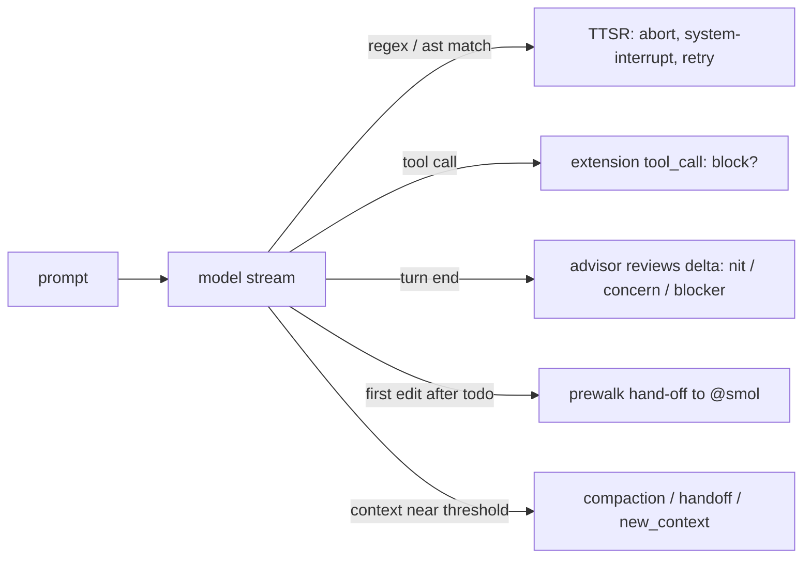

# Module 11 — Guardrails & Supervision (~1.5 h, advanced)

| | |
|---|---|
| Built against | `omp --version` → `omp/18.3.1` |
| Prerequisites | Module 9 (memory, `checkpoint`/`rewind`), Module 10 (subagents, Agent Hub, agent frontmatter) |
| Practice repo | `omp-course-lab`, start from `git checkout module-11-start` |
| Fixtures used | issue **#8** (`POST /signup` — catch-all `except Exception` temptation), `web/app.js` (static JS), `cli/` (argparse, `print()` in `cli/commands.py`), `api/server.py` |

**Goal:** Put a second model, live rules, and cost hand-offs around the agent.

By the end of Module 10 you can fan work out to subagents. This module is about what watches
the agent while it works:

- rules that fire *mid-stream* and force a retry (**Time-Traveling Stream Rules — TTSR**, 11.1);
- a second model that reviews every turn and can interrupt (**advisor/watchdog**, 11.2);
- a one-shot model hand-off so an expensive model plans and a cheap one implements (**prewalk**, 11.3);
- the `tool_call` block contract you will build in Module 12 (**extension guardrails**, 11.4 — an *extension* is code omp loads to add tools and event handlers; see Module 12);
- the context strategies that keep a multi-hour session coherent (**notes-backed windows**, 11.5).

Everything below is verified against the bundled docs (`read omp://…`) and the 18.3.1 binary.
Every feature in this module except TTSR itself is **off by default**; each lesson names the key
that turns it on.



---

## Lesson 11.1 — Time-Traveling Stream Rules (TTSR)              (~25 min)
**You will be able to:** write a `.omp/rules/*.md` rule with a `condition:` / `astCondition:` / `question:` trigger; predict from `interruptMode` and `scope` whether it aborts mid-stream or lands as a reminder; test and scan rules with `omp ttsr` before trusting them in a live session.
**Why this exists:** `AGENTS.md` and rulebook rules are advice the model reads once and can drift away from ten tool calls later. TTSR rules instead watch the *token stream* as it arrives; when a rule's regex or ast-grep pattern matches, omp aborts the generation, injects a `<system-interrupt>` carrying the rule body, and retries. The model never gets to finish the bad edit.
**Demo:** [`demos/11.1-ttsr-interrupt.md`](demos/11.1-ttsr-interrupt.md) — a `console.log` edit aborted mid-stream, the `Injecting rule: no-console-log` card, the retried edit using a guarded helper; plus real `omp ttsr test|scan|list` output captured on the build machine against the lab repo.
**Concepts:**
- **What is watched, and why "time-traveling".** The stream means assistant prose *and* tool arguments as they arrive. The partial output is thrown away; from the model's point of view the violation never happened — it just received a reminder before writing the line.
- **Where rules live.**
  - Project: `<cwd>/.omp/rules/*.md` (or `.mdc`), loaded when `.omp/` is non-empty.
  - User: `~/.omp/agent/rules/*.md` (profile-aware, honours `PI_CODING_AGENT_DIR`).
  - Rule **name = filename without extension**. Names dedupe first-wins across providers:
    project/user `.omp` rules (`native`, 100) › extension-package `rules/` (90) › `.agent(s)/rules` (70)
    › `.cursor/rules` (50) › `.windsurf/rules` (50) › `.clinerules` (40) › `.github/instructions` (30)
    › embedded `builtin-defaults` (1). Foreign formats accept the same TTSR frontmatter.
- **Bucketing.** A rule with an accepted trigger (`condition`, `astCondition`, or `question`) is
  **TTSR-only** — it is *not* pasted into the system prompt. Otherwise `alwaysApply: true` injects
  the body into the prompt, and a bare `description` lists it in the rulebook for on-demand
  `rule://<name>` reads. All three kinds resolve via `rule://<name>`.
- **Triggers (frontmatter).**
  - `condition: "regex"` — JavaScript regex; a YAML list means *any* matches. A leading `(?i)`,
    `(?m)`, or `(?s)` is translated to flags. Escape backslashes in YAML: `"console\\.log"`.
    A value that *looks like a file glob* is silently converted to `tool:edit(<glob>)` /
    `tool:write(<glob>)` scope plus condition `.*` — use `scope`/`globs` for paths, not `condition`.
  - `astCondition: "print($$$ARGS)"` — ast-grep pattern (string or list). Evaluated **only on
    `edit`/`write` tool streams** with a file path whose extension maps to a language; matched
    against the source the call *adds* (new lines / new content), never the existing file.
    `$X` binds one node, `$$$X` binds a list.
  - `question: "…yes/no…"` — **judged** rule. After an output completes, the `judge` model role
    answers the question; a yes (probability ≥ 0.7) delivers the rule body as a warning. It never
    interrupts. `condition`/`astCondition` next to a `question` act only as a *prefilter* that
    gates whether the judge is asked (keeps judge cost down). Governed by `ttsr.judge`:
    `auto` (default) judges only when the judge role resolves to a native jev judge; `on` uses
    whatever the role resolves to, including the chat model; `off` never judges.
- **Where it looks.**
  - `scope:` allowlist — `text`, `thinking`, `tool` (any tool's arguments), `tool:<name>(<glob>)`.
    Comma string or YAML list. **Default (omitted) = `text` + `tool`, not `thinking`.**
  - `globs:` — extra global path gate: at least one candidate file path must match.
  - `agents:` — limit to agent names: `main` (top-level), `sub` (unnamed child), `scout`,
    `foreman-*`. Omitted → every agent.
- **What a match does** — `interruptMode` per rule overrides `ttsr.interruptMode` (default `always`):
  | mode | aborts on |
  |---|---|
  | `always` | any matching source |
  | `prose-only` | text/thinking matches only |
  | `tool-only` | tool-argument matches only |
  | `never` | nothing — reminder only |
  - **Interrupt path:** abort → `ttsr_triggered` event → 50 ms → with `ttsr.contextMode: discard`
    (default) the partial assistant message is dropped (`keep` leaves it) → a hidden
    `custom_message` (`customType: "ttsr-injection"`) is appended containing
    `<system-interrupt reason="rule_violation" rule="<name>" path="<path>">…rule body…</system-interrupt>`
    → generation continues. The TUI shows **`Injecting rule: <name>`** (`ctrl+o` to expand).
  - **Non-interrupting tool match:** a `<system-reminder reason="rule_violation" …>` block is
    *prepended to that tool call's result*; no abort, no extra turn.
  - **Non-interrupting prose match:** a hidden follow-up is queued after the message ends.
- **Repeat policy.** `ttsr.repeatMode: once` (default) — a rule fires once per session.
  `after-gap` — fires again after `ttsr.repeatGap` (default `10`) *completed turns*.
  Fired-rule names are persisted as `ttsr_injection` journal entries and restored on `/resume`,
  so suppression survives restarts and compaction; the rule *file* is re-read at every session
  start, so compaction can never lose the rule itself.
- **Settings** (`omp config get ttsr.<key>`; live-reloaded, no restart):
  | key | default |
  |---|---|
  | `ttsr.enabled` | `true` |
  | `ttsr.interruptMode` | `always` |
  | `ttsr.contextMode` | `discard` |
  | `ttsr.repeatMode` / `ttsr.repeatGap` | `once` / `10` |
  | `ttsr.builtinRules` | `true` (27 embedded Go/Rust/TS rules, every one scoped to `tool:edit`/`tool:write` on `*.go`, `*.rs`, `*.ts(x)` — `omp ttsr list`) |
  | `ttsr.disabledRules` | `[]` (rule names to drop entirely) |
  | `ttsr.judge` | `auto` |
- **`/omfg <complaint>`** — "TTSR rule from a complaint to stop a recurring behavior". Generates a
  `condition`/`astCondition`/`question` rule from your complaint plus recent transcript, prefers
  pattern triggers, validates the candidate against recent outputs (a `question` candidate must
  get a judge yes on one of the 8 most recent in-scope outputs; without a judge you choose whether
  to save it unconfirmed), then offers to save it into your rules directory.
- **`omp ttsr`** (no model needed — runs on the build machine):
  - `list` — every registered rule with provider, trigger, scope, question.
  - `test '<snippet>'` — `--source text|thinking|tool`, `--tool edit|write`, `--path <candidate>`
    (drives scope globs and AST language), `--agent <name>`, `-r <rule.md>` (test one file in
    isolation, skips project rules), `--file -` (stdin), `-v` (show non-triggered), `--json`.
  - `scan [dir]` — run every regex/AST rule across files; question rules are skipped;
    `--no-gitignore`, `--max-bytes`, `-r`, `-v` (list matched files).
  - Do **not** key CI on exit codes: `scan` exits 0 whether or not it found matches, and `test`
    exits 0 on a no-trigger run when project rules are loaded (only the isolated `-r` mode exits 1
    when nothing triggers). Grep the output for `Triggered (` / `Found violations/matches` instead.
  - Scope path globs resolve **relative to the scan/test root** — run from the repo root.

  Three complete rules are in `solutions/`: [`no-console-log.md`](solutions/no-console-log.md)
  (regex, `always`), [`no-bare-print.md`](solutions/no-bare-print.md) (`astCondition`,
  `tool-only`), [`no-unverified-tests.md`](solutions/no-unverified-tests.md) (`question` with a
  `condition` prefilter). The first looks like this:
  ```markdown
  ---
  description: Never add console.log to shipped web code; use a DEBUG-guarded helper.
  condition: "console\\.log"
  scope: "text, tool:edit(web/*.js), tool:write(web/*.js)"
  interruptMode: always
  ---
  Do not add `console.log(...)` calls to files under `web/`. …
  ```
**Try it (Walkthrough):**
1. In `omp-course-lab`, create `.omp/rules/no-console-log.md` with the contents of
   [`solutions/no-console-log.md`](solutions/no-console-log.md).
   **Expected:** `omp ttsr list | grep no-console-log` prints
   `no-console-log [native] condition: console\.log  scope: text, tool:edit(web/*.js), tool:write(web/*.js)`.
2. Dry-run it from the repo root:
   `omp ttsr test --source tool --tool edit --path web/app.js 'console.log("x")'`
   **Expected:** `Triggered (1)` / `✓ no-console-log  condition: /console\.log/ [native]`.
   Repeat with `--path api/server.py`.
   **Expected:** `No rules triggered. (evaluated 28)` — the scope glob excluded it (the count is
   every registered rule: yours plus the 27 builtins).
3. Start `omp` in the repo and prompt:
   *"In web/app.js, log the form payload to the console right before the fetch so I can debug submissions."*
   **Expected:** the edit stream is cut off; an **`Injecting rule: no-console-log`** card appears;
   the retried edit defines `debug()` and calls that instead.
   `grep -n "console.log" web/app.js` prints nothing (the seeded file has no `console.log`).
4. Ask the same thing again in the same session.
   **Expected:** no card — `repeatMode: once`. Run `omp config set ttsr.repeatMode after-gap` and
   `omp config set ttsr.repeatGap 1`; ask again after one completed turn.
   **Expected:** the card fires again. Revert both keys.
5. Find the persisted record. The session journal is
   `~/.omp/agent/sessions/<encoded-cwd>/<timestamp>_<sessionId>.jsonl`; run
   `grep -l ttsr_injection ~/.omp/agent/sessions/*/*.jsonl` (or `/export` and search the HTML — it
   embeds the session entries).
   **Expected:** a `custom_message` entry with `customType: "ttsr-injection"` and a
   `ttsr_injection` entry naming `no-console-log`. (`read history://current` does **not** show
   this — bare `history://current` names an ordinary agent called `current`.)
**Guided task:** *Goal:* stop the CLI from growing new bare `print()` calls without touching the prose the model writes.
*Hints:* `astCondition: "print($$$ARGS)"`; `scope: "tool:edit(cli/*.py), tool:write(cli/*.py)"`; `interruptMode: tool-only`. Verify with `omp ttsr test --source tool --tool edit --path cli/__main__.py 'print("hi")'` (should trigger) and the same with `'sys.stdout.write("hi\n")'` (should not).
*Checkpoints:* `omp ttsr scan -v cli/` from the repo root lists `cli/commands.py` (the seeded `print()` sites; `cli/log.py`'s `logger` is the intended replacement).
*Pass:* the rule shows in `omp ttsr list` with `astCondition: print($$$ARGS)`; the two `test` calls behave as stated; a live prompt that would add a `print()` to `cli/` produces the `Injecting rule: no-bare-print` card.
**Stretch:** *Goal:* a generated-then-judged rule: start from a complaint about the agent claiming "tests pass" without running them, and end with a `question:` rule whose `condition:` prefilter asks the judge only when the reply contains "pass"/"verified".
*Pass:* `omp ttsr list` shows the rule with both `condition:` and `question:`; `omp ttsr test -v --source text 'All tests pass'` prints `question (judged at runtime, not tested)`; with `ttsr.judge: on`, a live reply that claims success without a test run receives a warning injection after the message (not mid-stream).
**Troubleshooting:**
| Symptom | Cause | Fix |
|---|---|---|
| `omp ttsr list` does not show your rule | `.omp/` otherwise empty? wrong extension? name shadowed by a higher-priority provider | use `.omp/rules/<name>.md`; check `omp ttsr list` for a same-named rule; rename |
| Listed but never fires on prose | default scope excludes `thinking`; or the regex only matches tool arguments | add `scope: "text, thinking"`; compare `--source text` vs `--source tool` |
| `omp ttsr scan` reports `no-relevant-rules` for every file | scope path globs (`tool:edit(web/*.js)`) resolve relative to the scan root | run from the repo root |
| `astCondition` never matches | AST rules run only on `edit`/`write` streams with a language-mapped path | test with `--source tool --tool edit --path cli/x.py` |
| `TTSR condition has invalid regex pattern, skipping condition` | JS regex syntax / unescaped YAML backslashes | double the backslashes; `omp ttsr test -r <file>` |
| Fires once, then silent | `ttsr.repeatMode: once` | `omp config set ttsr.repeatMode after-gap` (+ `ttsr.repeatGap`) |
| Model's partial bad output stays in the transcript | `ttsr.contextMode: keep` | `omp config set ttsr.contextMode discard` |
| Judged rule never warns | `ttsr.judge: auto` needs a native judge model | `omp config set ttsr.judge on` (uses the chat model — costs tokens) |
| Builtin rules clutter `omp ttsr list` / `scan` output | `ttsr.builtinRules: true` (they are scoped to `.go`/`.rs`/`.ts` edits, so they never fire on the Python lab) | `omp config set ttsr.builtinRules false`, or list names in `ttsr.disabledRules` |
**Cheat sheet:**
| Item | Value |
|---|---|
| Rule files | `<cwd>/.omp/rules/*.md`, `~/.omp/agent/rules/*.md`; name = filename |
| Triggers | `condition:` regex · `astCondition:` ast-grep (edit/write only) · `question:` judged |
| Scope tokens | `text`, `thinking`, `tool`, `tool:<name>(<glob>)`; default `text`+`tool` |
| Per-rule override | `interruptMode: always \| prose-only \| tool-only \| never` |
| Injection markers | `<system-interrupt reason="rule_violation" rule= path=>` (abort+retry) · `<system-reminder …>` (in tool result) |
| Settings | `ttsr.enabled/interruptMode/contextMode/repeatMode/repeatGap/builtinRules/disabledRules/judge` |
| Commands | `/omfg <complaint>` · `omp ttsr list` · `omp ttsr test [-r f] [--source] [--tool] [--path] [--agent] [--json] [-v]` · `omp ttsr scan [dir]` |
**Source:** omp://rulebook-matching-pipeline.md, omp://ttsr-injection-lifecycle.md, omp://settings.md, `omp ttsr --help`, `omp config list`

---

## Lesson 11.2 — Advisor / Watchdog              (~25 min)
**You will be able to:** enable a second model that reviews every turn; steer it with `WATCHDOG.md` priorities and a `WATCHDOG.yml` roster; read `<advisory>` notes by severity and know which ones interrupt; inspect the advisor with `/advisor status|dump`.
**Why this exists:** A model marking its own homework misses the same things each time. The advisor is a separate agent with its own model, read-only tool session, and append-only context. After each primary turn it sees only the *new transcript delta* and may call one tool, `advise`, to push a note into the transcript: a reviewer on the shoulder, billed separately, steered by `WATCHDOG.md`.
**Demo:** [`demos/11.2-advisor.md`](demos/11.2-advisor.md) — enabling the advisor, the `<advisory severity="blocker">` card landing after the agent wraps issue #8's `_signup` in a catch-all `except Exception` → 400, and `/advisor status`.
**Concepts:**
- **What it sees and can do.** The delta includes reasoning and tool results. Nits batch quietly; a `concern` or `blocker` can interrupt and re-steer the run. It never approves or edits for the primary unless you explicitly grant mutating tools in the roster; you write its priorities in `WATCHDOG.md`.
- **Turn on (off by default).** Assign a model to the `advisor` role, then enable — persisted:
  ```yaml
  # ~/.omp/agent/config.yml (or <repo>/.omp/config.yml)
  modelRoles:
    advisor: anthropic/claude-sonnet-4-5:medium
  advisor:
    enabled: true
  ```
  `modelRoles` is a **record**: `omp config set modelRoles '{…}'` replaces the whole object
  (Module 7), and `omp config get modelRoles.advisor` reports `Unknown setting` — read it with
  `omp config get modelRoles`. `advisor` is also a chat role in the `/model` picker (Module 7).
  `omp config set advisor.enabled true` persists the switch;
  or per session `/advisor on` (session-scoped, never persisted; `/advisor` alone toggles), or
  headless `omp -p --advisor "…"`. With `advisor.enabled: true` but no `modelRoles.advisor`,
  omp reports `Advisor setting enabled, but no model is assigned to the 'advisor' role.`
- **Commands:** `/advisor [on|off|status|dump [raw]|configure]`.
  - `status` — each advisor's runtime state, model, context usage, tokens, cost.
  - `dump` — compact transcript to the clipboard; `dump raw` adds system prompt, tools, thinking, calls.
  - `configure` — TUI editor for project- or user-level `WATCHDOG.yml` (validates entries as it saves).
- **What it sees.** The delta since its last update: assistant prose, reasoning, tool calls, tool
  results (passed through the secret obfuscator), plus the primary's `AGENTS.md` family in a
  `<project-context>` block. Its own prior advisories are filtered out so it never reviews itself.
  It is **reset** (context cleared, cursor rewound) on compaction, session switch/resume, and
  branch/fork; enabling mid-session seeds the cursor at the current transcript end (no replay).
- **Tools.** Default grant `read`, `grep`, `glob` in an isolated `ToolSession` (id suffix
  `-advisor`; separate file snapshots, no shared hashline state). A `WATCHDOG.yml` entry may grant
  any built-in — `edit`, `write`, `bash`, `eval`, `task`, memory tools — and those calls still go
  through **your approval mode**. `tools: []` grants nothing but `advise`.
- **Severity → delivery** (`advise` takes one note + optional severity):
  | severity | delivery |
  |---|---|
  | omitted / `nit` | non-interrupting aside, batched at the next step boundary |
  | `concern` | interrupting steer while the run is live or yielded mid-work; after a terminal answer it is preserved as a visible card and re-enters context on the next resume |
  | `blocker` | interrupting steer; a terminal answer does not stop it — broken/unverified work must be acknowledged |
  Rendered into the primary transcript as
  `<advisory advisor="<Name>" severity="<sev>" guidance="weigh, don't blindly obey">note</advisory>`
  (the `advisor=` attribute appears only for roster advisors). Plan mode preserves every would-be
  steer as a card. Your own `Esc` stops the advisor from auto-resuming the run.
- **Rate limits you can tune.**
  | key | default | effect |
  |---|---|---|
  | `advisor.immuneTurns` | `3` | after one delivered concern/blocker, further ones become asides for N completed turns |
  | `advisor.maxNotesPerUpdate` | `4` (1–32) | non-blocker notes per review; `WATCHDOG.yml` top-level/per-advisor override |
  | `advisor.syncBacklog` | `off` (`1`/`3`/`5`) | primary waits ≤ 30 s while advisor backlog ≥ N deltas; `1` ≈ synchronous review |
  | `tier.advisor` | `none` | provider service tier for advisors (`inherit` follows the primary) |
  | `retry.fallbackChains.advisor` | — | backup reviewer models on outage (needs `retry.modelFallback`) |
  An emission guard drops content-free notes (`lgtm`, `stop`, `done`) and repeats at equal or
  lower severity; escalations (`nit` → `concern` → `blocker`) still pass.
- **`WATCHDOG.md`** — advisor-only guidance appended to the advisor system prompt as
  `Especially pay attention to: <attention>…</attention>`. **Never** injected into the primary.
  Discovery loads **all** of: `~/.omp/agent/WATCHDOG.md`, then every `<dir>/WATCHDOG.md` and
  `<dir>/.omp/WATCHDOG.md` walking from `cwd` up to the repo root (unlike `AGENTS.md` it does not
  stop at the nearest file). Order: user → far ancestors → cwd, so the closest file is most
  prominent. `@path` imports expand like context files (code spans stay literal, cycles skipped).
- **`WATCHDOG.yml`** (or `.yaml`, same locations) — the roster:
  ```yaml
  instructions: |            # shared prefix for every advisor
    Prefer one precise note over three vague ones.
  maxNotesPerUpdate: 3       # top-level override of advisor.maxNotesPerUpdate
  advisors:
    - name: ErrorHandling    # slug → __advisor.errorhandling.jsonl
      enabled: true          # false = visible as paused, runtime not built
      model: anthropic/claude-sonnet-4-5:medium   # omit → modelRoles.advisor
      tools: [read, grep, glob]                   # omit → same default; [] → none
      instructions: |
        Flag any new `except` that swallows a failure the caller relies on.
  ```
  Same-slug entries: project leaf › project ancestor › user. Malformed entries are skipped with a
  named warning (shown at startup and inside `/advisor configure`). Unknown tool names are dropped
  with a warning. Without any roster you get one legacy/default advisor on `modelRoles.advisor`.
- **Cost & observability.** Advisor usage is separate: `/advisor status` and `omp stats` attribute
  it. Every advisor turn is appended to `<session>/__advisor.jsonl` (default advisor) or
  `__advisor.<slug>.jsonl` (roster). Agent Hub lists them as read-only `advisor`-kind rows under
  the owning session. The advisor is **not a peer**: excluded from `history://` index and
  `agent://all`, cannot be messaged, revived, or killed.
- **Subagents are unadvised by default.** Opt in per agent:
  - frontmatter `advisor: true` (uses `modelRoles.advisor`) or `advisor: "provider/id:level"`;
  - `task.agentAdvisor: { <agent>: on | off | "pattern" }` — set from the `/agents` hub
    (Enter on an agent → property strip → advisor). Overrides frontmatter.
  - The advised child re-runs `WATCHDOG.md`/`.yml` discovery for its own `cwd`; its log lands in
    `<session>/<SubId>/__advisor[.<slug>].jsonl`.
**Try it (Walkthrough):**
1. Assign the `advisor` role: pick a model you have credentials for in `/model` (Roles view) or add
   `advisor: <provider/id>` under `modelRoles:` in `~/.omp/agent/config.yml`; then `omp config get modelRoles`.
   **Expected:** the record now contains `"advisor":"<provider/id>"`.
2. Copy [`solutions/WATCHDOG.md`](solutions/WATCHDOG.md) to `omp-course-lab/WATCHDOG.md`
   (or `.omp/WATCHDOG.md`). Start `omp`, run `/advisor on`.
   **Expected:** `Advisor enabled.`; `/advisor status` lists one advisor with your model and zero usage.
3. Prompt: *"Fix issue #8 as described in docs/ISSUES.md. Keep the change minimal."* Watch the turn end.
   Issue #8: `POST /signup` (`api/server.py::_signup`) answers 500 on a duplicate email and 201 on
   `not-an-email`. The tempting minimal fix is to wrap the handler in `except Exception:` → 400 —
   which also turns a genuine crash into a 400 and hides it; the gated test
   (`LAB_ISSUE=8 python3 -m unittest tests.test_issues`) patches `create_user` to raise and expects
   a 500.
   **Expected:** an `<advisory severity="concern">` (or `blocker`) card appears if the agent
   reached for the catch-all; the agent's next step narrows it (missing field / no `@` → 400,
   `sqlite3.IntegrityError` → 409, anything else still 500). If the agent did it right first time
   you may only see a `nit` aside — also a pass; `/advisor dump` shows the review either way.
4. `/advisor status`.
   **Expected:** model id, state, context tokens, and non-zero cost. Then `read history://` —
   the advisor is **not** listed (excluded from the peer roster and `history://` index), but Agent
   Hub (`/agents`) shows an `advisor`-kind transcript row under this session.
5. `/advisor off`.
   **Expected:** `Advisor disabled.`; `omp config get advisor.enabled` is still `false` — `/advisor` never persists.
**Guided task:** *Goal:* replace the single advisor with a roster of two specialists plus one paused "Fixer".
*Hints:* start from [`solutions/WATCHDOG.yml`](solutions/WATCHDOG.yml); keep `Fixer.enabled: false` until you have read what `bash` in an advisor implies; run `/advisor configure` to see how omp validates the file; re-run the issue #8 task.
*Checkpoints:* `/advisor status` lists `ErrorHandling`, `ApiContract` (active) and `Fixer` (paused); the advisory card carries `advisor="ErrorHandling"`; the session artifacts dir contains `__advisor.errorhandling.jsonl` and `__advisor.apicontract.jsonl`.
*Pass:* both named files exist and `omp stats` for the session shows advisor cost.
**Stretch:** *Goal:* advise a subagent, not the main session — a custom agent from Module 10 gets its own advisor while the parent session stays unadvised.
*Pass:* Agent Hub shows the subagent's `advisor`-kind transcript with at least one review turn; if you used the hub, `omp config get task.agentAdvisor` records the choice.
**Troubleshooting:**
| Symptom | Cause | Fix |
|---|---|---|
| `Advisor setting enabled, but no model is assigned to the 'advisor' role.` | `modelRoles.advisor` unset | assign the `advisor` role in `/model`, or add `advisor:` under `modelRoles:` in `config.yml` |
| `/advisor status` says `no_model` for a roster entry | that entry's `model` cannot resolve or lacks credentials | fix the selector or drop `model:` to inherit the role |
| Advisor never interrupts, only asides | `advisor.immuneTurns` cooldown after a delivered concern; or plan mode | wait for the cooldown (default 3 completed turns) or lower it; leave plan mode |
| Concern arrived after the final answer as a card; agent did not react | documented behaviour (#4840) | send any message / `.` to resume — the advice re-enters context |
| WATCHDOG guidance ignored | file in a hidden dir that is not `.omp/`; or you put it in `AGENTS.md` | place at `<repo>/WATCHDOG.md` or `<repo>/.omp/WATCHDOG.md` |
| Roster entry silently missing | malformed YAML entry (skipped with a named warning) | `/advisor configure` shows the warning; fix and save |
| Primary pauses ~30 s at turn end | `advisor.syncBacklog` set | `omp config set advisor.syncBacklog off` |
| Advisor tool asks for approval | roster granted `edit`/`bash`; approval mode applies to advisor tools | expected — keep `Fixer` disabled unless trusted |
**Cheat sheet:**
| Item | Value |
|---|---|
| Enable | `modelRoles.advisor` + `advisor.enabled: true` (default `false`) · `/advisor on` (session) · `--advisor` (headless) |
| Commands | `/advisor [on\|off\|status\|dump [raw]\|configure]` |
| Guidance | `WATCHDOG.md` — user `~/.omp/agent/`, every `<dir>/` and `<dir>/.omp/` up to repo root; all load |
| Roster | `WATCHDOG.yml`: `instructions`, `maxNotesPerUpdate`, `advisors[]: name, enabled, model, tools, instructions` |
| Severities | `nit` aside · `concern` steer (card if after terminal answer) · `blocker` steer always |
| Tuning | `advisor.immuneTurns=3`, `advisor.maxNotesPerUpdate=4`, `advisor.syncBacklog=off`, `tier.advisor=none`, `retry.fallbackChains.advisor` |
| Subagents | frontmatter `advisor: true\|"model"`, `task.agentAdvisor`, `/agents` hub |
| Logs | `<session>/__advisor[.<slug>].jsonl`; Agent Hub `advisor` kind; `omp stats` |
**Source:** omp://advisor-watchdog.md, omp://settings.md, omp://task-agent-discovery.md, omp://cli-reference.md, omp://agent-hub.md

---

## Lesson 11.3 — Prewalk: plan expensive, implement cheap              (~15 min)
**You will be able to:** arm a one-shot hand-off so the current model plans and the `@smol` model implements; recognise the hand-off point in the transcript and status line; restart the cycle with `/prewalk restart`; arm prewalk for subagents.
**Why this exists:** Reading the repo, deciding what to change, and writing the todo list is where a strong model earns its price; typing out the edits once the plan exists is not. Prewalk starts on your `@default` (or any) model, injects a "plan deeply first" nudge, and switches to the `@smol` role once the plan is committed and the first edit completes. One shot, no manual `/model` dance.
**Demo:** [`demos/11.3-prewalk.md`](demos/11.3-prewalk.md) — `omp --prewalk`, the armed notice, the todo list, the `Prewalk: switched to …` notice after the first edit, and the model chip change.
**Concepts:**
- **Roles first.** Model roles were set up in Module 7; prewalk is the workflow that cashes them in. "Plan committed" means a `todo` call; "first edit" means the first completed `edit`/`write` (details below).
- **Off by default.** Persist with `omp config set prewalk.enabled true`, i.e.
  ```yaml
  prewalk:
    enabled: true
  ```
  in `~/.omp/agent/config.yml` or `<repo>/.omp/config.yml`.
- **Per-session flags.**
  | flag | effect |
  |---|---|
  | `--prewalk` | arm for this session |
  | `--no-prewalk` | stay off even if `prewalk.enabled`; cannot be combined with the other two |
  | `--prewalk-into <model-or-role>` | arm with a different target, e.g. `@smol`, `openai/gpt-5-mini` |
  The target must resolve **and have credentials** at startup, else
  `Warning: prewalk disabled — …` and the session starts unarmed.
- **The gate, exactly.**
  1. Armed → a planning nudge is injected (`Prewalk: injected deep-plan nudge.`).
  2. Any *successful* `todo` call — even a read-only `view` — opens the gate.
  3. The **first completed `edit` or `write`** flips the model.
  Other tools never count. Read-only `xd://` device requests routed through `write` (LSP
  navigation) do not count; only device operations classified as workspace writes or execution
  do. One-shot: after switching, prewalk disarms. If the target already equals the active model
  *and* thinking level: `Prewalk: target … already matches the active model and thinking level; nothing to switch.`
- **What you see.**
  - Start: `Prewalk: armed for <provider>/<id> — will switch at the first edit/write once the todo list exists.`
  - Status line mode segment shows the prewalk icon (`prewalk active`) while armed.
  - After the first edit: `Prewalk: switched to <provider>/<id> after first edit call.` (or
    `… after first write call.`) and the model chip (Module 7's `^` chip) now names the target.
- **Mid-session.** `/prewalk` arms a hand-off to the current `@smol`
  (`Prewalk on: switching to … at the next edit/write (todo-gated).`); if already armed:
  `Prewalk: already armed for …, waiting for the first edit/write.` — the existing target stays.
  After a hand-off, `/prewalk restart` returns to `@default` **now** and
  re-arms to `@smol`: `Prewalk restarted: using @default (…) for planning, then switching to @smol (…) at the next edit/write (todo-gated).`
  Both resolve roles at call time — nothing persisted changes. Anything else prints
  `Usage: /prewalk [restart]` — there is **no `status` subcommand**; the notices and the chip are the status.
- **Subagents.**
  - frontmatter `prewalk: true` (target `@smol`) or `prewalk: "@smol"` / `"openai/gpt-5-mini"`;
  - `task.prewalk: true` (default `false`) arms the bundled generic `task` agent;
  - `task.agentPrewalk: { <agent>: on | off | "pattern" }` overrides frontmatter — editable from
    the `/agents` hub prewalk strip.
  Prewalk-armed children keep the `todo` tool (normally stripped from subagents) because the gate
  needs it. Plan-mode spawns clear prewalk. Unresolvable targets or exact no-ops skip the hand-off
  instead of failing the spawn.
**Try it (Walkthrough):**
1. `omp config get modelRoles` — confirm `smol` and `default` differ.
   **Expected:** two different selectors (else assign a cheaper model to `smol` in `/model`, or edit `modelRoles:` in `config.yml` — Module 7).
2. `omp --prewalk` in `omp-course-lab`.
   **Expected:** `Prewalk: armed for <smol provider>/<id> — will switch at the first edit/write once the todo list exists.`; status line shows the prewalk indicator.
3. Prompt:
   ```text
   Add a `--json` flag to the CLI `orders` subcommand (`python3 -m cli orders --month 2026-03 --json`) that prints the rows as a JSON array instead of the table. Plan first, then implement, then run the tests.
   ```
   **Expected:** a todo card *before* any edit (the planning nudge). After the first `edit` card
   completes: `Prewalk: switched to <smol> after first edit call.`; the model chip shows the smol
   model; remaining edits and the test run happen on it.
4. `/prewalk restart`.
   **Expected:** `Prewalk restarted: using @default (…) for planning, then switching to @smol (…) at the next edit/write (todo-gated).`; chip back to default. Prompt a follow-up change.
   **Expected:** a second hand-off after its first edit.
5. `omp config set prewalk.enabled true`, then `omp --no-prewalk`.
   **Expected:** no armed notice; the model never switches. Revert the key.
**Guided task:** *Goal:* apply the same economics to a subagent.
*Hints:* take the custom agent you wrote in Module 10 (or `.omp/agents/implementer.md`), add `prewalk: true` to its frontmatter, spawn it on the same `--json` task in a fresh session; alternatively leave frontmatter alone and set `task.prewalk: true` for the bundled `task` agent.
*Checkpoints:* the child's transcript in Agent Hub shows a todo card, then edits; `history://<child-id>` shows a model change after the first edit.
*Pass:* the child's Agent Hub transcript shows two different model ids before/after its first edit, and either the frontmatter or `omp config get task.prewalk` explains why.
**Stretch:** *Goal:* find the cheapest target that still passes the tests. Run the walkthrough task three times with `--prewalk-into` pointing at three different models (a fallback-chain candidate, a local model from Module 7, `@tiny`) and compare `omp stats` cost per run.
*Pass:* a three-row table (target, cost, tests pass?) in `notes/prewalk.md`, and at least one run where the target was rejected at startup with the `Warning: prewalk disabled — …` line captured verbatim.
**Troubleshooting:**
| Symptom | Cause | Fix |
|---|---|---|
| `Warning: prewalk disabled — no API key for …` at start | target model has no credentials | `/login` for that provider or `--prewalk-into` another |
| Armed but never switches | no `todo` call happened, or files were written via `bash`/`eval` | ask for a plan/todo first; only `edit`/`write` (and write-classified `xd://` ops) count |
| `… already matches the active model and thinking level; nothing to switch.` | `@smol` == active model | assign a different model to `smol` (`/model` or `modelRoles:` in `config.yml`) |
| `/prewalk status` → `Usage: /prewalk [restart]` | no status subcommand | read the `Prewalk:` notices / model chip |
| Child subagent never hands off | prewalk not set for that agent; plan-mode spawn; `task.agentPrewalk` off | frontmatter `prewalk: true`, or `/agents` → prewalk strip |
**Cheat sheet:**
| Item | Value |
|---|---|
| Enable | `prewalk.enabled: true` (default `false`) · `--prewalk` · `--prewalk-into <model\|@role>` · `--no-prewalk` |
| Gate | planning nudge → successful `todo` call → first completed `edit`/`write` → switch to `@smol` (one-shot) |
| In session | `/prewalk` (arm) · `/prewalk restart` (back to `@default`, re-arm) |
| Notices | `Prewalk: armed for …` · `Prewalk: injected deep-plan nudge.` · `Prewalk: switched to … after first edit call.` |
| Subagents | frontmatter `prewalk: true\|"target"` · `task.prewalk` (bundled `task`) · `task.agentPrewalk` · `/agents` hub |
**Source:** omp://prewalk.md, omp://cli-reference.md, omp://task-agent-discovery.md, omp://tools/todo.md, `omp --help`

---

## Lesson 11.4 — Extension-level guardrails (preview)              (~5 min)
**You will be able to:** state the `tool_call` block contract and where a hook file must live, so that in Module 12 you can build a hard guardrail that neither TTSR nor the advisor can provide.
**Why this exists:** TTSR reacts to *text* and the advisor gives *advice*; neither can say "this `bash` command shall not run". That is a code-level guardrail: an extension (or hook — hooks are loaded as extensions) subscribes to `tool_call`, inspects the tool name and input *before execution*, and returns `{ block: true, reason }`. The tool never runs; the model sees `reason` as the tool error.
**Demo:** [`demos/11.4-extension-block.md`](demos/11.4-extension-block.md) — the handler shape and what a blocked call looks like as a tool-error card.
**Concepts:**
- **Preview only.** This lesson states the contract; the build/load/test cycle is Module 12.
- **Contract.** `pi.on("tool_call", async (event, ctx) => { … })` may return
  `{ block?: boolean; reason?: string; input?: Record<string, unknown>; additionalContext?: string }`.
  - any handler returning `block: true` stops execution; `reason` becomes the thrown error text;
  - a handler that **throws fails closed** (the call is blocked);
  - `input` (non-blocking) replaces the raw execution arguments, last-wins;
  - `additionalContext` from non-blocking handlers is delivered after the tool result as trusted instructions.
- **Same contract for extensions and hooks.** From `extensions.md`:
  ```ts
  pi.on("tool_call", async (event) => {
    if (event.toolName === "bash" && event.input.command?.includes("rm -rf")) {
      return { block: true, reason: "Blocked by extension policy" };
    }
  });
  ```
  Hook factories are discovered at `<cwd>/.omp/hooks/pre/*.{ts,js}` and
  `<cwd>/.omp/hooks/post/*.{ts,js}` (user: `~/.omp/agent/hooks/pre|post/`). A file placed
  directly in `.omp/hooks/` loads nothing and reports no error. `--hook <file>` is an alias of
  `-e`/`--extension <file>`.
- **Related events you now understand:** `ttsr_triggered` (`pi.on("ttsr_triggered", e => e.rules)`),
  `before_subagent_spawn` (`{ block, reason, model }`), `session_stop`
  (`{ decision: "block", reason }` refuses completion).
- **Where each guardrail sits:**
  | layer | mechanism | effect |
  |---|---|---|
  | stream text | TTSR | abort + `<system-interrupt>` + retry |
  | second model | advisor | advice / steer |
  | code | `tool_call` block | hard block, tool error with `reason` |
  | human | approval mode (Module 4) | per-call prompt |
**Try it (Walkthrough):** none — deferred to Module 12 (needs an extension file loaded into omp).
**Guided task:** *Goal:* write, in `notes/guardrail-plan.md`, the three tool-name/argument predicates you would block in `omp-course-lab` (hint: edits under `generated/`, deletion of `data/lab.sqlite`, `git push --force`).
*Pass:* the file lists three predicates, each naming the exact `event.toolName` and the `event.input` field to inspect, ready to paste into Module 12's hook.
**Stretch:** *Goal:* predict the model-visible difference between a TTSR rule on `rm -rf` (`scope: "tool:bash"`) and a `tool_call` block on the same string.
*Pass:* one paragraph in `notes/guardrail-plan.md` stating correctly that TTSR aborts the stream and retries with a `<system-interrupt>`, whereas the hook lets the call reach dispatch and returns a tool error carrying `reason`.
**Troubleshooting:**
| Symptom | Cause | Fix |
|---|---|---|
| Hook file ignored | placed in `.omp/hooks/` root | move to `.omp/hooks/pre/` |
| `browser.open(...)` / `computer` calls not intercepted | eval-prelude bridge calls are not `AgentTool` calls | they never emit `tool_call` (documented) |
**Cheat sheet:**
| Item | Value |
|---|---|
| Handler | `pi.on("tool_call", async (event, ctx) => ({ block: true, reason: "…" }))` |
| Locations | `<cwd>/.omp/hooks/pre/*.ts` · `.omp/hooks/post/*.ts` · `~/.omp/agent/hooks/pre\|post/` · `--hook` / `-e` |
| Semantics | first block short-circuits · throw = blocked · `reason` = error text · `input` rewrite · `additionalContext` |
**Source:** omp://extensions.md, omp://hooks.md

---

## Lesson 11.5 — Long-running context strategies              (~20 min)
**You will be able to:** turn on notes-backed context windows and use `context_notes`, `new_context`, and `history://current/full`; toggle `/extended-context`; choose between compaction, `/handoff`, `checkpoint`/`rewind`, and notes for a given situation.
**Why this exists:** Module 5 showed compaction: near the threshold omp asks a model to summarise old history — lossy, and a paid model call. For very long tasks omp 18.x offers an experimental alternative: the model keeps a **notebook** (`context_notes`) of its working state and, when the window fills, asks for a fresh one (`new_context`). No summariser; notebook and recent results carry over.
**Demo:** [`demos/11.5-notes-context.md`](demos/11.5-notes-context.md) — enabling the setting, the two tools appearing, a `Context notes saved.` card, `new_context` → rollover divider, and `read history://current/full:1-40`.
**Concepts:**
- **Choosing.** The raw journal stays searchable through `history://current/full`. Knowing which mechanism to reach for is the real skill; each has a distinct trigger, cost, and loss profile.
- **Enable (default `false`, experimental).** `/settings` → Context → Compaction →
  *Notes-backed context windows (experimental)*, or
  ```yaml
  compaction:
    experimentalContextManagement: true
  ```
  (`omp config set compaction.experimentalContextManagement true`). The settings catalogue says
  toggling adds/removes the two tools in the running session; `compaction.md` says restart to
  refresh the roster — if they are missing from `/tools`, `/restart`. Rollover requires **all
  four** of `context_notes`, `new_context`, `read`, `grep` in the active tool set; a restricted
  session without them keeps legacy compaction.
- **`context_notes`** (card label *Context Notes*).
  | call | result |
  |---|---|
  | no `text` | read → latest notebook, or `No context notes are stored for this session branch.` |
  | `text: "…"` | **replace** whole notebook → `Context notes saved.` (details: `entryId`, `bytes`) |
  | `text: ""` | clear (appends an empty revision) |
  Limit **16,384 UTF-8 bytes** — oversized writes fail *without* replacing. Revisions are journal
  entries on the active branch; only the latest visible revision is injected into context; it
  survives rollover, resume, and fork; a context reset hides earlier revisions. Reads need read
  approval, writes need write approval.
- **`new_context`** (card label *New Context*). Input `{}`; returns `New context window requested.`
  The rollover commits at the next safe tool-loop boundary: a normal compaction boundary
  **without a summarisation model**, keeping complete recent tool-call/result units plus the
  notebook; everything else stays recoverable. Near the automatic threshold the model receives a
  once-per-window reminder to save its working state first. A successful tool result is a
  *request*, not proof the rollover committed.
- **`history://current/full`** — `read`/`grep` the current branch's raw messages and tool outputs
  with stable entry IDs and window boundaries: `history://current/full:1-200`,
  `history://current/full:raw:1-200`. Bound to the calling session's branch; queries, fragments,
  trailing slashes, and extra path components are rejected. Existing `history://<id>` routes keep
  their concise behaviour.
- **`/compact` under this mode** — a bare `/compact` uses notes-backed rollover; explicit modes or
  focus text keep classic summarisation.
- **`/extended-context [on|off|status]`** (`extendedContext`, default `false`). Selects a model's
  larger window — `maxContextWindow` on a `models.yml` model/override, or curated maxima such as
  `openai-codex/gpt-6-astra` (272k off → 922k input on). Changes omp's *local* budget only —
  verify the endpoint accepts it. Per-model `contextWindow` overrides win in both modes.
- **Choosing** (defaults verified):
  | Situation | Reach for | Why |
  |---|---|---|
  | Context creeping toward the threshold in normal work | automatic compaction (`compaction.enabled: true`; `methodOrder` default `[remote, snapcompact, handoff, shake, soft]`; `keepRecentTokens: 20000`) | zero effort; lossy summary; async speculation hides latency |
  | You want to shape what survives | `/compact <focus>` or `/handoff [focus]` | handoff writes a structured document off the live cache prefix and commits it *in place* (`Context handed off and compacted in place`); `compaction.handoffSaveToDisk: true` also writes `handoff-<ts>.md` for **automatic** handoffs only |
  | A noisy investigation you want to forget | `checkpoint {goal}` → `rewind {report}` (`checkpoint.enabled: true`, default `false`) | prunes the exploratory branch, keeps only the report (Module 9) |
  | Multi-hour build where the model must keep its own state | notes-backed windows | model-maintained notebook + raw history, no summariser |
  | Window is just too small for the repo | `/extended-context on` | more room before any of the above triggers |
**Try it (Walkthrough):**
1. `omp config set compaction.experimentalContextManagement true`, start `omp`, run `/tools`.
   **Expected:** `context_notes` and `new_context` are listed (`/restart` once if not).
2. Prompt: *"Before you start: save a context note with the goal 'implement issue #8 fix' and an empty checklist. Then read docs/ISSUES.md."*
   **Expected:** a *Context Notes* card with `Context notes saved.`; expanding shows `bytes`.
3. Prompt: *"Read back your context notes."*
   **Expected:** a read card returning the notebook you just wrote.
4. Prompt: *"Update the notes with the files you will change, then request a new context window and continue."*
   **Expected:** `Context notes saved.`, then a *New Context* card `New context window requested.`,
   then a slim compaction divider (`── 📷 compacted · ctrl+o ──`) at the next tool-loop
   boundary; the next model reply still knows the goal (notebook carried over).
5. `read history://current/full:1-60` and `grep "ISSUES" history://current/full`.
   **Expected:** raw entries with IDs, including the pre-rollover read of `docs/ISSUES.md`.
6. `/extended-context status`, then `/extended-context on`, then `status` again.
   **Expected:** off → on. The context gauge grows only if your model defines a larger window;
   otherwise unchanged — record that in your notes.
**Guided task:** *Goal:* drive a long task to a real *automatic* rollover.
*Hints:* lower the threshold so it is reachable (`omp config set compaction.thresholdTokens 40000`); ask for the issue #8 fix plus a full read of every file under `api/` and `cli/`; watch for the once-per-window reminder and the model's own `context_notes` write.
*Checkpoints:* a reminder about saving working state appears before the boundary; the notebook is updated by the model, not by you.
*Pass:* `read history://current/full` shows at least one window boundary, and a `context_notes` read after the boundary returns a notebook that mentions issue #8. Revert the threshold afterwards.
**Stretch:** *Goal:* same task, four ways. Run the issue #8 fix under (a) default compaction, (b) `/handoff` forced at the midpoint, (c) `checkpoint`/`rewind` around the investigation, (d) notes-backed windows; record tokens/cost from `omp stats` and one sentence on what each lost.
*Pass:* a 4-row table in `notes/context-strategies.md` with cost figures taken from `omp stats`.
**Troubleshooting:**
| Symptom | Cause | Fix |
|---|---|---|
| Tools missing after enabling | roster not refreshed | `/restart` |
| `Context notes are N bytes; the limit is 16384 UTF-8 bytes. Shorten the notebook and use history://current/full to recover raw detail.` | > 16,384 bytes | keep the notebook a summary; recover detail via `history://current/full` |
| `Experimental context notes were not saved because the session branch changed.` | branch switched (`/tree`, `/fork`) during the write | re-issue the write on the new branch |
| `new_context` acknowledged but no divider | rollover commits only at a safe tool-loop boundary after guards | continue the turn; check `read history://current/full` for the boundary |
| `history://current/full?x` rejected | queries/fragments not allowed | use `:N-M` / `:raw:N-M` selectors only |
| `/extended-context on` had no visible effect | model has no `maxContextWindow` / curated maximum | add `maxContextWindow` to the model in `models.yml` (Module 7) |
**Cheat sheet:**
| Item | Value |
|---|---|
| Enable | `compaction.experimentalContextManagement: true` (default `false`; `/settings` → Context → Compaction) |
| Tools | `context_notes` (read / `text:` replace / `text: ""` clear; ≤ 16,384 bytes) · `new_context` (`{}`; rollover at next safe boundary) |
| Raw history | `history://current/full[:N-M \| :raw:N-M]` via `read`/`grep` |
| Bigger window | `/extended-context [on\|off\|status]` (`extendedContext`, default `false`; `maxContextWindow` in `models.yml`) |
| Alternatives | `/compact [focus]` · `/handoff [focus]` · `checkpoint`/`rewind` (`checkpoint.enabled`) · `compaction.methodOrder` |
**Source:** omp://compaction.md, omp://tools/context-notes.md, omp://tools/new-context.md, omp://settings.md, omp://models.md, omp://handoff-generation-pipeline.md, omp://tools/checkpoint.md, omp://tools/rewind.md

---

## Module wrap-up

| Guardrail | Layer | Default | Turn on | Observable |
|---|---|---|---|---|
| TTSR | token stream | **on** (rules opt-in per file) | `.omp/rules/<name>.md` + trigger | `Injecting rule: <name>` card; `ttsr_injection` entry |
| Advisor | second model | off | `modelRoles.advisor` + `advisor.enabled` / `/advisor on` | `<advisory severity=…>` card; `/advisor status` |
| Prewalk | model routing | off | `prewalk.enabled` / `--prewalk` / `/prewalk` | `Prewalk: switched to …`; model chip |
| `tool_call` block | code | — | extension/hook (Module 12) | tool error with `reason` |
| Notes-backed windows | context | off (experimental) | `compaction.experimentalContextManagement` | `Context notes saved.`; rollover divider |

Coursework: [`exercises.md`](exercises.md). Reference: [`cheatsheet.md`](cheatsheet.md).
Instructor notes: [`solutions/README.md`](solutions/README.md).
Deviations from the outline: [`BUILD-NOTES.md`](BUILD-NOTES.md).
