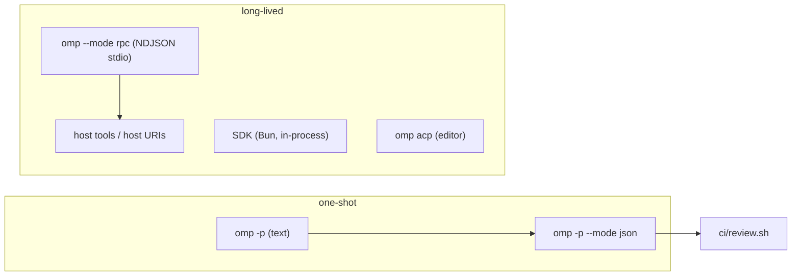

# Module 13 — Headless, Scripted & Editor-Embedded omp (~1.5 h, advanced)

| | |
|---|---|
| **Built against** | `omp --version` → `omp/18.3.1` (`omp v18.3.1`) |
| **Prerequisites** | Module 4 (approval modes, `/review`). A configured model (`omp models` lists at least one). |
| **Lab checkpoint** | `git checkout module-13-start` in `omp-course-lab` |
| **Learner machine extras** | 13.3 needs Bun ≥ 1.3.14. 13.4 needs an ACP-capable editor (Zed or any ACP client). 13.5 needs `jq` and, for `pr://`, the GitHub CLI `gh` logged in. |
| **Sources** | `omp://cli-reference.md`, `omp://rpc.md`, `omp://sdk.md`, `omp://approval-mode.md`, `omp://settings.md`, `omp://environment-variables.md`, `omp://tools/read.md`, `omp://user-facing-packages.md`, `omp://extensions.md`, `omp://slash-command-internals.md` |

**Goal:** run omp without the TUI — in shell scripts, CI, other programs, and editors — and know which safety switches survive the loss of a human at the keyboard.

Everything in this module was run on the build machine unless a lesson says otherwise; the transcripts in `demos/` are real output.



---

## Lesson 13.1 — Print mode              (~20 min)
**You will be able to:** run one prompt non-interactively with `omp -p`; choose `text` vs `json` output; bound cost with `--max-time`; pin tools and approval for an unattended run; read omp's exit code correctly.
**Why this exists:** the TUI is for a human steering an agent. Scripts and CI have no human, so they need the same agent as a plain process: prompt in, answer (or event stream) out, deterministic exit code, no session litter, and a hard stop on runaway cost. `-p` is that entry point; every other flag in this lesson narrows what that process may do.
**Demo:** `demos/13.1-print-mode.md`
**Concepts:**
- `omp -p "<prompt>"` / `omp --print` — process the prompt, stream the result to stdout, exit. Non-TTY stdin is read automatically as the prompt (`echo "…" | omp -p`, no `-` marker). `@path` attaches files; `--` ends flag parsing.
- **stdout is only the answer.** The `Working...` spinner line goes to stderr. `2>/dev/null` gives you a clean pipe.
- `--print-thoughts` — include thinking blocks in the text output (text mode only; JSON mode always carries them as `thinking_delta` events).
- `--mode json` — one JSON object per line. Frame types, in the order they appear (captured on 18.3.1):

  ```jsonc
  {"type":"session","version":3,"id":"01a0…","timestamp":"…","cwd":"/path"}   // header, once
  {"type":"agent_start"}
  {"type":"turn_start"}
  {"type":"message_start","message":{"role":"user","content":[{"type":"text","text":"…"}]}}
  {"type":"message_end","message":{"role":"user",…}}
  {"type":"message_start","message":{"role":"assistant","content":[…],"provider":"anthropic","model":"…","usage":{"input":2089,"output":3,"cost":{"total":0.0021}},…}}
  {"type":"message_update","assistantMessageEvent":{"type":"text_delta","contentIndex":1,"delta":"hi"}}
  {"type":"message_end","message":{"role":"assistant","content":[{"type":"text","text":"hi"}],"stopReason":"stop"}}
  {"type":"turn_end","message":{…}}
  {"type":"agent_end","messages":[…all messages…]}
  ```

  When the model calls a tool the assistant message has `content:[{type:"toolCall",…}]` and `stopReason:"toolUse"`, followed by `tool_execution_start {toolCallId,toolName,args,intent}`, `tool_execution_end {toolCallId,toolName,result,isError}`, a `message_start/end` pair with `role:"toolResult"`, `turn_end`, then a new `turn_start`. `assistantMessageEvent.type` is one of `thinking_start|delta|end`, `text_start|delta|end`, `toolcall_start|delta|end`; the `*_delta` forms carry `delta`, the `*_end` forms carry the full `content`.
  The final answer is the **last** `message_end` whose `message.role == "assistant"`; the `usage`/`cost` block on each assistant `message_start` is how you meter a run.
- `--max-time <dur>` (`600`, `10m`, `1h`) — kills the run at the deadline: stderr `Deadline exceeded`, exit `1`, nothing on stdout.
- `--no-session` — don't write a session file. `--no-title` (or `PI_NO_TITLE`) — skip the extra title-generation model call.
- `--config <file>` (repeatable) — a `config.yml`-style overlay for this run only. Precedence: runtime flags (`--approval-mode`, `--yolo`, `--model` …) > `--config` overlays (later files win) > project `.omp/settings.json` / `.omp/config.yml` > global `~/.omp/agent/config.yml`.
- `--tools read,grep,glob` — the *only* tools the model gets. `--no-tools` — none. `--no-lsp` — no LSP tools/formatting.
- `--approval-mode always-ask|write|yolo` — overrides `tools.approvalMode` (default **`yolo`**). Print mode has no UI, so any tool that *would* prompt is refused instead — the model reports it, omp still exits `0`.
- `--profile <name>` — isolated auth/sessions/settings/caches (also `OMP_PROFILE`). Use a dedicated profile for bots.
- `--model <id-or-role>` — fuzzy id (`haiku`, `openai/gpt-5.2`) or a configured role (`slow`, `@slow`).
- Print-mode specifics from the docs: `plan.defaultOnStartup` is ignored (a note is printed; use `--plan-yolo` for a headless plan flow); bash always runs non-PTY; MCP servers are awaited up to `OMP_MCP_TIMEOUT_MS` (30 s) before the first turn, and `OMP_MCP_REQUIRE_READY=1` makes a pending/failed server exit `1`; with `--advisor`, print mode waits up to ten minutes for final advisor reviews before disposing.
- **Exit codes observed (18.3.1):** `0` normal completion — including when the model could not do what you asked; `1` startup failure (unknown model, no credentials) or `Deadline exceeded`. Treat "pass/fail" as a property of the *output*, never of the exit code alone.

**Try it (Walkthrough):**
1. In `omp-course-lab`: `omp -p --no-session "How many test files are under tests/? One line."`
   **Expected:** stderr `Working...`, stdout a one-line answer, `echo $?` → `0`.
2. Same prompt via stdin and clean stdout: `echo "How many test files are under tests/? One line." | omp -p --no-session 2>/dev/null | cat -A`
   **Expected:** only the answer text terminated by `$` (newline). No spinner.
3. `omp -p --no-session --mode json "Reply with exactly the word: hi" 2>/dev/null | jq -r .type | uniq -c`
   **Expected:** a count per event type: `session`, `agent_start`, `turn_start`, `message_start`, `message_end`, `message_update`(many), `turn_end`, `agent_end`.
4. Extract only the answer: `omp -p --no-session --mode json "Reply with exactly the word: hi" 2>/dev/null | jq -rs '[.[] | select(.type=="message_end" and .message.role=="assistant")] | last | .message.content[] | select(.type=="text") | .text'`
   **Expected:** `hi`
5. Cap it: `omp -p --no-session --no-tools --max-time 1 "Write a 500 word essay about rivers" >out.txt; echo $?; wc -c out.txt`
   **Expected:** stderr `Deadline exceeded`, `1`, `0 out.txt`.
6. Pin tools: `omp -p --no-session --tools read,grep,glob "Create a file named NEW.txt containing the word done. If you cannot, say CANNOT-WRITE and list your tools."`
   **Expected:** the reply contains `CANNOT-WRITE` and lists read/grep/glob; `ls NEW.txt` → no such file; `echo $?` → `0`.
7. Overlay instead of flags: `printf 'tools:\n  approvalMode: always-ask\n' > /tmp/ask.yml` then `omp -p --no-session --config /tmp/ask.yml "Use the write tool to create NEW2.txt containing done."`
   **Expected:** the model reports it needs approval / cannot proceed; `NEW2.txt` does not exist; exit `0`.
8. Show the precedence: `omp -p --no-session --config /tmp/ask.yml --yolo "Use the write tool to create NEW2.txt containing done."`
   **Expected:** `NEW2.txt` now exists (runtime flag beat the overlay). `rm NEW2.txt`.

**Guided task:** `notes/answer.sh` — a script that takes a prompt as `$1`, runs omp headless against the lab with read-only tools, a 2-minute cap, no session file, and prints **only** the final assistant text. Hints: `--mode json`, the `jq -s … | last` filter from step 4, `2>/dev/null`. Checkpoints: (a) `bash notes/answer.sh "Reply with: ok"` prints exactly `ok`; (b) `bash notes/answer.sh "Create foo.txt"` creates nothing and exits `0`; (c) with `--max-time 1` hard-coded it prints nothing and exits `1`. Pass condition: (a)–(c) observed.

**Stretch:** make the script exit `2` when the model's answer contains the string `CANNOT` and `1` on omp failure, without changing omp's own exit codes. Pass: `bash notes/answer.sh "…"; echo $?` shows `0`, `1`, and `2` in the three scenarios.

**Troubleshooting:**

| Symptom | Cause | Fix |
|---|---|---|
| `Model "x" not found` … exit 1 | no provider credential / bad fuzzy id | `omp models` to see what is available; set `ANTHROPIC_API_KEY`/`OPENAI_API_KEY`… or `--api-key` |
| Pipe contains `Working...` | you captured stderr | add `2>/dev/null` (stdout is clean) |
| Script hangs at start | MCP server configured in the project is slow/dead | print mode waits for MCP up to `OMP_MCP_TIMEOUT_MS`; set `OMP_MCP_REQUIRE_READY=1` to fail fast |
| `jq` prints multiple answers | multi-turn tool use emits several assistant `message_end` | use `jq -s … | last` |
| Prompt starts with `-` and is parsed as a flag | flag parsing | `omp -p -- "-x looks like a flag"` |
| `~/.omp/agent/sessions` fills up | forgot `--no-session` | add it, or `--session-dir` to a temp dir |
| Session in plan mode does nothing | `plan.defaultOnStartup` is ignored in print mode | use `--plan-yolo` for headless plan-then-execute |

**Cheat sheet:**

| Want | Flag |
|---|---|
| headless, text | `omp -p "…"` / `echo … \| omp -p` |
| headless, events | `omp -p --mode json "…"` |
| thinking in text output | `--print-thoughts` |
| hard stop | `--max-time 10m` (exit 1, `Deadline exceeded`) |
| no session file / no title call | `--no-session` / `--no-title` |
| read-only | `--tools read,grep,glob` (or `--no-tools`) |
| approval without UI | `--approval-mode always-ask` → write/exec refused |
| per-run config | `--config ci.yml` (repeatable; flags still win) |
| isolated bot identity | `--profile ci-bot` |

**Source:** omp://cli-reference.md, omp://settings.md, omp://approval-mode.md, omp://environment-variables.md, omp://mcp-config.md, omp://bash-tool-runtime.md, omp://advisor-watchdog.md

---

## Lesson 13.2 — RPC              (~25 min)
**You will be able to:** drive a long-lived `omp --mode rpc` process from any language over NDJSON; correlate `prompt` → `prompt_result` → `session_settled`; abort a running turn; know when to reach for host tools, host URI schemes and subagent subscriptions.
**Why this exists:** `-p` is one prompt, one process. A service that hosts many conversations, needs to steer mid-turn, or wants the agent to call *its* functions needs a persistent, bidirectional channel. RPC mode is that: omp keeps the session in memory, you send commands on stdin, and it streams the same events the TUI renders back on stdout — plus a few frames that exist only for hosts.
**Demo:** `demos/13.2-rpc.md`
**Concepts:**
- Start: `omp --mode rpc [normal launch flags]`. Add `--no-ui` when your host cannot answer dialogs: extensions see `ctx.hasUI === false`, dialogs resolve to defaults, no `extension_ui_request` frames (except a host-issued `login`). `--mode rpc-ui` additionally routes tool UI such as `ask` through the UI sub-protocol. `@file` arguments are rejected in RPC mode. Title generation is off by default.
- **Framing:** one JSON object per line, both directions. First stdout line is `{"type":"ready","protocolVersion":1,"supportedProtocolVersions":[1,2],"maxFrameBytes":1048576,"maxReassembledFrameBytes":67108864}`. Send `{"id":"…","type":"negotiate_protocol","protocolVersion":2}` to get lossless `rpc_chunk` sequences (base64 segments with `chunkId`, `index`, `count`, `byteLength`) instead of v1's 1 MiB cap.
- **Correlation:** every command accepts `id`; the response echoes it: `{"id","type":"response","command","success":true,"data"}` or `{"success":false,"error","code?"}`. Malformed JSON → `command:"parse"` failure, loop continues. Responses across concurrent commands (e.g. `bash`) are **not** ordered — match on `id`.
- **Prompt lifecycle:** `{"id":"req_1","type":"prompt","message":"…"}` is acked *immediately*. The turn's events follow (`agent_start`, `message_update` with `assistantMessageEvent.type == "text_delta"`, `tool_execution_*`, `agent_end`). Completion is the `prompt_result` frame with the same `id`: `{"type":"prompt_result","id","agentInvoked":true,"status":"completed|aborted|error","error?","sessionSettled"}`. A slash command that starts no turn completes with `data.agentInvoked:false` on the ack instead.
- **Yield vs settled:** `prompt_result` = the agent yielded. `session_settled` = nothing can wake it (no queued steer/follow-up, no background `bash`/`task`/`eval`). Tear down a sandbox on `session_settled` or `prompt_result.sessionSettled == true`; `get_state` exposes `isSettled` and `hasPendingAsyncWork` for hosts attaching mid-stream.
- **While streaming:** `prompt` needs `streamingBehavior: "steer" | "followUp"` or it fails; or use `steer` / `follow_up` / `abort` / `abort_and_prompt`. Queue defaults: `steeringMode` and `followUpMode` `one-at-a-time`, `interruptMode` `immediate` (steering can abort remaining tool calls in the turn; `wait` defers to turn end).
- **Command families** (rpc.md "Command Schema"): state (`get_state`, `get_entries`, `get_tree`, `set_todos`, `set_event_filter`), model (`set_model {provider, modelId}`, `cycle_model`, `get_available_models`), thinking (`set_thinking_level`, `get_available_thinking_levels`), compaction (`compact`, `set_auto_compaction`), retry, `bash`/`abort_bash`, session (`new_session`, `open_session {sessionDir}`, `switch_session`, `branch`, `handoff`, `export_html`, `get_last_assistant_text`, `set_session_name`), messages (`get_messages`, `get_messages_page {cursor,limit}` — ≤ 256 per page, errors `session_busy` / `stale_cursor`), login.
- `set_event_filter {events:[…]|null}` — pin the event `type`s you understand; responses, `prompt_result`, `session_settled`, host frames and `extension_error` are always written.
- **Host tools:** `set_host_tools {tools:[{name,label,description,parameters(JSON Schema),hidden?,loadMode?}]}` → response `{toolNames}`. When the model calls one, omp emits `{"type":"host_tool_call","id","toolCallId","toolName","arguments"}`; you answer `{"type":"host_tool_result","id","result":{"content":[{"type":"text","text":"…"}]},"isError?"}` (optional `host_tool_update` with `partialResult` for progress; omp sends `host_tool_cancel {targetId}` on abort). Re-sending replaces the whole set.
- **Host URI schemes:** `set_host_uri_schemes {schemes:[{scheme:"db",description,writable,immutable}]}`; reads/writes of `db://…` arrive as `host_uri_request {id, operation:"read"|"write", url, content?}`; reply `host_uri_result {id, content, contentType?, notes?, immutable?}` (writes: just `{id}`), or `isError:true` + `error`. Built-in schemes (`local://`, `skill://`, `artifact://`, `mcp://`, …) are reserved. `edit` never targets host URIs — expose `writable` and the model uses `write`.
- **Subagents:** `set_subagent_subscription {level:"off"|"progress"|"events"}` (default `off`) gates `subagent_lifecycle` / `subagent_progress` / `subagent_event` frames; `get_subagents`, `get_subagent_messages {subagentId|sessionFile, fromByte}`.
- **Shutdown:** close stdin → pending host/UI requests rejected, accepted commands drained, session disposed, exit `0`. Keep reading stdout until EOF; an unread pipe can delay exit indefinitely.
- **Client libraries:** TypeScript `RpcClient` (`packages/coding-agent/src/modes/rpc/rpc-client.ts`; spawns `bun <cli> --mode rpc`, `setCustomTools()`) and Python `omp-rpc` (`from omp_rpc import RpcClient`; `RpcClient(provider=…, model=…)`, `get_state()`, `prompt_and_wait(...)`, `.require_assistant_text()`, `get_messages()`, `command=[...]` to own the child command). Both negotiate v2 automatically. The bundled Python package lives at `python/omp-rpc` in the omp source tree; `solutions/rpc_client.py` is a stdlib re-implementation of the same wire protocol so you can read every frame.

  The `omp-rpc` example from rpc.md, verbatim:

  ```python
  from omp_rpc import RpcClient

  with RpcClient(provider="anthropic", model="claude-sonnet-4-5") as client:
      state = client.get_state()
      turn = client.prompt_and_wait("Reply with just the word hello")
      print(turn.require_assistant_text())
  ```

  The same thing with nothing but the stdlib — this is what every client does underneath (run on 18.3.1; a trimmed version of `solutions/rpc_client.py`):

  ```python
  import json, subprocess
  p = subprocess.Popen(["omp", "--mode", "rpc", "--no-ui", "--no-session"],
                       stdin=subprocess.PIPE, stdout=subprocess.PIPE, text=True, bufsize=1)
  send = lambda o: (p.stdin.write(json.dumps(o) + "\n"), p.stdin.flush())
  assert json.loads(p.stdout.readline())["type"] == "ready"
  send({"id": "r1", "type": "prompt", "message": "Reply with just the word hello"})
  for line in p.stdout:
      f = json.loads(line)
      if f["type"] == "message_update" and f["assistantMessageEvent"]["type"] == "text_delta":
          print(f["assistantMessageEvent"]["delta"], end="", flush=True)
      elif f["type"] == "prompt_result" and f["id"] == "r1":
          print(f"\nstatus={f['status']}")
          if f["sessionSettled"]:
              break
  p.stdin.close(); p.wait()          # EOF on stdin => omp disposes the session and exits 0
  ```

  A host-URI round trip looks like this on the wire (rpc.md "Host URI Sub-Protocol"):

  ```json
  → {"id":"u0","type":"set_host_uri_schemes","schemes":[{"scheme":"db","description":"Virtual db rows","writable":true,"immutable":false}]}
  ← {"id":"u0","type":"response","command":"set_host_uri_schemes","success":true,"data":{"schemes":["db"]}}
  → {"id":"r2","type":"prompt","message":"Read db://users/42 and tell me the name"}
  ← {"type":"host_uri_request","id":"uri_1","operation":"read","url":"db://users/42"}
  → {"type":"host_uri_result","id":"uri_1","content":"id=42\nname=Alice\n","contentType":"text/plain"}
  ← … text deltas … {"type":"prompt_result","id":"r2","status":"completed",…}
  ```

**Try it (Walkthrough):**
1. `printf '{"id":"s1","type":"get_state"}\n' | omp --mode rpc --no-ui --no-session --no-tools`
   **Expected:** three lines — `ready`, `available_commands_update`, and the `response` for `s1` with `data.model`, `data.isSettled: true`. Exit `0` after stdin EOF.
2. Run the shipped client: `python3 modules/M13-headless-scripted-embedded/solutions/rpc_client.py --tools read,grep,glob "Reply with exactly the word: hello"`
   **Expected:** stderr shows `[ready]`, `[state]`, `[ack]`, `[prompt_result] status=completed sessionSettled=True`, `[exit] omp exited 0`; stdout `hello`; exit `0`.
3. Abort: `python3 …/rpc_client.py --tools read,grep,glob --abort-after 1.5 "Write a 1500 word essay about rivers, streaming it as you go."`
   **Expected:** a partial essay on stdout, then `[abort] success=True` and `[prompt_result] status=aborted`; exit `0`.
4. Read the client's `call()` and the main loop. Find where it (a) negotiates v2, (b) matches `prompt_result` by `id`, (c) closes stdin to exit.
   **Expected:** you can point at the three lines.
5. Send a bad line: `printf 'not json\n{"id":"s2","type":"get_state"}\n' | omp --mode rpc --no-ui --no-session --no-tools | jq -c 'select(.type=="response") | {id,command,success}'`
   **Expected:** `{"id":null,"command":"parse","success":false}` then `{"id":"s2","command":"get_state","success":true}` — the loop survived.

**Guided task:** extend `rpc_client.py` (copy it to `notes/rpc_abort.py`) so that `--abort-after N` is replaced by *steering*: after N seconds send `{"type":"steer","message":"Stop and instead reply with only the word STEERED"}`. Hints: rpc.md "While streaming"; the steer is applied between tool calls / at the next step, so use a prompt that generates a long answer. Checkpoints: (a) the steer command gets a `success:true` response; (b) the `prompt_result` for the original prompt has `status:"completed"`; (c) the final assistant text is `STEERED`. Pass condition: all three observed in the client's output.

**Stretch:** register a host tool `lab_issue` (`parameters: {number:int}`) that returns the text of `docs/ISSUES.md` for issue *N* from your Python process, then prompt "Use lab_issue to read issue #1 and summarize it in one line". Pass: a `host_tool_call` frame arrives with `toolName:"lab_issue"`, your `host_tool_result` is accepted, and the final text mentions the issue #1 bug.

**Troubleshooting:**

| Symptom | Cause | Fix |
|---|---|---|
| Client blocks forever after last frame | you closed stdin but stopped reading stdout, or never closed stdin | keep draining stdout; close stdin to trigger exit `0` |
| `prompt` response `success:false` mid-turn | sent a second `prompt` while streaming without `streamingBehavior` | add `"streamingBehavior":"steer"` or use `steer`/`follow_up` |
| Extension dialog never answered, turn stalls | host started without `--no-ui` and ignores `extension_ui_request` | start with `--no-ui`, or answer with `extension_ui_response {id, value|confirmed|cancelled}` |
| `@file` argument error at startup | `@file` is rejected in RPC mode | send content in the `prompt` message or `images` |
| Response order differs from send order | `bash` and other commands run concurrently | correlate on `id` |
| `Host URI scheme is reserved by OMP` | tried to register a built-in scheme | pick another name |
| Oversized frame error on v1 | > 1 MiB stdout object | negotiate protocol 2 and reassemble `rpc_chunk` |

**Cheat sheet:**

| Do | Frame |
|---|---|
| start | `omp --mode rpc --no-ui [--no-session] [--tools …]` |
| upgrade | `{"id":"p","type":"negotiate_protocol","protocolVersion":2}` |
| ask | `{"id":"r1","type":"prompt","message":"…"}` → ack → events → `prompt_result{id:"r1"}` → `session_settled` |
| steer / queue | `{"type":"steer","message"}` / `{"type":"follow_up","message"}` |
| stop | `{"type":"abort"}` → `prompt_result.status:"aborted"` |
| switch model | `{"type":"set_model","provider":"anthropic","modelId":"…"}` |
| expose your functions | `set_host_tools` → `host_tool_call` → `host_tool_result` |
| virtual files | `set_host_uri_schemes` → `host_uri_request` → `host_uri_result` |
| subagent frames | `set_subagent_subscription {level:"progress"}` |
| finish | close stdin, read to EOF, exit `0` |

**Source:** omp://rpc.md, omp://cli-reference.md

---

## Lesson 13.3 — SDK              (~15 min)
**You will be able to:** create an in-process `AgentSession` from Bun with explicit auth/model/settings; restrict it to a read-only tool set; stream `text_delta` events; dispose cleanly.
**Why this exists:** RPC isolates omp in a child process and costs you a serialization layer. When your program already runs on Bun and wants direct access to session state, tool wiring and events, `@oh-my-pi/pi-coding-agent` is the in-process surface. The doc's rule of thumb: cross-language or process isolation → RPC; same-process Bun → SDK.
**Demo:** `solutions/sdk-readonly.ts` (cannot be executed on the Python-only build machine; every identifier is copied from `omp://sdk.md`).
**Concepts:**
- Install: `bun add @oh-my-pi/pi-coding-agent`, Bun ≥ 1.3.14. Session construction works without a model; `prompt()` does not.
- The whole API in twelve lines — sdk.md "Quick start (auto-discovery defaults)", verbatim:

  ```ts
  import { createAgentSession } from "@oh-my-pi/pi-coding-agent";

  const { session, modelFallbackMessage } = await createAgentSession();

  if (modelFallbackMessage) {
    process.stderr.write(`${modelFallbackMessage}\n`);
  }

  const unsubscribe = session.subscribe((event) => {
    if (
      event.type === "message_update" &&
      event.assistantMessageEvent.type === "text_delta"
    ) {
      process.stdout.write(event.assistantMessageEvent.delta);
    }
  });

  await session.prompt("Summarize this repository in 3 bullets.");
  unsubscribe();
  await session.dispose();
  ```

  Everything else in this lesson is about replacing the defaults that line 3 discovers.
- Import from the package root: `createAgentSession`, `SessionManager`, `Settings`, `AuthStorage`, `ModelRegistry`, `AgentRegistry`, `discoverAuthStorage`, discovery helpers, `createTools`/`BUILTIN_TOOLS`. The narrower `…/sdk` subpath does **not** export `SessionManager`, `AuthStorage`, `ModelRegistry`.
- `createAgentSession(options?)` — "provide to override, omit to discover": defaults are `cwd = getProjectDir()`, `agentDir = ~/.omp/agent`, `discoverAuthStorage(agentDir)`, `new ModelRegistry(authStorage)`, `Settings.init({cwd, agentDir})`, file-backed `SessionManager.create(...)`, skills/rules/context files/extensions, built-in tools, MCP and LSP enabled.
- Explicit wiring: `const authStorage = await discoverAuthStorage(); const modelRegistry = new ModelRegistry(authStorage); await modelRegistry.refresh(); modelRegistry.getAvailable()[0]` → pass `authStorage`, `modelRegistry`, `model`. If you pass both, `modelRegistry.authStorage` must be the same instance.
- Model selection when `model` omitted: restore from session → settings `default` role → authenticated provider default. `modelFallbackMessage` tells you if a restore failed.
- `SessionManager.inMemory()` → `session.sessionFile === undefined`, no disk persistence. `SessionManager.create(cwd)` → `.jsonl` on disk; `SessionManager.continueRecent(cwd)`, `.list(cwd)`, `.open(path)` for resume flows.
- `Settings.isolated({...})` — test/embedder config that ignores the user's files (e.g. `"compaction.enabled": true, "retry.enabled": true`).
- Tools: `toolNames: [...]` *requests* tools (can enable default-off ones) and is **not** an allowlist by itself; add `restrictToolNames: true` to make it one. Restricted sessions disable ambient MCP, extensions, custom commands and LSP by default; `enableMCP: false`, `enableLsp: false` are explicit. `customTools` in a restricted session need `allowRestrictedCustomTools: true` *and* their names in `toolNames`. Runtime: `getActiveToolNames()`, `getAllToolNames()`, `setActiveToolsByName(names)`.
- Events: `session.subscribe(listener)` returns an unsubscribe fn. `message_update` → `event.assistantMessageEvent.type === "text_delta"` → `.delta`. `agent_end` is completion only when `event.isTerminal !== false`.
- Prompting: `await session.prompt(text, { streamingBehavior? })`; while streaming use `steer()`, `followUp()`, `sendUserMessage(content, { deliverAs: "aside" })`, `abort()`.
- Disposal: `await session.dispose()` (idempotent). If you must await your own teardown first, call `session.beginDispose()` synchronously before your first `await`, then `dispose()`.
- Several top-level sessions in one process → give each a private `AgentRegistry`.
- The restricted-session shape from sdk.md "Built-ins and filtering":

  ```ts
  const { session } = await createAgentSession({
    toolNames: ["read", "grep", "glob", "write"],
    restrictToolNames: true,
    requireYieldTool: true,
  });
  ```

  and the two-phase teardown from "`AgentSession` lifecycle and disposal":

  ```ts
  async function closeEmbeddedSession(
    session: AgentSession,
    closeHostInputAndUi: () => Promise<void>,
  ): Promise<void> {
    session.beginDispose(); // no new deferred work may enter after this point
    await closeHostInputAndUi();
    await session.dispose();
  }
  ```
- Subagent-oriented options you will meet in orchestrators: `outputSchema` / `outputSchemaMode` (structured output), `requireYieldTool`, `taskDepth`, `parentTaskPrefix`, `bindProcessState: false` for helper sessions. Not needed for single-agent embedding.

**Try it (Walkthrough):** *(on a machine with Bun; skip on the Python-only lab box)*
1. `cd omp-course-lab && bun add @oh-my-pi/pi-coding-agent`
   **Expected:** package installed; `bun --version` ≥ 1.3.14.
2. `cp modules/M13-headless-scripted-embedded/solutions/sdk-readonly.ts notes/ && bun notes/sdk-readonly.ts "List the files under api/ in one line"`
   **Expected:** stderr `[tools] read, grep, glob`, `[sessionFile] undefined`, `[tool] glob` (or `read`); stdout streams the answer; `[agent_end] terminal`.
3. `bun notes/sdk-readonly.ts "Create notes/sdk.txt containing done"`
   **Expected:** the model reports it has no write tool; `ls notes/sdk.txt` → no such file.
4. Change `restrictToolNames: true` to `false`, re-run step 3.
   **Expected:** the file may now be created (toolNames alone only *requests* tools; the full default set is active). Revert.

**Guided task:** write `notes/sdk-count.ts` that runs a read-only in-memory session, counts `tool_execution_start` events by `toolName`, and prints the table after `agent_end` with `isTerminal !== false`. Hints: sdk.md "Event subscription model"; keep a `Map`. Checkpoints: (a) compiles under `bun`; (b) for the prompt "grep for TODO across the repo and summarize" the table shows `grep ≥ 1`; (c) no `write`/`edit` row ever appears. Pass condition: the printed table.

**Stretch:** persist instead — `SessionManager.create(process.cwd())`, print `session.sessionFile`, then in a second run resume it with `SessionManager.continueRecent(process.cwd())` and ask "what did I ask you last time?". Pass: the second run's answer references the first prompt, and `omp --resume <id>` opens the same session in the TUI.

**Troubleshooting:**

| Symptom | Cause | Fix |
|---|---|---|
| `No authenticated models available` | no provider credentials for this agentDir | `omp login` / env key; or pass `authStorage` from a profile's dir |
| Import of `SessionManager` from `…/sdk` fails | subpath doesn't export it | import from the package root |
| Session creation rejects auth store | `authStorage` ≠ `modelRegistry.authStorage` | build the registry from the same instance |
| Tools you didn't list still run | `toolNames` without `restrictToolNames` | set `restrictToolNames: true` |
| Custom tool silently missing in restricted session | excluded by default | `allowRestrictedCustomTools: true` + name in `toolNames` |
| Second session in same process fails with "Main" identity | shared process-global `AgentRegistry` | pass a private `AgentRegistry` per session |
| Process never exits | session not disposed | `await session.dispose()` |

**Cheat sheet:**

| Need | API |
|---|---|
| create | `await createAgentSession({...})` → `{ session, modelFallbackMessage, eventBus, ... }` |
| own auth/models | `discoverAuthStorage()`, `new ModelRegistry(auth)`, `.refresh()`, `.getAvailable()` |
| ephemeral | `sessionManager: SessionManager.inMemory()` |
| isolated config | `settings: Settings.isolated({...})` |
| allowlist | `toolNames: [...]`, `restrictToolNames: true` |
| stream | `session.subscribe(e => …text_delta…)` |
| done | `agent_end` with `isTerminal !== false`; then `await session.dispose()` |

**Source:** omp://sdk.md

---

## Lesson 13.4 — ACP / editors              (~15 min)
**You will be able to:** run omp as an ACP server for an editor; predict which tool calls the editor will be asked to approve; make an ACP session unattended with `--yolo` / `--config`.
**Why this exists:** editors that speak the Agent Client Protocol (Zed, and any other ACP client) can host omp as *their* agent: the editor owns the chat surface and the permission dialog, omp owns the tools and the session. The point of this lesson is the approval story, because ACP is the one headless mode where a human *is* present — but on the other side of a protocol.
**Demo:** none captured — no ACP client on the build machine. The commands below are documented in `omp://approval-mode.md` (ACP sessions) and `omp://cli-reference.md`.
**Concepts:**
- Start: `omp acp` (stdio server). `omp --mode acp` is documented as equivalent. Your editor launches this command; consult the editor's own docs for how to register a custom ACP agent (the omp docs do not ship editor config snippets).
- **Same settings resolver as every launch:** global `~/.omp/agent/config.yml`, the project config of the ACP session's `cwd`, and any `--config <file>` overlays given to the `omp acp` process apply to every session that process creates.
- **Default is *not* unattended.** The schema default of `tools.approvalMode` is `yolo`, but a default-config ACP session still keeps the **client permission gate**: `bash`, `edit`, `delete`, `move` go to the editor via ACP `session/request_permission`; other approval prompts use form elicitation when the client advertises `elicitation.form`. A rejected, cancelled or unsupported prompt rejects/cancels the tool call — omp never silently allows.
- **Unattended:** set `tools.approvalMode: yolo` *explicitly* (global or project config), or launch `omp acp --yolo` / `omp acp --auto-approve` / `omp acp --approval-mode yolo` / `omp acp --config ./acp-yolo.yml`. Explicit yolo skips omp's prompts *and* the client gate for `bash`/`edit`/`delete`/`move`, unless `tools.approval.<tool>` is `prompt` or `deny`.
- Precedence is normal: runtime flags > `--config` overlays > project config > global config. ACP has no per-session approval field on `session/new` / `session/load` / `session/resume`; per-session yolo means a separate `omp acp` process with a flag or overlay.
- Extension UI in ACP: `ctx.hasUI` is `true`; `select`/`confirm`/`input`/`editor` round-trip as elicitations (defaults when the client lacks `elicitation.form`); widgets/theming/terminal input are no-ops.
- Slash commands: built-ins with a text-mode handler are advertised to the ACP client; TUI-only built-ins are not. `/share` in ACP always uses the default encrypted flow (custom share scripts are not loaded). `/memory mm …` is unsupported in ACP.
- File writes through the ACP bridge (`writeTextFile`) are handed to the editor when available.
- `omp acp --help` on 18.3.1 prints only the usage line; the flags above are documented in approval-mode.md, and `--approval-mode`, `--auto-approve`, `--config` are launch flags shared with `omp`.

**Try it (Walkthrough):** *(requires an ACP-capable editor on the learner machine)*
1. Register `omp acp` as an agent server in your editor (see its docs) and open `omp-course-lab`.
   **Expected:** the editor's agent panel connects; omp answers "which files are under api/?" using `read`/`glob` with **no** permission dialog (read tier).
2. Ask "append a comment line to cli/__init__.py".
   **Expected:** the editor shows a permission request for `edit` (`session/request_permission`). Reject it. The tool call is cancelled; the file is unchanged (`git diff --stat` empty).
3. Ask again and approve.
   **Expected:** the edit lands; `git diff --stat` shows `cli/__init__.py`. Revert with `git checkout cli/__init__.py`.
4. Create `notes/acp-yolo.yml` containing `tools:\n  approvalMode: yolo`, change the editor's agent command to `omp acp --config <abs path>/notes/acp-yolo.yml`, reconnect, repeat step 2.
   **Expected:** no permission dialog; the edit lands.

**Guided task:** keep yolo but re-gate one tool: add `tools:\n  approval:\n    bash: prompt` to the same overlay and ask the agent to run `python -m pytest -q`. Hints: approval-mode.md "ACP sessions" last two paragraphs; per-tool `prompt`/`deny` survive yolo. Checkpoints: (a) `edit` still needs no dialog; (b) `bash` produces a permission request. Pass condition: both observed in the editor.

**Stretch:** run the guided-task overlay (yolo + `tools.approval.bash: prompt`) through print mode instead (`omp -p --no-session --config notes/acp-yolo.yml "run python -m pytest -q and report the summary line"`) and explain, in `notes/acp-vs-print.md`, why the bash call is *refused* there but *prompted* in ACP. Pass: the note names the missing surface (no UI in print mode → a `prompt` policy cannot be satisfied) and cites approval-mode.md.

**Troubleshooting:**

| Symptom | Cause | Fix |
|---|---|---|
| Every write asks for permission although config says yolo | default-config ACP keeps the client gate | set `tools.approvalMode: yolo` *explicitly* or launch with `--yolo` |
| One session needs yolo, another doesn't | no per-session approval field in ACP | run two `omp acp` processes with different `--config` overlays |
| Dialog "unsupported", tool call cancelled | client lacks `elicitation.form` for a generic prompt | switch mode/policy so that tool doesn't prompt, or use a client that supports elicitation |
| Custom share script ignored | ACP uses the default encrypted share flow | expected behaviour |
| `omp acp --help` shows no flags | help text is minimal in 18.3.1 | use the launch flags from `omp --help` (`--yolo`, `--approval-mode`, `--config`) |

**Cheat sheet:**

| Do | Command / setting |
|---|---|
| serve | `omp acp` (= `omp --mode acp`) |
| unattended | `omp acp --yolo` · `--auto-approve` · `--approval-mode yolo` · `--config acp-yolo.yml` |
| explicit config | `tools.approvalMode: yolo` in global/project config |
| keep one gate under yolo | `tools.approval.bash: prompt` (or `deny`) |
| which calls hit the client gate | `bash`, `edit`, `delete`, `move` → `session/request_permission` |

**Source:** omp://approval-mode.md, omp://cli-reference.md, omp://extensions.md, omp://slash-command-internals.md, omp://session-operations-export-share-fork-resume.md, omp://memory.md

---

## Lesson 13.5 — CI patterns              (~25 min)
**You will be able to:** build a read-only review bot that fails a pipeline on a P0; feed it a PR via `pr://`; keep secrets out of files; bound cost; know what `robomp` is when you outgrow a shell script.
**Why this exists:** the useful CI agent is a *reviewer*, not a committer: it may read the diff and the repo, must not touch the tree, must finish inside a budget, and must produce a machine-checkable verdict. Every flag from 13.1 exists for one of those four constraints; this lesson assembles them.
**Demo:** `demos/13.5-ci-review.md`
**Concepts:**
- **Four fences, applied together** (all verified on the build machine):
  1. `--tools read,grep,glob` — the model literally has no write/edit/bash tool.
  2. `--config ci.yml` with `tools.approvalMode: always-ask` (only `read`-tier auto-approved) plus `tools.approval: {write: deny, edit: deny, bash: deny, eval: deny, task: deny}` — a user `deny` cannot be bypassed by any mode, so even a tool that sneaks in via an extension is blocked.
  3. `--max-time 10m` — cost/time cap; exit `1` on `Deadline exceeded`.
  4. `--no-session --no-extensions --no-skills` — nothing persisted, nothing from a developer's home dir loaded. Consider `--profile ci-bot` for a fully separate identity.

  `solutions/ci.yml` in full:

  ```yaml
  tools:
    approvalMode: always-ask   # only the `read` tier is auto-approved
    approval:
      write: deny
      edit: deny
      bash: deny
      eval: deny
      task: deny
  ```

  What a blocked call looks like inside the JSON stream (a `tools.approval.bash: prompt` policy under `-p`, captured on 18.3.1): `tool_execution_end … "isError": true`, result text `Tool "bash" requires approval but no interactive UI available.` — the model then reports the error and the run still exits `0`.
- **Skeleton of `ci-review.sh`** (the shipped file adds arg parsing and a `pr://` mode):

  ```bash
  omp -p --mode json --no-session --no-extensions --no-skills \
      --config ci/ci.yml --tools read,grep,glob --max-time 10m \
      "/review Respond with ONLY a JSON object … {\"findings\":[…],\"verdict\":\"pass|fail\"}" > "$RAW" 2>/dev/null \
    || { echo "omp failed — failing closed" >&2; exit 1; }
  python3 - "$RAW" <<'PY'      # last assistant message_end → strip ``` → json.loads → exit 1 on any P0
  …
  PY
  ```
- **`/review` runs headless.** `omp -p "/review …"` resolves the working diff itself (bundled review command) and any trailing text is appended to its prompt — that is where you specify the JSON verdict format. There is no documented native JSON output for `/review`; the shipped script asks for `{"findings":[{severity,file,line,title}],"verdict"}` and strips the code fence the model sometimes adds anyway.
- **Verdict from content, not exit code.** omp exits `0` after a refused tool or an empty review. Parse the last assistant `message_end` from `--mode json`, then exit `1` on any `P0` (or on unparseable output — fail closed).
- **PRs:** `read pr://<N>` (or `pr://<owner>/<repo>/<N>`) gives the PR view (`?comments=0` to drop comments); `pr://<N>/diff` lists changed files, `pr://<N>/diff/<i>` one file, `pr://<N>/diff/all` the full unified diff. The same URIs work from the shell: `omp read pr://12/diff/all`. Needs `gh` authenticated; results are cached in `~/.omp/cache/github-cache.db` (`github.cache.*` settings). `ci-review.sh` switches to a `pr://` target with `OMP_REVIEW_TARGET=pr://12`.
- **Secrets via environment.** Provider keys are read from env (`ANTHROPIC_API_KEY`, `OPENAI_API_KEY`, `GEMINI_API_KEY`, …; `omp --help` lists them) or `--api-key`. Put them in the CI secret store, never in `ci.yml` or the repo. The lab's `.env.example` `labtok_…` token exists so you can check the bot never echoes it.
- **MCP in CI:** print mode waits for configured MCP servers up to `OMP_MCP_TIMEOUT_MS`; set `OMP_MCP_REQUIRE_READY=1` to fail fast, or avoid MCP in the bot profile.
- **`robomp`** (`python/robomp`, Python ≥ 3.11): a self-hosted service that receives GitHub webhooks, classifies issues, resumes an `omp --mode rpc` session per issue, comments or opens a fix PR, and handles follow-ups; dashboard on `http://localhost:6543/` under Docker Compose; commands `robomp serve|triage|replay|status|cleanup`. It is what the shell script grows into once you want *fixes*, not just reviews.
- **Pipeline skeleton** (generic CI YAML; the only omp-specific lines are the install and the two commands):

  ```yaml
  review:
    runs-on: ubuntu-latest
    steps:
      - uses: actions/checkout@v4
        with: { fetch-depth: 0 }          # full history so /review can diff against the base branch
      - run: <install omp per omp.sh>      # see Module 1 for install paths
      - run: bash ci/review.sh --max-time 5m
        env:
          ANTHROPIC_API_KEY: ${{ secrets.ANTHROPIC_API_KEY }}   # or OPENAI_API_KEY, …
          OMP_REVIEW_TARGET: pr://${{ github.event.pull_request.number }}
          OMP_MCP_REQUIRE_READY: "1"
  ```

**Try it (Walkthrough):**
1. `mkdir -p ci && cp modules/M13-headless-scripted-embedded/solutions/{ci-review.sh,ci.yml} ci/ && chmod +x ci/ci-review.sh`
   **Expected:** `ci/ci-review.sh`, `ci/ci.yml` exist.
2. Clean tree: `bash ci/ci-review.sh --max-time 3m; echo EXIT=$?`
   **Expected:** `review: 0 finding(s), 0 P0, verdict=pass`, `EXIT=0` (the working diff is empty).
3. Plant a P0: append `os.system("rm -rf " + input())` (with `import os`) to `cli/__init__.py`, rerun.
   **Expected:** a `P0  cli/__init__.py:<line>  …` row, `review: … P0, verdict=fail`, `EXIT=1`.
4. Watch the fences: `omp -p --mode json --no-session --config ci/ci.yml --tools read,grep,glob "/review Respond with one line." 2>/dev/null | jq -r 'select(.type=="tool_execution_start") | .toolName' | sort | uniq -c`
   **Expected:** only `read`, `grep`, `glob` rows.
5. Deadline path: `bash ci/ci-review.sh --max-time 1; echo EXIT=$?`
   **Expected:** `review: omp exited 1 (deadline or startup failure) — failing closed`, `EXIT=1`.
6. `git checkout cli/__init__.py`.
   **Expected:** step 2 passes again.

**Guided task:** wire it to a PR. Push a branch with the P0 from step 3, open a PR, then `OMP_REVIEW_TARGET=pr://<N> bash ci/ci-review.sh`. Hints: `omp read pr://<N>/diff/all` first to confirm `gh` works; the script's prompt for PR targets tells the model to read that URI. Checkpoints: (a) `omp read pr://<N>` renders the PR; (b) the run's `tool_execution_start` frames show a `read` of `pr://<N>/diff/all`; (c) exit `1`. Pass condition: (c), and after fixing the P0 on the branch, exit `0`.

**Stretch:** put it in a workflow (`.github/workflows/review.yml` or your CI's equivalent) that installs omp, exports the provider key from the CI secret store, runs `ci/ci-review.sh --max-time 5m`, and posts the finding rows as a PR comment. Pass: one red run on the P0 branch, one green run after the fix, and `grep -r labtok_ $CI_LOG` finds nothing.

**Troubleshooting:**

| Symptom | Cause | Fix |
|---|---|---|
| `review: could not parse JSON verdict` | model answered in prose | keep the schema line in the prompt; a stronger `--model`; the script already strips ``` fences |
| Bot edits files | a tool got through | check all four fences: `--tools`, `ci.yml` deny list, `--no-extensions`, and that no `--yolo` is on the command line (flags beat overlays) |
| `pr://` read fails | `gh` not authenticated / wrong repo | `gh auth status`; use `pr://owner/repo/N` |
| Stale PR content | github cache | `github.cache.softTtlSec` / `hardTtlSec` settings, or wait for TTL |
| Exit 1 with empty output | `Deadline exceeded` | raise `--max-time`, narrow the prompt |
| Run hangs at start in CI | MCP server from project config | `OMP_MCP_REQUIRE_READY=1` or remove MCP in the bot profile |
| Key leaked into logs | key passed as an argument | env var only; never `--api-key` in a logged command |

**Cheat sheet:**

| Fence | How |
|---|---|
| tools | `--tools read,grep,glob` |
| approval | `ci.yml`: `tools.approvalMode: always-ask` + `tools.approval.{write,edit,bash,eval,task}: deny` |
| budget | `--max-time 10m` |
| hygiene | `--no-session --no-extensions --no-skills [--profile ci-bot]` |
| review | `omp -p --mode json "/review <verdict format>"` |
| PR | `pr://N`, `pr://N/diff`, `pr://N/diff/<i>`, `pr://N/diff/all`, `omp read pr://N` |
| verdict | last assistant `message_end` → JSON → exit 1 on P0 |
| bigger | `robomp serve` (webhooks → RPC session per issue → PR) |

**Source:** omp://cli-reference.md, omp://settings.md, omp://approval-mode.md, omp://tools/read.md, omp://tools/github.md, omp://environment-variables.md, omp://user-facing-packages.md

---

## Module summary

| Mode | Process model | Human present? | Approval surface | Use when |
|---|---|---|---|---|
| `omp -p` | one prompt, one process | no | none — prompts are refused; `--tools`/`--config` fence | scripts, CI |
| `omp --mode rpc` | long-lived child, NDJSON | optional (`extension_ui_request`) | host answers or `--no-ui` defaults | services, other languages, host tools |
| SDK | in-process Bun | your code | `restrictToolNames`, `Settings.isolated` | Bun apps, tests, orchestrators |
| `omp acp` | stdio server for an editor | yes, via the editor | `session/request_permission`, elicitation; `--yolo` to skip | editors |

Default-off / opt-in items this module relies on: `tools.approvalMode` defaults to **`yolo`** (you *lower* it for CI); RPC subagent frames default to `off`; RPC protocol v2 must be negotiated; ACP unattended mode must be *explicitly* set even though the schema default is `yolo`.
