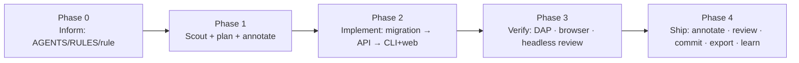

# Module 15 — Capstone Project (~3 h, all levels)

**Built and verified against:** `omp --version` → `omp/18.3.1` (Linux x64).
**Prerequisites:** Modules 1–14. Every command below is used exactly as its home module teaches it; the per-module `cheatsheet.md` files are the quick reference.
**Lab checkpoint:** `cd omp-course-lab && git checkout module-15-start` (same commit as `main`), then work on your own branch: `git switch -c v2`.
**Spec:** `omp-course-lab/docs/V2-SPEC.md`. Read it first — with your eyes, then with omp.

**Goal:** Ship the lab's **v2 feature set** — schema-v2 migration, `GET /users/<id>/orders`, `python3 -m cli orders --status`, the optional `company` field on the web form — as a reviewed, committed, documented change, driving omp the way a senior engineer would: informed sessions, a plan you annotated, parallel scouts with typed results, semantic refactors, a real debugger, a browser check, a headless review gate, and a retained lesson.

There is one lesson (the brief), five phases, and an evidence checklist of eleven items. `exercises.md` gives phase-by-phase guidance with pass conditions; `rubric.md` is what the instructor grades against; `solutions/instructor-notes.md` holds the reference approach and the `capstone-solution` tag.

---

## Lesson 15.1 — The brief              (~180 min total; phases 15–60 min each)

**You will be able to:**
1. Take a written feature spec from zero to ≥ 3 atomic, reviewed commits with omp, choosing the right tool at each step instead of the nearest one.
2. Produce evidence for every step (cards, files, `omp config get` values, exit codes) that another engineer can audit without you in the room.
3. Turn one gotcha you hit into a durable memory or managed skill.

**Why this exists:** Every earlier module isolated one capability. Real work is the opposite: a spec with four coupled items, a repo with eight known bugs you are told *not* to fix, generated files you must not hand-edit, and a reviewer who will not accept "tests pass" without a `bash` card behind it. The capstone is where you decide *when* to plan, *when* to fan out, *when* a rename deserves the LSP instead of a regex, *when* the debugger beats a print, and *when* to stop and commit. The evidence checklist is not bureaucracy — it is the same artefact trail a senior engineer leaves behind so that a change can be trusted after they have moved on.

**Demo:** `demos/15.1-spec-to-plan.md` (a real `omp -p` run turning `docs/V2-SPEC.md` into the four work items and their tests) and `demos/15.2-ci-review-v2.md` (the Module 13 `ci/review.sh` run headless against the finished v2 diff).

**Concepts:** the phases, in order. Each bullet names the module that teaches the command.

- **Phase 0 — Inform the session (M6, M11).** `.omp/AGENTS.md` (test command, layout, "never edit `generated/`", "issues #1–#8 are out of scope"), `.omp/RULES.md` (hard rules, re-read every request), and one `.omp/rules/<name>.md` with a `condition:` regex (TTSR: aborts the stream when it fires). Check with `/extensions` and `omp ttsr list`.
- **Phase 1 — Scout, plan, annotate (M10, M4).** One batch `task` with `context` + three `scout` items, each with an `outputSchema`, so the migration/API/CLI-web facts come back typed (`read agent://<id>`). Then `Alt+Shift+P` (`app.plan.toggle`), prompt for the plan, annotate at least one section (`a`, `Enter`), accept. Define ≥ 1 custom agent in `.omp/agents/<name>.md` (e.g. a `test-writer`) and watch it in Agent Hub (`Alt+A`).
- **Phase 2 — Implement in the spec's natural split (M2, M3, M8).** Migration → API → CLI+web, tests with each. Use the LSP (`lsp rename`) or `ast_edit` (`Staged as a proposal…` → `write xd://resolve`) for at least one mechanical change, and accept it. Never hand-edit `generated/` — regenerate through `tools/seed_db.py` (`edit.blockAutoGenerated: true` will refuse anyway).
- **Phase 3 — Verify like a skeptic (M8, M14, M13).** `debug` (DAP) on a real question — the migration against a v1 database, or the seeded `bin/crash.py`; browser check of the form with the `browser` eval prelude against a running `python3 -m api` (bash service with `name` + `ready`); `ci/review.sh` (Module 13) headless, exit `0`.
- **Phase 4 — Ship (M4, M5, M7, M9, M12).** `/annotate code-review` with your notes → **Continue with LLM review** (`/review`), fix what matters, `omp commit --dry-run` then `omp commit` per atomic slice (≥ 3 commits), `/export notes/capstone.html`, `/share`, `omp stats --summary`, and one `learn` call (needs `autolearn.enabled: true` + `memory.backend` ≠ `off`) or `manage_skill`. One extension/hook or MCP server must have been used somewhere in the flow (M12).

**Defaults that are off and must be enabled for this module** (verify with `omp config get <key>`):

| Feature | Key | Default | Turn on |
|---|---|---|---|
| memory + `learn` | `memory.backend`, `autolearn.enabled` | `off`, `false` | `omp config set memory.backend local` · `omp config set autolearn.enabled true` |
| `ast_grep` (search only; `ast_edit` is on) | `astGrep.enabled` | `false` | `omp config set astGrep.enabled true` |
| advisor (stretch) | `advisor.enabled` + `modelRoles.advisor` | `false` / unset | `omp config set advisor.enabled true` or `/advisor on` |
| prewalk (stretch) | `prewalk.enabled` | `false` | `omp --prewalk` for one session |
| checkpoint/rewind (optional) | `checkpoint.enabled` | `false` | `omp config set checkpoint.enabled true` |

On by default and used here: `tools.approvalMode: yolo` (consider `omp --approval-mode write` for Phase 2), `plan.enabled`, `task.batch`, `lsp.enabled`, `astEdit.enabled`, `debug.enabled`, `browser.enabled`, `eval.js`/`eval.py`, `edit.blockAutoGenerated`, `share.redactSecrets`. Off by default: `task.isolation.enabled` (set `true` in `.omp/config.yml` before Phase 2, per M10).

**Try it (Walkthrough):** the walkthrough is the five phases in `exercises.md`. The short form:

1. `git switch -c v2 module-15-start`; write `.omp/AGENTS.md`, `.omp/RULES.md`, `.omp/rules/no-hand-edit-generated.md` (with `condition:`); start `omp`; `/extensions`.
   **Expected:** `/extensions` lists the two context files and the rule; `omp ttsr list` (shell) shows the rule with `condition:`.
2. Prompt the batch of three scouts with `outputSchema`; `read agent://<id>` for each.
   **Expected:** ``Spawned 3 background agents using scout`` and three typed results (`files`, `tests_to_add`, `risks`).
3. `Alt+Shift+P`; prompt for the plan; annotate one section; accept.
   **Expected:** the Plan Review overlay shows your note; the transcript shows the accepted plan before any `edit` card.
4. Implement slice by slice (migration → API → CLI+web); after each: `python3 -m unittest discover -s tests` in a `bash` card, then `omp commit --dry-run`, then `omp commit -c "<slice>"`.
   **Expected:** `git log --oneline module-15-start..` shows ≥ 3 commits, the suite is `OK` after each.
5. DAP, browser, `ci/review.sh`, `/annotate code-review` → `/review`, `/export`, `/share`, `omp stats --summary`, `learn`.
   **Expected:** the eleven evidence items below all exist.

**Guided task:** the capstone itself — goal, hints, checkpoints and pass conditions are in `exercises.md` (Phases 0–4).

**Stretch:** (a) pair on Phase 2 via `/collab` (guest `/join <link>`, host-only commit); (b) add `.omp/WATCHDOG.md` + `advisor.enabled: true` and capture one `<advisory severity="concern">` that changed what you did; (c) run Phase 2 once with `omp --prewalk` and once without, and report the `omp stats --summary` cost delta.
*Pass:* (a) `/collab status` shows a second participant; (b) the advisory text is quoted in `notes/capstone.md` with the diff it changed; (c) two numbers from `omp stats --summary` (or `--json`) and one sentence on what the `@smol` hand-off did to quality.

**Evidence checklist (what you hand in):** every item is a file, a card, a command output, or a config value — nothing is "I understood it". Put paths and pasted outputs in `notes/capstone.md` (gitignored, so also `/export` it).

| # | Evidence | Module | Observable proof |
|---|---|---|---|
| 1 | `.omp/AGENTS.md`, `.omp/RULES.md`, ≥ 1 rule with `condition:` | M6, M11 | files in the branch; `omp ttsr list` line; `/extensions` listing |
| 2 | Plan-mode plan with ≥ 1 annotation **before** implementation | M4 | transcript: plan overlay note, then accepted plan, then first `edit` card |
| 3 | Batch `task` fan-out with `outputSchema`; ≥ 1 custom agent definition; Agent Hub screenshot | M10 | `read agent://<id>` typed results; `.omp/agents/<name>.md`; `Alt+A` screenshot |
| 4 | LSP rename **or** `ast_edit` codemod used and accepted | M8 | `Applied rename:` card, or `Staged as a proposal…` + `Applied N replacements` |
| 5 | DAP session on the seeded regression (`bin/crash.py`) or on the migration against a v1 DB | M8 | `debug` cards: `launch`, `set_breakpoint … verified`, `variables`/`evaluate`, `terminate` |
| 6 | `/review` verdict; `/annotate` notes; `omp commit` producing ≥ 3 commits | M4 | review findings card; annotation notes in the review prompt; `git log --oneline module-15-start..` ≥ 3 |
| 7 | Browser-verified web form | M14 | eval card: `#banner` text `Welcome aboard!`; screenshot path; the new row in the DB |
| 8 | One extension/hook **or** MCP server used in the flow | M12 | hook file + blocked-call card, or `/mcp list` + an `mcp__…` tool card |
| 9 | `ci/review.sh` headless review passing | M13 | `review: N finding(s), 0 P0, verdict=pass` and `exit=0` |
| 10 | `/export` HTML; `/share` link; `omp stats` cost summary | M5, M7 | `notes/capstone.html`; share URL; `omp stats --summary` output |
| 11 | A retained memory or learned skill from a gotcha you hit | M9 | `Lesson stored.` card, or `Created managed skill "<n>"`; `read memory://root/learned.md` |

Item 6 is deliberately phrased as *what the docs document*: `/review` is the bundled single-target review command whose output you read as a reviewer's report (M4 §4.4); `/annotate` notes are what you hand it; `omp commit` generates one commit from the staged/working changes per invocation, so ≥ 3 commits means you ran it ≥ 3 times on ≥ 3 slices. There is no built-in severity scale in `/review` — if you want P0–P3, ask for it in the review focus, as `ci/review.sh` does.

**Troubleshooting:**

| Symptom | Cause | Fix |
|---|---|---|
| Migration item done but `generated/schema_info.py` still says `SCHEMA_VERSION = 1` | `generated/` was not regenerated through the tool | `python3 tools/seed_db.py --db /tmp/scratch.sqlite` (rewrites `generated/`, leaves `data/lab.sqlite` alone), or run the full seed if you accept a fresh DB |
| `edit` refuses a file under `generated/` | `edit.blockAutoGenerated: true` (default) — correct behaviour | regenerate via the tool; never hand-edit |
| `omp commit` → `No model available for commit generation` | no `commit`/`smol` role resolves | `/login`, or `omp commit -m <provider/model>` |
| `omp commit` bundles two slices into one commit | everything was in the working tree | stage one slice first (`git add api/ tests/test_api.py`) or commit between slices |
| `learn` tool not offered | `autolearn.enabled` false or `memory.backend: off` | set both (table above), restart omp |
| `debug` → `No debugger adapter available` | `debugpy` not installed for `python` on PATH | `pip install debugpy`; or `.omp/dap.json` with `command: python3` (M8 §8.4) |
| Browser cell: `Signup failed: …` or banner never visible | `python3 -m api` not running, or wrong port | start it as a bash service (`name: lab-api`, `ready: {port: 8080}`); `read proc://lab-api` |
| Browser signup wrote into the committed `data/lab.sqlite` | server used the default DB | run it with `DATABASE_URL=/tmp/v2-browser.sqlite` (copy of the seed), or `git checkout data/lab.sqlite` after |
| `ci/review.sh` exits 1 with "could not parse JSON verdict" | model fenced or prosed the JSON | the script strips fences; if it still fails re-run with `--model` set to a stronger model |
| `/export` → `Cannot export in-memory session to HTML` | started with `--no-session` | persistent session for the capstone; `/share` still works |
| Scout batch rejected: `isolated` unknown / plan mode | isolation is refused in plan mode | leave plan mode for the scouts, or drop `isolated` |
| `omp ttsr list` shows nothing | rule file has no `condition:`/`description:`/`alwaysApply:`; or wrong dir | `<lab>/.omp/rules/<name>.md`, run from the lab root |

**Cheat sheet:** `cheatsheet.md` (one page: the capstone's commands grouped by phase).

**Source:** omp://tools/task.md, omp://tools/lsp.md, omp://tools/ast-edit.md, omp://tools/debug.md, omp://tools/browser.md, omp://tools/learn.md, omp://slash-command-internals.md, omp://session-operations-export-share-fork-resume.md, omp://rulebook-matching-pipeline.md, omp://advisor-watchdog.md, omp://prewalk.md, omp://collab.md, omp://keybindings.md, omp://hooks.md, omp://mcp-config.md, omp://settings.md, `omp commit --help`, `omp stats --help`, `omp share --help`

---

Coursework: `exercises.md`. Grading: `rubric.md`. One-page reference: `cheatsheet.md`. Instructor notes and the `capstone-solution` tag: `solutions/instructor-notes.md`.
